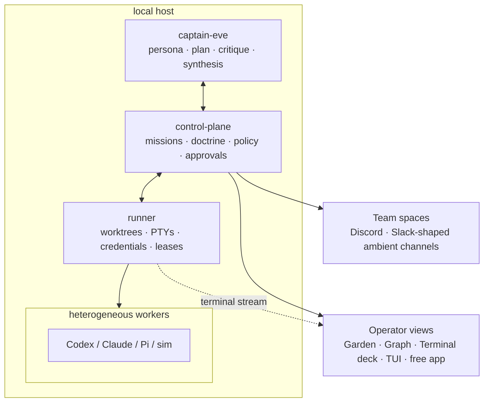

<div align="center">


# Clankie

**Give your agents a lead.**

Clankie is an **agent fleet OS** embodied as a persistent teammate: a lead agent
plans missions, dispatches coding workers, supervises them in visible terminals,
enforces doctrine, gathers evidence — and **shows up where your team already
is** (Discord today; other team spaces on the same ambient contract). It asks
you only when authority is required.

[](https://github.com/Volpestyle/clankie/actions/workflows/ci.yml)
[](LICENSE)
[](https://eve.dev)
[](https://www.typescriptlang.org)

[**Why**](#why-clankie) · [**How it works**](#how-it-works) · [**Presence**](#presence-a-teammate-in-the-room) · [**Evals**](#evals) · [**Laws**](#repository-laws) · [**Apps**](#main-applications) · [**Docs**](#documentation-map)

</div>

---

## Why Clankie

Coding agents are good now. Running several of them is still miserable in a few
specific ways:

- **You can't tell what any of them actually did.** Output scrolls away,
  subagents run invisibly, and at the end you're left diffing blind.
- **You burn your attention polling terminals.** The agents work in minutes;
  you're the latency, checking tabs to see who needs you.
- **They block while you're away.** A worker hits a question at minute four and
  sits there until you come back.
- **The swarm lives in terminals; the team lives in chat.** Status, blocks, and
  “someone look at this” already happen in Discord or Slack. A lead that only
  exists in a private TUI is a tool you open — not a teammate.

Clankie attacks all four with one mechanism: **a lead owns the mission, workers
run in isolated scopes you can always inspect, every surface — garden, graph,
terminal, chat — is a projection of the same receipted event stream, and the
captain can join the rooms where humans already work.** Nothing important runs
where you couldn't later prove what happened.

## How it works

Lead, control plane, workers, team spaces, operator views.



Three rules shape the system:

1. **Missions.** An outcome becomes an explicit task graph with write scopes,
   roles, and acceptance criteria — before anyone starts coding.
2. **Verify it worked.** Implementation and verification are separated. The
   implementer does not mark itself independently verified; acceptance tests
   stay frozen.
3. **Keep the receipt.** Hash-chained events, doctrine hashes, correlation IDs,
   scorecards, and garden projections survive the run. When a mission ends you
   can answer: what was asked, who did what, what was verified, what was
   approved, what it cost.

The operating rule:

> The lead owns intent. Deterministic code owns scheduling and policy. Workers
> own bounded execution. Humans retain authority.

Social channels are **membership**. Garden, graph, and terminal are
**oversight**. One mission stream feeds both.

## Presence

Clankie is built to **join the places you and/or your team already works**, Discord
, Slack, iMessage, and more.

- **Membership.** Clankie is a real community member: an 
  account in the server, addressable, role-bound, visible in the same channels
  and mission threads as everyone else.
- **Same Clankie everywhere.** Discord, TUI, garden, and the free command-center app are windows onto
  one captain identity and one mission stream, not separate agents with
  separate memories. Although you can create multiple Clankie sub-leads.
- **Speaks when it matters, and when he feels like it.** Status, blocks, and harvest results surface in
  the mission thread when attention is required. But Clankie also can bring things to your attention if he feels like you'll be interested.

A day in the life: after showing clankie some memes in discord livestream, you `@clankie` in `#eng` to cut a release branch for ur developing app, Uber, for cycle enthusiasts.
It opens a mission thread, spawns workers you can still inspect in the garden or terminal,
posts when review is ready, and only hands off to an authenticated surface when
something irreversible needs a human. 

| Surface | Role | Authority |
| --- | --- | --- |
| **Discord** (shipped bridge) | Ambient teammate: missions, status, steer, optional voice join | Create / steer / query; never complete privileged approvals |
| **Slack & peers** | Same ambient contract | Protocol-shaped; adapters as they land |
| **TUI · garden · phone** | High-trust operator views | Inspect fleet, take over terminals, drive authenticated flows |
| **Authenticated surface** | Approvals and irreversible actions | Merge, deploy, doctrine, recorded human authority |

The Discord bridge is the first ambient channel (`apps/discord-bridge`): official
bot only, role-bound ambient vs approval handoff, mission threads as
presentation over control-plane state. See
[`docs/04-doctrine.md`](docs/04-doctrine.md) for persona and channel authority.

## Evals

Requirements: Node 24+, pnpm 11+, and Git.

```bash
corepack enable
pnpm install
pnpm doctor
pnpm eval:self-build
```

The self-build lab:

- creates a mission and typed task graph
- delegates context, implementation, verification, and debugging to distinct
  simulated harnesses
- injects an off-by-one implementation defect
- requires an independent verifier to detect it
- dynamically assigns a debugger to repair it
- reruns unchanged acceptance tests
- evaluates a privileged merge request through doctrine
- records a human approval before simulated execution
- produces a scorecard, event log, mission snapshot, and garden projection

Outputs land in `artifacts/evals/self-build/`:

```text
self-build-report.md
self-build-report.json
self-build-events.jsonl
self-build-audit.jsonl
self-build-audit-verification.json
self-build-snapshot.json
self-build-garden.json
```

A passing result proves the **control-loop mechanics**, not general
intelligence. The real-provider experiment in
[`docs/02-lead-agent-e2e-proof.md`](docs/02-lead-agent-e2e-proof.md) is the next
evidentiary gate.

## Repository laws

1. A model cannot grant itself permission, waive a test, merge, deploy, or
   modify doctrine.
2. Verification is independently attributable and runs acceptance tests the
   implementer did not silently weaken.
3. Provider output is untrusted input; structured semantic events and
   deterministic state remain authoritative.
4. Secrets stay in the runner or credential broker. Workers receive
   capabilities, never organization-wide credentials.
5. Every mission, task, approval, and external action carries a correlation ID
   and doctrine hash.
6. Self-improvement is proposal-driven and regression-gated — no uncontrolled
   runtime self-modification.

## Main applications

| App | Responsibility |
| --- | --- |
| `apps/captain-eve` | Eve-based captain: personality, conversation, planning, critique, synthesis |
| `apps/control-plane` | Mission API, doctrine compilation, scheduling, policy, approvals |
| `apps/runner` | Worktrees, processes, PTYs, credentials, provider sessions, control leases |
| `apps/tui` | Operator console (`@earendil-works/pi-tui`) |
| `apps/discord-bridge` | Ambient teammate surface (official bot): mission threads, steer, voice join/leave; approvals never complete here |
| `apps/relay` | Dev remote relay (semantic control vs terminal data planes) |
| `apps/lead-agent-lab` | Deterministic self-build and lead-agent evaluation laboratory |

The free graphical command center (iOS / Android / macOS) is a **separate private product repo** (`clankie-app`). This monorepo is the agent OS and public protocols.

### Core packages

```text
protocol             commands, events, plans, evidence, approvals
mission-engine       deterministic DAG lifecycle and worker leasing
doctrine             profiles, routing, constraints, action policy
evals                lead-agent scorecards and release thresholds
worker-sdk           provider-neutral worker contract
worker-codex / claude / pi / sim   harness adapters
event-store          append-only hash-chained audit/replay
credential-broker    short-lived capabilities; no org secrets in workers
terminal-protocol    snapshots, deltas, sequence replay, control leases
garden-model         operational events → spatial presentation state
```

## Development commands

```bash
pnpm doctor              # toolchain and optional integration checks
pnpm arch:check          # dependency and privilege-boundary invariants
pnpm typecheck
pnpm test
pnpm eval:self-build
pnpm check               # format, lint, typecheck, tests, architecture, eval
pnpm support:bundle      # redacted diagnostic archive
pnpm --filter @clankie/tui dev
pnpm --filter @clankie/control-plane dev
```

Read [`AGENTS.md`](AGENTS.md) before assigning work to any autonomous coding
agent.

## Documentation map

- [`docs/00-product-thesis.md`](docs/00-product-thesis.md) — category, presence, open-core, moat
- [`docs/01-architecture.md`](docs/01-architecture.md) — system shape
- [`docs/02-lead-agent-e2e-proof.md`](docs/02-lead-agent-e2e-proof.md) — real-provider gate
- [`docs/03-build-plan.md`](docs/03-build-plan.md) — milestones
- [`docs/04-doctrine.md`](docs/04-doctrine.md) — policy, persona, and channel authority
- [`docs/05-worker-and-terminal-runtime.md`](docs/05-worker-and-terminal-runtime.md)
- [`docs/06-garden-and-graph.md`](docs/06-garden-and-graph.md)
- [`docs/07-evaluations.md`](docs/07-evaluations.md)
- [`docs/08-observability-debugging.md`](docs/08-observability-debugging.md)
- [`docs/09-analytics-privacy.md`](docs/09-analytics-privacy.md)
- [`docs/10-security-threat-model.md`](docs/10-security-threat-model.md)
- [`docs/11-development.md`](docs/11-development.md)
- [`docs/12-release-criteria.md`](docs/12-release-criteria.md)
- [`docs/testing/`](docs/testing/) — dated, re-runnable verification archives
- [`docs/adr/`](docs/adr/) — architecture decisions
- [`apps/discord-bridge/README.md`](apps/discord-bridge/README.md) — ambient Discord surface
- [`branding/`](branding/) — official mark, banner, regenerate recipes

## Open-core boundary

The protocol, local runner, TUI, doctrine language, adapters, evaluator, and
local event store are intended to remain inspectable and extensible. Hosted
relay, team collaboration, managed connectors, fleet policy, private
registries, long-term analytics, compliance, and enterprise administration are
the natural commercial layer. See
[`docs/00-product-thesis.md`](docs/00-product-thesis.md).

## License

Apache-2.0. Third-party dependencies retain their own licenses; see
[`THIRD_PARTY_NOTICES.md`](THIRD_PARTY_NOTICES.md). Herdr is an optional
external integration and is not vendored.
