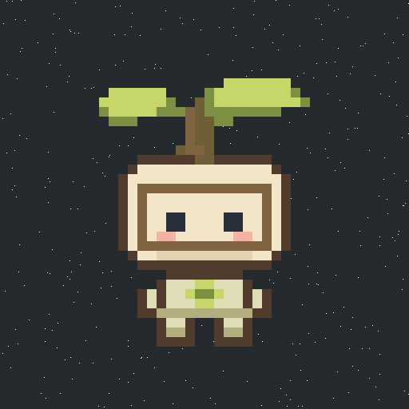

<div align="center">



# Clankie

**A persistent agent with a life of his own.**

Clankie hangs out in your Discord — text and voice — plays Pokemon live on a
watch surface, draws pictures, makes videos, browses the web, remembers people
and what happened yesterday, and codes. When work is bigger than one pair of
hands, he leads a fleet of coding agents through herdr panes you can watch.

[](#license)
[](https://pi.dev)
[](https://www.typescriptlang.org)

</div>

---

## What he does

- **Discord teammate.** A real member of your server: bounded text turns,
  consented group voice, pictures ride his replies, and he remembers the
  people he talks to. Ask him to search or play YouTube music in voice; he can
  also stay silent — silence is a real answer. Each media-enabled active Discord
  body owns one native Vox child for voice capture, TTS, and audible music; a
  text-only official-bot process does not spawn Vox.
- **Plays games on stream.** Pokemon FireRed/Emerald from his own credentialed
  seat in a hosted PokeAgents world, watchable live in a Discord Activity with
  voice commentary over the run. Other agents join the same world through
  PokeAgents' own MCP, CLI, or skill and get their own seats; nobody takes
  Clankie's body or receives his room input.
- **Makes things.** Image and video generation behind one provider-neutral
  seam (OpenAI, Google, Grok); a browser via the agent-browser MCP host.
- **Codes and leads.** The same pi coding tools every agent has, plus the
  herdr CLI for fanning work out to visible agent panes — from the console,
  and from Discord when the person asking is on the system-actor allowlist.
  No mission protocol — he delegates, watches, and reports what actually
  happened.
- **One Clankie everywhere.** The TUI, Discord, voice, and gameplay are rooms,
  not separate agents: he can read his other rooms, and his persona is
  owner-authored settings, never caller input.

## Get started

On macOS 14 or newer with Apple silicon:

```bash
curl -fsSL https://raw.githubusercontent.com/Volpestyle/clankie/main/install.sh | sh
clankie              # start the service and open the TUI
```

The release includes its Node runtime, services, assets, and native Vox media
process. `clankie doctor` reports whether this is a release or a checkout,
which models and credentials are configured, and whether optional tools such
as herdr are on PATH. See [`docs/distribution.md`](docs/distribution.md) for
the installed layout, version pinning, and release process.

For development from a checkout, install Node 24+, pnpm 11+, Git, Rust 1.88+,
and CMake:

```bash
corepack enable
pnpm install
pnpm doctor          # toolchain and credential status
pnpm cli:install     # symlink the `clankie` launcher into ~/.local/bin
clankie
```

The credential broker is the canonical secret store (macOS Keychain, or a
mode-0600 file store elsewhere). Configure it from inside the TUI: `/auth` for
provider keys or OAuth, `/model` for the captain model, `/image-model` for
generation, `/persona` for who he is, `/connect` for Linear and email, and
`/discord` for either Discord body. For compatibility, the clankie service also fills absent environment
keys from a gitignored root `.env.local`, and model/media providers may fall
back to their declared API-key environment variables when the broker has no
entry. Existing shell values win. Discord account, bridge, activity-producer,
and play-voice credentials remain broker-only and reject their forbidden
environment names. Operator and captain bearers retain documented test/CI
overrides. `pnpm doctor` reports broker status and exported
OpenAI/Anthropic fallbacks; it does not load `.env.local` or print secret values.

## Apps

| App                                                                | What it is                                                                                  |
| ------------------------------------------------------------------ | ------------------------------------------------------------------------------------------- |
| [`apps/clankie`](apps/clankie)                                     | The service: captain, tools, bodies, API (:4310). [HTTP catalog](apps/clankie/openapi.yaml) |
| [`apps/tui`](apps/tui/README.md)                                   | Operator console and the `clankie` launcher                                                 |
| [`apps/menu-bar`](apps/menu-bar/README.md)                         | Native macOS menu bar: private local voice and operator conversation tails                  |
| [`apps/discord-bridge`](apps/discord-bridge/README.md)             | Official bot: text, voice, attachments                                                      |
| [`apps/discord-user-session`](apps/discord-user-session/README.md) | Personal-lab voice, screen-watch, and Go Live body (off by default)                         |
| [`apps/discord-activity`](apps/discord-activity/README.md)         | The watch-me-play surface                                                                   |
| [`apps/relay`](apps/relay/README.md)                               | Remote access for the phone/desktop app                                                     |
| [`apps/vox`](apps/vox/README.md)                                   | Sole native Discord media owner behind an AGPL process boundary                             |

[`packages/play`](packages/play/README.md) is the play mind above the body
seam; `packages/` holds the shared contracts. The body itself is his seat in a
PokeAgents world ([ADR 0145](docs/adr/0145-the-world-is-the-only-body.md), and
[ADR 0129](docs/adr/0129-each-player-owns-a-body.md) for the identity boundary).
The graphical garden app is a separate private repo (`clankie-app`).

## Development

```bash
pnpm typecheck
pnpm deadcode
pnpm test
pnpm check           # required final check: fmt, lint, docs links, typecheck, tests
pnpm gba:free-play   # drive the GBA body from a CLI
pnpm discord:readiness
```

If you drive agent panes with [herdr](https://herdr.dev), link Clankie's
plugin once to get his fleet board, operator console, and status popup as
first-class herdr panes — `pnpm doctor` (checkout) or `clankie doctor`
(any install) reports whether it is linked:

```bash
herdr plugin link "$PWD/integrations/herdr-plugin"
```

An installed release ships the same plugin; `clankie doctor` reports
`herdrPlugin.bundlePath`.

Requirements, keybindings, and troubleshooting live in
[`integrations/herdr-plugin/README.md`](integrations/herdr-plugin/README.md).

See [`docs/architecture.md`](docs/architecture.md) for the system shape,
[`docs/distribution.md`](docs/distribution.md) for binary installation,
[`docs/credentials.md`](docs/credentials.md) for bot/user/internal token
boundaries, and [`docs/discord-media.md`](docs/discord-media.md) for YouTube
music, the Activity, Go Live, and share watching. Read [`AGENTS.md`](AGENTS.md)
before pointing a coding agent at this repo.

## License

Apache-2.0 except `apps/vox`, which is AGPL-3.0-or-later under its own
[`LICENSE`](apps/vox/LICENSE). Third-party dependencies retain their own
licenses; see [`THIRD_PARTY_NOTICES.md`](THIRD_PARTY_NOTICES.md).
