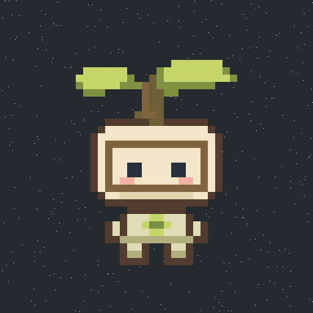

# Clankie

**Your own assistant. Your machine, models, and tools.**

A persistent AI teammate who remembers, makes things, codes, leads other agents,
and hangs out in Discord. Run him on your Mac, shape his character, and connect
the tools you want. The iPhone and iPad app gives you a window into the same
Clankie wherever you are.

[Get started](https://docs.clankie.bot/get-started/#diy-start-on-your-mac) ·
[Customize Clankie](https://docs.clankie.bot/diy/) ·
[Watch the film](https://clankie.bot/#film) ·
[Technical reference](docs/README.md)

## Run your own

The [Mac quick start](https://docs.clankie.bot/get-started/#diy-start-on-your-mac)
installs a self-contained bundle on **Apple silicon, macOS 14 or newer**. Choose
local mode, connect a supported model subscription, API key, or local runtime,
and start talking. `/setup` guides the required model choice and lists the
optional connections. No app account or Discord setup is required to use him locally.

- [Install and pair the app](https://docs.clankie.bot/get-started/) — the complete onboarding path
- [Run from source](CONTRIBUTING.md) — development setup and checks
- [Run on Linux](infra/hosted/README.md) — advanced self-hosting, with its own capability limits
- [Release details](docs/distribution.md) — checksums, layout, pinning, and upgrades

Clankie's software is free to run; model providers and connected services may
charge for use. Prefer to have the machine managed for you? [Hosted Clankie](https://clankie.bot)
uses the same open-source foundation. Its plans and available features are described there.

## What you can make him

**An assistant with continuity.** Talk through ideas, make drafts, generate
pictures, and keep useful memories across conversations. His persona is yours
to configure. Conversation history, memory, and ongoing goals belong to the
service, so closing a console does not discard them.

**His own browser.** Clankie browses headlessly with a private profile that keeps
his logins. An explicit headed request opens a window for sign-in takeover;
windows and tabs close after 60 seconds without a browser call, and the next
burst starts headless. `clankie browser record on` saves browsing bursts as WebM
videos. See the [browser contract](docs/adr/0082-clankie-holds-the-browser.md).

**A coding partner and team lead.** He can work directly or bring in agents
using supported harnesses such as Claude Code, Codex, and pi. Swarm carries
messages and task ownership; Herdr supplies visible worker terminals. You can
connect other runtimes and coordinators, inspect the work, and give him durable
goals. See [current support](packages/swarm/README.md#support-at-a-glance).

**A familiar face on your phone.** Messages is home. Commons shows the team as
a small world of agent figures, each leading back to a real conversation.
Terminal exposes the worker panes when you want direct observation or control.
[Pair the app](https://docs.clankie.bot/get-started/#bring-your-mac-s-clankie-into-the-app)
to your Mac and keep that Mac awake and online to reach it away from your desk.

**Company in Discord.** The official bot can chat, join voice, play requested
YouTube music, and show his Pokémon play through an Activity. Play needs his
own credentialed seat in a separate PokeAgents world. Screen-share watching and
Go Live belong to the separately enabled personal-lab body. The
[Discord media guide](docs/discord-media.md) explains the differences and setup.

**A foundation to build on.** Choose models independently for conversation and
media, add skills and connected services, use the headless CLI, or build a client
against the HTTP API. An MCP projection lets other agent seats use authorized
service tools. Start with [customization](https://docs.clankie.bot/diy/) and the
[architecture](docs/architecture.md).

Start small and add the capabilities you want. The
[setup guide](https://docs.clankie.bot/get-started/) covers the hosted experience
and what you can enable on your own machine.

## The system underneath

Clankie is one persistent service plus the clients and connections around it.
His built-in agent runs on pi; choosing a worker harness does not replace that
runtime. The host owns conversations, memory, credentials, tool authority, and
device access. Portals, execution runtimes, coordinators, and work trackers are
independent connections.

The [architecture](docs/architecture.md) owns the current system diagram.
The [library index](docs/README.md) maps every subsystem to its canonical guide;
the [CLI](docs/cli.md) and [HTTP catalog](apps/clankie/openapi.yaml) own their
command and route contracts.

The service, console, relay, and public contracts live here. The companion app
and managed service live in separate private repositories. The
[repository boundary](docs/adr/0183-the-harness-is-public-the-hosted-service-is-private.md)
explains what belongs where.

## Contribute

Read [CONTRIBUTING.md](CONTRIBUTING.md) for the toolchain, source setup, and
verification commands. Read [AGENTS.md](AGENTS.md) before pointing a coding agent
at the checkout. Keep the relevant user guide and technical reference current
when changing behavior.

For questions about using Clankie, start with the [docs](https://docs.clankie.bot)
or [support](https://clankie.bot/support/). Report security issues through
[SECURITY.md](SECURITY.md).

## License

Apache-2.0 except `apps/vox`, the native Discord media executable, which is
AGPL-3.0-or-later under its own [LICENSE](apps/vox/LICENSE). Third-party components
retain their own licenses; see [THIRD_PARTY_NOTICES.md](THIRD_PARTY_NOTICES.md).
