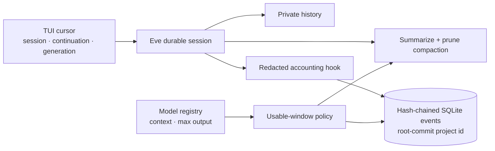
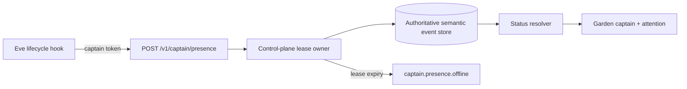

# Eve captain

This is the lead-agent runtime. Eve supplies durable sessions, filesystem-authored instructions, tools, skills, channels, and bounded subagents. Clankie keeps mission scheduling, action policy, runner state, and the versioned event protocol outside Eve so clients and workers are not coupled to a beta framework API.

The only authored tools call a narrow control-plane API. They do not expose a generic application-runtime shell or raw credentials.

`add_recovery` proposes exactly one debugger plus read-only re-verifier pair for
an observed verification failure. The tool supplies task intent and scope only;
the control plane derives the authoritative diagnosis, failed evidence, check
identities, lineage, and resolution state from its durable mission projection.

The service resolves the captain model dynamically from layered Clankie config
through `@clankie/model-provider`. Provider credentials remain behind the local
credential broker; the TUI sees only Eve session events. The built-in Eve
shell, filesystem, and web tools are explicitly disabled, leaving the authored
mission tools plus framework coordination primitives.

Run the headless service directly when developing the TUI without the
`clankie` launcher:

```bash
pnpm --filter @clankie/captain-eve exec eve build
pnpm --filter @clankie/captain-eve exec eve start --host 127.0.0.1 --port 4321
CLANKIE_CAPTAIN_URL=http://127.0.0.1:4321 pnpm --filter @clankie/tui dev
```

Use `eve dev --no-ui` only while editing the authored captain itself. The shared
operator service uses built output so a process restart never leaves a durable
session pointing at a pruned development snapshot.

Eve owns durable conversation execution, replay, and compaction. Clients store
only their continuation/session cursor. Mission state remains authoritative in
the control plane.

The Linear channel uses the same canonical `/eve/v1/session` and replayable NDJSON stream. The control plane owns the cursor per workspace/session and supplies ambient Linear identity plus the trusted tracker thread as `clientContext`; the bridge supplies only the human trigger and correlation identities. A final non-tool `message.completed` maps to a Linear response. An `input.requested` maps to `waiting_user`; the bridge converts it to an elicitation unless its structured options identify a tool approval or its prose is approval-shaped. Approval cursors are abandoned rather than exposed to later Linear text.

## Session context and accounting

The captain keeps the private transcript in Eve's durable workflow state and
projects only redacted lifecycle and token metadata into the v2 SQLite event
store. The database is namespaced by the repository's root commit, lives under
`${XDG_STATE_HOME:-~/.local/state}/clankie/captain-sessions/`, and is protected
by a mode-0700 directory and mode-0600 database file. Continuation tokens,
prompts, model text, reasoning text, and tool inputs/outputs are never written
to this projection.



For each selected model:

```text
reserved = min(20_000, maxOutput)
usable   = context - reserved
compact  when inputTokens >= usable
```

An absent or zero output limit reserves 20,000 tokens instead of silently
reserving nothing. Eve receives a one-token-lower compaction window because
its threshold comparison is strict `>`; integer provider counts therefore
trigger at `inputTokens >= usable`. Eve performs a dedicated summary call,
preserves the recent conversational tail, and removes tool-result payloads from
the compacted history. The
accounting projection records compaction requested/completed checkpoints and
idempotently totals `input`, `output`, `reasoning`, and
`cache.{read,write}` across restart replay. Eve 0.22.4 does not expose
reasoning tokens on its step event, so that axis remains zero unless a future
additive event field supplies it; the captain does not guess.

The operator status bar continues to compute live context percentage against
the registry's full `limit.context`, not the smaller usable compaction window.
The TUI cursor and build-generation compatibility behavior from ADR 0014 remain
unchanged.

## Restart queue check (VUH-796)

The production restart check uses a built captain, an ephemeral loopback port,
and an isolated `XDG_STATE_HOME` so the durable Eve session survives only the
captain process restart:

```bash
export XDG_STATE_HOME="$(mktemp -d /tmp/vuh-796-state.XXXXXX)"
# Leave CLANKIE_CAPTAIN_PROJECT_ID unset: the captain derives a stable id from
# the Git root-commit hash. A non-hash value is rejected by stableProjectId
# ("CLANKIE_CAPTAIN_PROJECT_ID must be a Git root-commit hash") and the turn
# never runs, so do not set it to a literal label.
PORT=63809   # any free ephemeral loopback port; 4321 and 8082 are reserved
pnpm --filter @clankie/captain-eve exec eve build
pnpm --filter @clankie/captain-eve exec eve start --host 127.0.0.1 --port "$PORT"
```

Create a session and send one turn through the Eve client, stop that service,
then start the same built output with the same state directory and port. With
the session-accounting fix (VUH-822) the turn survives `session.started` and
reaches the live model call. If the provider is available the turn completes and
saves a continuation; if the provider is quota-limited the run parks for retry.
Either way a durable active run remains in the session state, so on restart the
local world reports `Re-enqueued 1 active run(s)` and retries the queue item
`__wkf_workflow_workflow//eve//workflowEntry` with HTTP 400 `Unhandled queue` —
this retry stream is the recorded check.

The retries are an upstream Eve 0.22.4/0.22.5 namespace mismatch: the local-world
re-enqueue path uses the unscoped prefix `__wkf_workflow_`, while the captain's
production handler is registered under the agent-scoped prefix
`__eve6361707461696e2d657665_wkf_workflow_` (`6361707461696e2d657665` decodes to
`captain-eve`). No captain configuration or session-handling seam changes that
upstream queue name, so the captain does not filter the retry logs or claim this
check is fixed; the residual is upstream-owned and tracked in VUH-796.

Validated on this branch rebased onto `main` after the VUH-822 accounting fix:
one driven turn survived `session.started`, reached the Anthropic model call, and
parked for retry on `CaptainProviderPressureError: The usage limit has been
reached`; the restart then emitted `Re-enqueued 1 active run(s)` and six
`Unhandled queue` retries of the unscoped queue, on an isolated ephemeral port
and isolated `XDG_STATE_HOME`. The exactly-once continuation execution on resume
is not re-exercised under this quota condition (the turn parks before
completion); it is carried from the wave-3 restart-recovery evidence, not
re-observed here.

## Captain presence

The captain reports a process-scoped lease and typed Eve lifecycle facts to the
captain-authenticated control-plane presence boundary. The control plane owns
lease expiry, so a killed captain becomes an explicit Tier-1 `offline` event
within one lease window instead of disappearing silently. Heartbeat requests
renew every five seconds; the semantic log records them sparsely.

`turn.started` reports Tier-0 `working`. A parked operator question reports
`waiting_user` with a bounded generic summary and clears on its structured
action result. A session parked with live mission/subagent dependencies reports
`waiting_dependency`; otherwise it reports `idle`. The hook never persists the
question prompt, approval payload, model text, transcript, or reasoning.



## Concurrent captain lanes

TUI, Discord voice, and gameplay use independent durable Eve sessions keyed by
character, frozen lane kind, and channel target. A private mode-0600 SQLite
registry owns each lane's session and continuation token. The redacted lane
snapshots and provider-pressure traces cannot contain those tokens, and a token
or session observed in a second lane fails closed.

All lanes load the same authored agent definition and soul, resolve the same
configured provider identity, and receive a short dynamic instruction stating
their local authority. HTTP remains the authenticated TUI lane. Future Discord
voice and gameplay adapters must provide `captainLane` and `captainTargetId` in
their existing Eve channel metadata; this package does not implement either
channel.

The provider admission controller serializes bursts only within one lane.
Different lanes run concurrently when the configured provider capacity permits
it. TUI has foreground reservation and highest priority, voice is admitted
before gameplay for latency, and gameplay calls are cancellable borrowers. With
a one-call limit, a foreground arrival aborts gameplay and TUI admits as soon as
that call releases. Streamed model calls retain their permit until the stream
actually settles.

## Skill verification

`pnpm --filter @clankie/captain-eve test` compiles the authored Eve surface without provider credentials and verifies that all mission skills are discovered. `pnpm --filter @clankie/captain-eve exec eve eval --list` validates the behavior-eval definitions.

With captain model credentials configured, run `pnpm --filter @clankie/captain-eve exec eve eval skills --strict` to verify that mission-shaped prompts load the matching skill and an unrelated prompt does not load one.

## Tracker ceremony projection

The captain loads the effective compiled tracker ceremony from an
HMAC-authenticated channel-metadata envelope signed by the control plane with
`CLANKIE_CAPTAIN_TOKEN`. Unsigned or modified caller context is ignored by the
dynamic `agent/instructions/ceremony.ts` module. A short root rule in `instructions.md`
requires following that projection and governed tools for draft validation and
human-attention delivery. Portable captain surfaces never hard-code personal
emails, tracker labels, or mention syntax. Notification delivery is not a reply;
only verified agent-session correlation may close pending attention.
