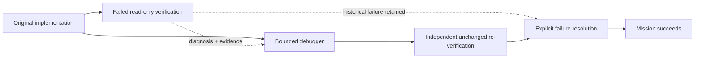
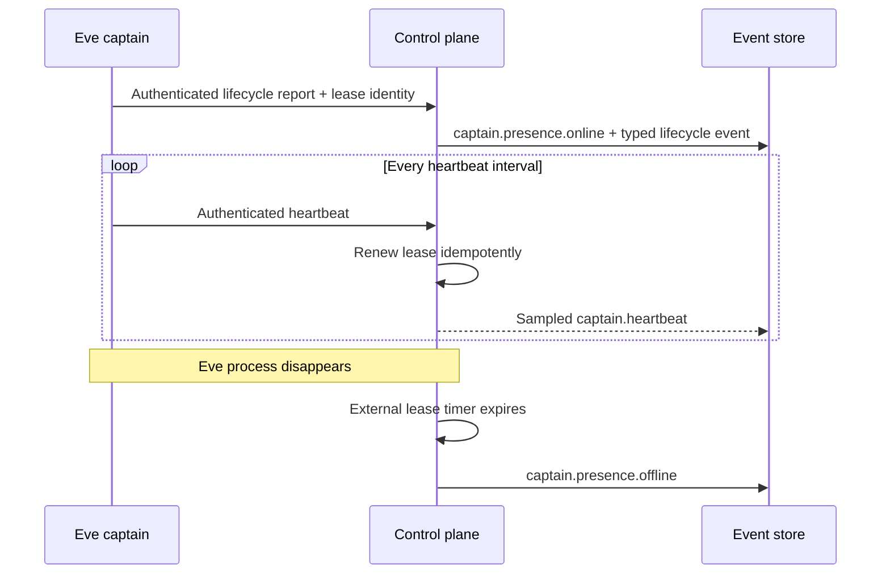
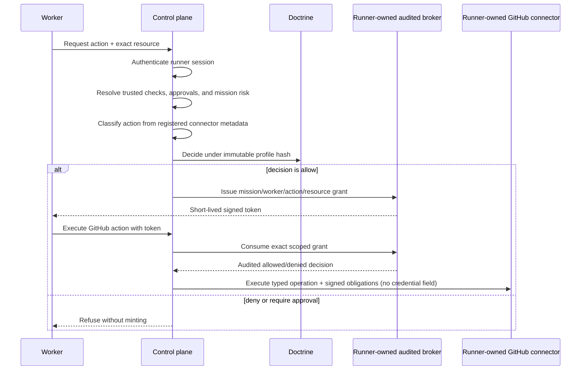

# Control plane

This service owns mission state, doctrine compilation, action decisions, approvals, and the semantic event stream. Mission and approval projections rebuild from the durable append-only event store on startup.

It must never own provider subscription credentials or terminal processes. Those remain on the local runner.

## Runner pull execution

After a validated implementation-plus-read-only-verification plan is submitted, an authenticated captain starts it with `POST /v1/missions/:id/start`. An authenticated runner pulls work from `POST /v1/runner/claims`, heartbeats the server-owned attempt lease, reports allowlisted idempotent semantic events, and settles the exact attempt. `GET /v1/missions/:id` includes the live task snapshot and results.

The execution boundary is fail-closed: `CLANKIE_CAPTAIN_TOKEN` authenticates start separately from `CLANKIE_RUNNER_TOKEN`; missing configuration returns an unavailable error and invalid credentials return an authentication error. Production authenticators compare bearer credentials in constant time and bind the runner ID from server configuration, never a caller header. The control plane owns serialized scheduling and replay only. Codex, Git worktrees, provider processes, and credentials remain in the runner.

## Worker steering command bus

Authenticated captain steering is normalized into a versioned command bound to
the active mission, task, worker run, attempt, owning runner, lease, correlation
identity, and doctrine profile. The private payload queue is atomically persisted
beside the event store with mode `0600`; mission events contain only content
length and SHA-256, never steering text. Runner claim and settlement endpoints
revalidate attempt, runner, and lease authority and return typed non-delivery
outcomes for stale, terminal, unsupported, or human-controlled workers.
Claiming is a one-way delivery transition: restart reconciliation marks a
claimed-but-unsettled command as failed instead of replaying it to the adapter.

The request accepts a finite typed intent surface: focus on the current task,
failing test, acceptance criteria, scope, or diagnosis; continue; retry the last
step; or summarize status. The control plane renders the provider text from
that intent. Legacy strings fail closed unless they exactly match a canonical
safe intent, so approval answers, credentials, merge/deploy permission, policy
overrides, and control characters never enter the payload store. Duplicate
command IDs are idempotent only when their worker run and rendered content hash
match.

Steering authorization is required and fail-closed. The authenticated principal
supplies the trusted source lane; request bodies may only assert the same lane
and cannot elevate a captain to the TUI. Production binds the captain lane with
`CLANKIE_CAPTAIN_STEER_SOURCE_LANE=api|discord_text|discord_voice`; operator
steering is bound to `tui`. Runner settlement diagnostics are hash/length-only
audit metadata, while the durable outcome message is derived from its typed code.

## Verification recovery

An authenticated captain can add one bounded recovery pair after a read-only
verification task settles failed. `POST /v1/missions/:id/recovery` accepts a
debugger task and a read-only re-verifier task; it does not accept diagnosis or
verification authority from the caller. The control plane copies the failed
task's stored diagnosis, evidence, and trusted
`runner-check:<id>:sha256:<digest>` identities into reserved recovery metadata.

The debugger inherits the original implementation lineage and exact write
scope, and is routed away from the original implementer and verifier. The
re-verifier depends only on the debugger, remains read-only, and is routed away
from both writing attempts; the original read-only verifier remains eligible in
the production three-seat fleet.
Recovery command IDs are idempotent and fail closed when reused with different
content.

One atomic `recovery.pair.added` event contains both full `TaskSpec` values and
the recovery record, so SQLite replay never exposes one task without the other.
Legacy partial recovery `task.added` events are not schedulable. A successful
re-verifier resolves rather than rewrites the original failure. Mission success
requires the original check ID plus canonical command, arguments, dependency,
and sandbox digest identities, and terminal success is emitted once. A complete
`worker.settled` result is durable before its terminal task projection, so crash
prefix replay retains the evidence needed for recovery. Caller-supplied reserved
recovery metadata is rejected.

## Captain presence

Eve registers and renews its process generation through the captain-authenticated
`POST /v1/captain/presence` route. The control plane owns the lease and its timer,
so it appends `captain.presence.offline` even when the Eve process disappears.
Renewals are idempotent and every heartbeat extends the lease, while durable
`captain.heartbeat` events are sampled to keep the semantic stream sparse.

The same route accepts typed Eve lifecycle reports for turn start, turn settlement,
waiting on a dependency, and the bounded waiting-for-user state. The control plane
appends those reports, online/offline transitions, and sampled heartbeats to the
authoritative event store under the current doctrine hash. Callers cannot submit an
offline transition or a generic Tier-0 status signal.

## Capability exchange

The worker capability routes compose three injected boundaries:

`POST /v1/workers/:id/capabilities` mints only when doctrine returns
`allow`; `deny` and `require_approval` are both refusals. The grant is bound
to the authenticated mission, task, worker run, action, resource, doctrine
hash, signed policy obligations, and an expiry of at most 15 minutes. Check,
approval, change, cost, and mission-risk facts come from an injected
authoritative context provider. The connector risk class comes from an
injected metadata classifier that produces opaque, in-process
classifications. Worker-supplied policy facts and class fields are discarded,
and unclassified connector actions fail closed.

## Authenticated approvals

A `require_approval` policy result appends `approval.requested` with the exact
mission, worker, action, resource, policy rationale, correlation identity, and
doctrine hash. `GET /v1/approvals?status=pending` and
`POST /v1/approvals/:id/decision` require the dedicated operator authenticator
configured by `CLANKIE_OPERATOR_TOKEN`; captain and worker credentials cannot
grant approval authority.

Approve and deny append `approval.decided` with the authenticated operator ID,
time, and reason. A decision never invokes a connector. The original action
request must return through doctrine; an approval is bound to that exact
request and is consumed once when a capability grant is issued. Replays of the
same decision are idempotent, while conflicting decisions fail closed.

`POST /v1/workers/:id/connectors/github/execute` consumes that exact grant
before invoking the connector. The control plane receives an abstract broker
and connector from the local runner. Neither interface exposes a provider
credential or worker environment, so secrets remain inside the privileged
connector boundary. The runner generates the operation/idempotency ID and the
connector returns no payload. Any unexpected connector result fails closed;
the worker receives only the runner-generated ID and a constant acceptance
flag.

## Tracker authority mirror

The trusted `TrackerMirrorPort` imports intent, priority, and acceptance
criteria through `POST /v1/tracker/missions`. Plan submission validates that
contract; reconciliation records `tracker.drift.detected` without rewriting it.

Durably appended mission events become idempotent comments with worker
attribution. `worker.leased` mirrors the Clankie app as delegate; tracker state
never decides worker ownership.

Priority and completion use distinct policy-gated actions. Failures emit
credential-free `tracker.sync.failed` events.

## Linear narrative and captain channel seam

`POST /v1/discord/presence-actions` accepts bot-transport Discord presence writes (ADR 0024 P1), evaluates narrative or risk-class policy (shared narrative rate ledger), and executes via `discordPresenceRuntime` loaded from `CLANKIE_DISCORD_PRESENCE_RUNTIME_MODULE`.

`POST /v1/tracker/narratives` accepts only the five typed narrative actions (issue comment, thought, response, elicitation, and reaction) and evaluates exact content plus trusted correlation through one `createNarrativeWritePolicy()` instance retained for the compiled profile runtime. It then delegates to `LinearAgentRuntimePort`; non-narrative tracker mutations cannot enter this route.

`POST /v1/captain/channel-turns` deduplicates by Linear delivery ID, reads the full thread through the trusted runtime, and calls Eve over its canonical loopback session/NDJSON surface. Only the triggering text and typed identities arrive from the bridge. The control plane supplies the authoritative thread in Eve client context and returns only `settled`, `waiting_user`, or a bounded failure.

At startup, `CLANKIE_LINEAR_AGENT_RUNTIME_MODULE` may name an absolute trusted local module exporting `createLinearAgentRuntime()`. The module owns broker-backed construction; the control plane receives only the credential-free port. When it is absent, both Linear runtime routes fail unavailable. `CLANKIE_CAPTAIN_URL` defaults to the loopback Eve service.

When Linear human attention is enabled, `CLANKIE_LINEAR_ATTENTION_RUNTIME_MODULE` is required and exports `createLinearAttentionRuntime()`. Its credential-owning client and workspace config map semantic `operator` capabilities to the provider assignee, `needs-human` label, and direct mention. Startup fails closed when the Linear agent runtime is enabled without this companion runtime.

The control-plane HTTP service binds to `127.0.0.1`. The narrative and captain-channel routes rely on that local process boundary and are not public connector APIs.

### Discord presence actions

`POST /v1/discord/presence-actions` — ADR 0024 **P1 outbound** bot-transport presence catalog (not DM/chat ingress). Narrative actions share the mission narrative rate ledger; optional `content` is derived from the payload when omitted (emoji, typing sentinel, …). `publish-external` (attachments, Go Live) currently returns `require_approval` **without** minting an approval-store request — explicit follow-up before attachments can complete. Runtime: `CLANKIE_DISCORD_PRESENCE_RUNTIME_MODULE` exporting `createDiscordPresenceRuntime()`.

## Tracker ceremony routes

- `POST /v1/tracker/issue-drafts/validate` — pure draft validation against the compiled ceremony projection.
- `POST /v1/tracker/human-attention/deliver` — policy-evaluated, idempotent attention delivery with typed aggregate outcomes.
- `POST /v1/tracker/human-attention/correlate` — correlate verified agent-session events to pending attention (ordinary issue comments never match).

Eve channel turns carry the ceremony projection only in an HMAC-authenticated channel-metadata envelope signed with `CLANKIE_CAPTAIN_TOKEN`. Unsigned or modified caller context is ignored.
