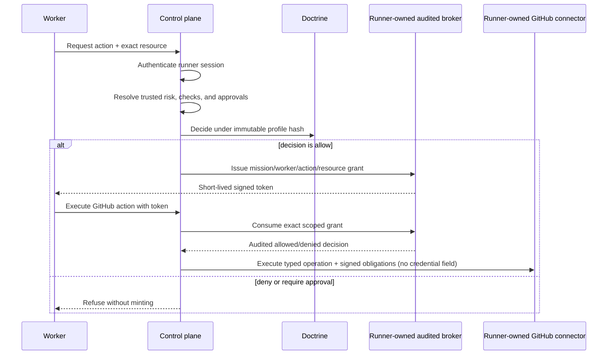

# Control plane

This service owns mission state, doctrine compilation, action decisions, approvals, and the semantic event stream. The current skeleton uses an in-memory mission registry so the lead-agent lab stays easy to inspect. The production milestone replaces it with PostgreSQL plus an append-only event table and materialized read models.

It must never own provider subscription credentials or terminal processes. Those remain on the local runner.

## Capability exchange

The worker capability routes compose three injected boundaries:

```mermaid
sequenceDiagram
    participant W as Worker
    participant C as Control plane
    participant D as Doctrine
    participant B as Runner-owned audited broker
    participant G as Runner-owned GitHub connector

    W->>C: Request action + exact resource
    C->>C: Authenticate runner session
    C->>C: Resolve trusted risk, checks, and approvals
    C->>D: Decide under immutable profile hash
    alt decision is allow
        C->>B: Issue mission/worker/action/resource grant
        B-->>W: Short-lived signed token
        W->>C: Execute GitHub action with token
        C->>B: Consume exact scoped grant
        B-->>C: Audited allowed/denied decision
        C->>G: Execute typed operation + signed obligations (no credential field)
    else deny or require approval
        C-->>W: Refuse without minting
    end
```

`POST /v1/workers/:id/capabilities` mints only when doctrine returns
`allow`; `deny` and `require_approval` are both refusals. The grant is bound
to the authenticated mission, task, worker run, action, resource, doctrine
hash, signed policy obligations, and an expiry of at most 15 minutes. Risk,
check, approval, change, and cost facts come from an injected authoritative
context provider; worker-supplied policy facts are discarded.

`POST /v1/workers/:id/connectors/github/execute` consumes that exact grant
before invoking the connector. The control plane receives an abstract broker
and connector from the local runner. Neither interface exposes a provider
credential or worker environment, so secrets remain inside the privileged
connector boundary.
