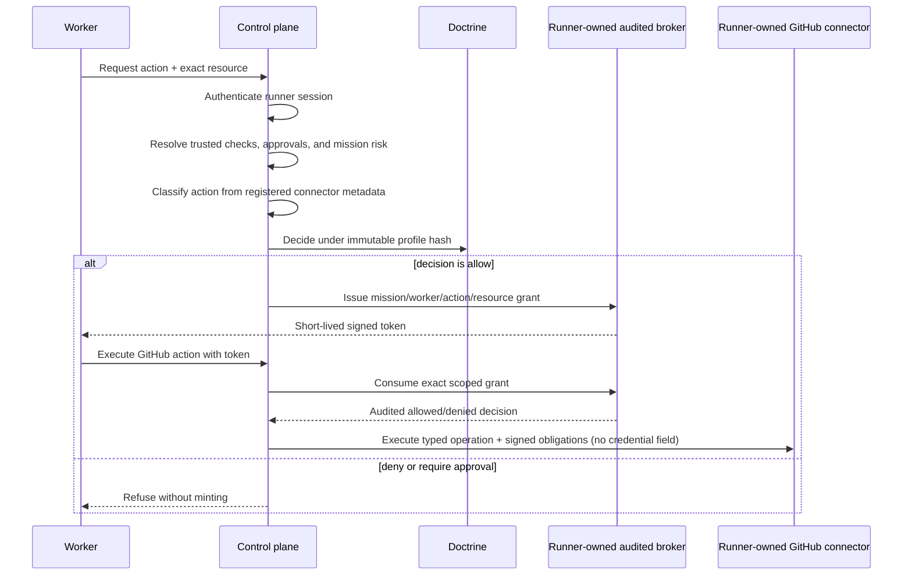

# Control plane

This service owns mission state, doctrine compilation, action decisions, approvals, and the semantic event stream. The current skeleton uses an in-memory mission registry so the lead-agent lab stays easy to inspect. The production milestone replaces it with PostgreSQL plus an append-only event table and materialized read models.

It must never own provider subscription credentials or terminal processes. Those remain on the local runner.

## Runner pull execution

After a validated implementation-plus-read-only-verification plan is submitted, an authenticated captain starts it with `POST /v1/missions/:id/start`. An authenticated runner pulls work from `POST /v1/runner/claims`, heartbeats the server-owned attempt lease, reports allowlisted idempotent semantic events, and settles the exact attempt. `GET /v1/missions/:id` includes the live task snapshot and results.

The execution boundary is fail-closed: `SAPLING_CAPTAIN_TOKEN` authenticates start separately from `SAPLING_RUNNER_TOKEN`; missing configuration returns an unavailable error and invalid credentials return an authentication error. Production authenticators compare bearer credentials in constant time and bind the runner ID from server configuration, never a caller header. The control plane owns serialized scheduling and replay only. Codex, Git worktrees, provider processes, and credentials remain in the runner.

## Capability exchange

The worker capability routes compose three injected boundaries:

```mermaid
sequenceDiagram
    participant W as Worker
    participant C as Control plane
    participant D as Doctrine
    participant B as Runner-owned audited broker
    participant G as Runner-owned GitHub connector

    W->>C: Request action + exact resource
    C->>C: Authenticate runner session
    C->>C: Resolve trusted checks, approvals, and mission risk
    C->>C: Classify action from registered connector metadata
    C->>D: Decide under immutable profile hash
    alt decision is allow
        C->>B: Issue mission/worker/action/resource grant
        B-->>W: Short-lived signed token
        W->>C: Execute GitHub action with token
        C->>B: Consume exact scoped grant
        B-->>C: Audited allowed/denied decision
        C->>G: Execute typed operation + signed obligations (no credential field)
    else deny or require approval
        C-->>W: Refuse without minting
    end
```

`POST /v1/workers/:id/capabilities` mints only when doctrine returns
`allow`; `deny` and `require_approval` are both refusals. The grant is bound
to the authenticated mission, task, worker run, action, resource, doctrine
hash, signed policy obligations, and an expiry of at most 15 minutes. Check,
approval, change, cost, and mission-risk facts come from an injected
authoritative context provider. The connector risk class comes from an
injected metadata classifier that produces opaque, in-process
classifications. Worker-supplied policy facts and class fields are discarded,
and unclassified connector actions fail closed.

`POST /v1/workers/:id/connectors/github/execute` consumes that exact grant
before invoking the connector. The control plane receives an abstract broker
and connector from the local runner. Neither interface exposes a provider
credential or worker environment, so secrets remain inside the privileged
connector boundary. The runner generates the operation/idempotency ID and the
connector returns no payload. Any unexpected connector result fails closed;
the worker receives only the runner-generated ID and a constant acceptance
flag.
