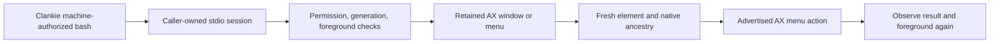

# Background native AX

`clankie-desktop` is a macOS CLI for bounded Spotify accessibility observation
and explicitly authorized menu actions. Clankie runs it through his existing
machine-authorized shell. One caller-owned stdio process holds the native AX
references; it exits on EOF. There is no listener, login item, capture backend,
model, or dependence on a Codex conversation.

## Build, install, and verify

```sh
pnpm --filter @clankie/desktop-control test
python3 apps/desktop-control/install.py
~/.local/bin/clankie-desktop --version
~/.local/bin/clankie-desktop diagnose
python3 apps/desktop-control/client.py ~/.local/bin/clankie-desktop
```

Installation builds the Apache-2.0 source with SwiftPM and verifies its normal
local ad-hoc signature. The binary and source-hash manifest live under
`~/.local/share/clankie/desktop/<binary-hash>/`; `~/.local/bin/clankie-desktop`
points there. Existing versions and Peekaboo stay installed. This is a local
build, not a notarized upstream distribution. No signing or TCC bypass is part
of installation. `client.py` and `install.py` use Python's standard library;
the executable has no external package dependencies.

The read proof invokes the real stdio protocol twice. Its compact receipt
includes row/control counts, observable content digests, Play/Pause labels,
target generation, and foreground identities. It performs zero menu actions.
It proves only its actual calling context. Repeat through Clankie's service
shell before claiming that boundary; menu proof is separately authorized.

## Protocol

Run `clankie-desktop session` and send one JSON object per line. Replies are
one JSON object per line. `client.py` provides the bounded `Desktop` context
manager for shell scripts; keep that context alive throughout a sequence. Run
the following Python example from `apps/desktop-control`.

```python
from client import Desktop, require_success

with Desktop("/Users/james/.local/bin/clankie-desktop") as desktop:
    inventory = require_success(desktop.request({"op": "windows"}))
    assert len(inventory["windows"]) == 1
    window = inventory["windows"][0]["id"]
    observation = require_success(desktop.request({
        "op": "observe", "window": window, "maxNodes": 2000,
        "roles": ["AXRow", "AXPopUpButton", "AXMenu"],
    }))
    print(observation)
```

`windows` returns fresh handles for the selected process's AX windows and
direct application-level AX menus. These are **native reference handles**, not
CoreGraphics window numbers. `diagnose` preserves the AXWindows error/count,
app exposure attribute results, and the optional AXWindowNumber result beside
WindowServer IDs. It never guesses a binding from similar titles or geometry. An application role
returned in window inventory refuses with `invalid_root`; it never becomes an
implicit application-tree fallback. Root discovery refuses `incomplete_inventory`
when AXWindows exceeds 32 or direct application children exceed 64. An omitted
root cannot count as evidence of menu dismissal.

`observe` binds one of those roots and traverses breadth first. `maxNodes`
defaults to 400, with a hard limit of 2000; `maxDepth` defaults to 48, maximum 64. Each child read is capped at 250. One five-second monotonic deadline covers
each operation, including root discovery, observation, validation, and the
last check immediately before dispatch. Expiry returns `operation_timeout`
and invalidates the snapshot. Native calls check that shared deadline between
messages; a single in-flight message can overrun it, but cannot authorize a
subsequent dispatch. Individual native messaging timeouts remain 150 ms. `incomplete` describes traversal coverage. Returned
elements retain their actual native ancestry even when other branches are
omitted; an incomplete result never proves a menu or row is absent.

The optional `roles` filter limits presentation, not traversal. A snapshot is
valid for at most 30 seconds in this exact process. Menu validation and the
immediate native dispatch share the earlier of snapshot expiry and the operation
deadline; either expiry invalidates the snapshot, including during final
preflight. Another observation, window
inventory, dispatch attempt, or process exit invalidates it. Root window handles
last until a new inventory or process exit, subject to live membership checks.
Never replay IDs from a prior process or invent an element ID.

Requests are capped at 16 KiB; responses at 512 KiB. Attributes exceeding 2048
bytes refuse instead of becoming truncated identity evidence. Native references
are capped at 10000 per session. Start a new session on a limit; do not silently
increase limits in a captain turn.

The Python client's twelve-second deadline covers nonblocking writes and reads.
It validates the response shape for the requested operation. Timeout, EOF,
malformed JSON, unexpected framing/shape, or output failure permanently closes
and reaps that transport; every subsequent request refuses before writing.
`TransportError.action_may_have_dispatched` retains action uncertainty and
`retry_safe` is false. A bounded, well-framed startup refusal is preserved in
`TransportError.startup_refusal` and its message; it remains a terminal error
even if the diagnostic receipt says `retrySafe: true`. Pending startup success
is rejected. Closing the process never dismisses a menu. A fresh
session is only for separately chosen inspection, never automatic action replay.

A well-framed native refusal remains a result for the caller to inspect with
`success`, `code`, `actionDispatched`, and `retrySafe`; `require_success` raises
on failure. An indeterminate action receipt can permit deliberate read-only
inspection in the same healthy session, subject to the foreground latch. It
never permits a second opening action. Read-proof stability flags and actual
transport-label coverage must be checked separately from its aggregate read
`success`; matching partial hashes cannot prove whole-library preservation.

## Menu actions and the no-focus contract

Opening is not an assuredly reversible proof. Establish a discoverable,
working `AXCancel` path for the matching menu in the relevant background context
before opening. A not-yet-exposed menu may make that preflight impossible; in
that case the first opening is a **controlled experiment requiring explicit
authorization and a separately authorized recovery plan before dispatch**.
The experiment may strand a menu. Inert tests are not live cancellation evidence.

Even known cancellation can become unavailable after focus changes, transport
failure, target changes, or incomplete discovery. The recovery plan must account
for those outcomes. A latched focus violation refuses observation and AXCancel
too; tearing down the helper does not undo the opening. No automatic Escape,
popup toggle, focus restoration, or latch bypass exists.

Within that authorization, start a session with `--allow-menu-actions`, or use
`Desktop(binary, allow_menu_actions=True)`. Its request shape is:

```json
{
  "op": "menu",
  "snapshot": "FROM_CURRENT_OBSERVATION",
  "element": "FROM_CURRENT_OBSERVATION",
  "action": "AXShowMenu"
}
```

Only three combinations are admitted, and the selected native element must
advertise the action:

| Action       | Native role              | Purpose                                     |
| ------------ | ------------------------ | ------------------------------------------- |
| `AXShowMenu` | `AXRow`, `AXPopUpButton` | Request a context menu                      |
| `AXPress`    | `AXPopUpButton`          | Press a menu control                        |
| `AXCancel`   | `AXMenu`                 | Request dismissal without choosing an entry |

The session checks permission, exact PID/start generation/bundle, membership
of the root in the app's current AX inventory, native parent-child links, and
the observed role/identifier/title/description/value along the retained path.
It checks advertised actions again immediately before dispatch. Recycled or
reparented controls refuse. No fuzzy lookup replaces a stale handle.

The target must remain in the background. The first request pins the foreground
process and observed activation history for the session. Reads and actions
check both before and after; a detected change latches a refusal for subsequent
requests, including when a native action itself errors. The helper never calls
activation, AXRaise, focus setters, synthetic events, or keyboard shortcuts.

An app may nevertheless change foreground internally when processing an AX
action. Monitoring detects observed changes; it cannot make another process's
action atomic or promise an unmeasured absence of transient activation. A
`focus_changed` result is a failed background proof, not permission to restore
focus automatically or retry. Native errors after dispatch are indeterminate.

Successful dispatch reports `effect: unverified`. Observe again and use fresh
handles to verify a menu appears or disappears. If `AXCancel` is unadvertised,
or a menu lies outside bounded evidence, report a stranded/indeterminate result
under the prearranged recovery plan. Do not send Escape,
choose an entry, synthesize a click, or focus the app as an automatic fallback.
The helper does not promise Spotify supports background menu dismissal until
that real interaction is independently demonstrated.

## Interface decision

Peekaboo 4.3.0 remains the existing general desktop provider. Its current
Spotify exact-window read succeeds with `--depth 48`; depth 12 stops before
song rows. Its supported background click route can press a native control,
but its named-action policy requires foreground consent for both `AXShowMenu`
and `AXCancel`. Its capture coordination guard is unrelated to AX-only reads.
[Pinned action policy](https://github.com/openclaw/Peekaboo/blob/44eff916c3330739108cc1d73683338d4250503a/Core/PeekabooFoundation/Sources/PeekabooFoundation/AccessibilityActionPolicy.swift).

[AXorcist](https://github.com/openclaw/AXorcist/tree/aa07d72fbb1861b56f5833b4cff8d9101c8dfbb3)
offers native action/query primitives, but its CLI resolves locators afresh;
it does not provide this retained-reference, process-generation, ancestry, and
foreground-history contract. [AXSwift](https://github.com/tmandry/AXSwift) is
deliberately a stateless API wrapper. Adding either dependency leaves the
required state here. This helper uses documented ApplicationServices APIs
directly and adds only that bounded contract; no provider code is copied.



The initial private diagnostic reports Spotify AXWindows success while
AXEnhancedUserInterface is false. No exposure setter is required or present.
Chromium documents deferred AX exposure, but this observation does not establish
the cause of an earlier menu-only provider result. Keep the measured error and
depth distinct from an inferred root cause.

## Verification scope

Swift tests exercise the session boundary with an inert native-driver fixture,
including permission denial, PID reuse, identity/ancestry drift, stale snapshots,
action admission, incomplete roots, shared deadlines, and focus changes. Menu
lifecycle tests preserve unsupported cancellation and focus-latched cleanup
refusal as acceptance limits. Python tests exercise the
actual pipe client with temporary synthetic processes. They do not interact
with user applications. The separate live read command exercises Spotify;
menu-open/dismiss and Clankie's service shell remain explicit higher proof steps.
