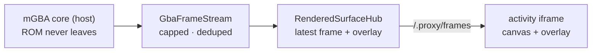

# Discord activity surface

The activity plane's rendering surface ([ADR 0047](../../docs/adr/0047-discord-activity-presence-plane.md)).

Discord blocks video publication from bot accounts, so Go Live is unavailable to
an official bot and every library that implements it depends on a normal-user
selfbot token. Activities are the supported alternative: a web app hosted in an
iframe inside a voice channel, launched by the bot through an
`EMBEDDED_APPLICATION` invite. This app is that web app.

It is a **rendering client only**. It holds no Discord credentials, no mission
authority, and no emulator core. The host feeds it frames; it draws them.
Its live lower third keeps Clankie's self-authored objective, intent, and
monologue separate from the runner-observed effect; spoken output stays on the
voice surface rather than being duplicated here.



## Running it

```bash
CLANKIE_ACTIVITY_PORT=4320 \
CLANKIE_ACTIVITY_PRODUCER_PORT=4322 \
pnpm --filter @clankie/discord-activity start
```

Only non-secret configuration is environment-supplied. The producer bearer is
minted into the credential broker on first start under provider id
`clankie_activity_producer`, exactly like the other internal Clankie bearers, so
it never reaches shell history, `ps` output, or a `.env` file.
`CLANKIE_ACTIVITY_PRODUCER_TOKEN` is a **hard startup error** — a process that
accepted both sources would silently prefer the weaker one.

Discord proxies all activity traffic through `discordsays.com`, so the server
answers both `/.proxy/*` and bare paths and local development needs an HTTPS
tunnel with a matching URL Mapping registered in the developer portal. A
relative request without the `/.proxy` prefix is refused as `blocked:csp`.

## The tunnel is a launcher-owned service

`clankie restart` starts and supervises the tunnel alongside everything else,
and `clankie health` probes it end to end. Configure it once in the operator
settings' `discord` block:

```jsonc
{
  "activityTunnelName": "clankie-activity", // cloudflared tunnel create <name>
  "activityTunnelHostname": "clankie.example.com", // the DNS route to it
}
```

Both unset means the launcher runs no tunnel and the activity stays local —
reported as healthy, because wanting it local is not a fault.

Settings alone are not enough. The launcher runs `cloudflared tunnel run <name>`,
which takes its ingress rules from `~/.cloudflared/config.yml` — the settings say
_which_ tunnel, that file says _where it points_. Create it alongside the tunnel:

```yaml
tunnel: clankie-activity
credentials-file: /Users/<you>/.cloudflared/<tunnel-uuid>.json

ingress:
  - hostname: activity.example.com
    service: http://127.0.0.1:4320 # the viewer, never the producer
  - service: http_status:404
```

Publish only the viewer. The producer on 4322 must stay on loopback, for the
reason the two-listener table below spells out.

Full first-time setup, once the hostname's zone is on Cloudflare:

```bash
cloudflared tunnel login
cloudflared tunnel create clankie-activity
cloudflared tunnel route dns clankie-activity activity.example.com
# write ~/.cloudflared/config.yml as above, set both settings, then:
clankie restart tunnel
```

The zone must be **active** in Cloudflare, not merely added. A pending zone
serves the routed hostname as a bare `*.cfargotunnel.com` CNAME that resolves to
nothing, because Cloudflare only proxies once it is authoritative — the probe
reports `unreachable` and the tunnel itself logs a clean connection, which reads
as a tunnel fault rather than an unfinished delegation.

**Use a named tunnel, not a quick one.** `cloudflared tunnel --url …` mints a
fresh `*.trycloudflare.com` hostname on every start, and the URL Mapping is
configured once in the developer portal — so a quick tunnel makes restarting the
thing that publishes him a breaking change. The predictable result: one gets
started by hand, never restarted, and outlives every deploy until its edge dies.
That is the 2026-08-01 failure, where a six-day-old quick tunnel had a live
process, a healthy server behind it, and a dead edge, and the activity rendered
blank in Discord with nothing reporting why
([ADR 0047](../../docs/adr/0047-discord-activity-presence-plane.md) owns the
plane; the incident is recorded in the launcher's tunnel service).

The probe asks the public hostname rather than the process table, because "a
`cloudflared` is running" was true for every one of those six days. It
distinguishes three states an operator repairs differently:

| Probe result           | Means                                         |
| ---------------------- | --------------------------------------------- |
| `healthy` + URL        | DNS, edge, tunnel, and origin all answered    |
| `edge up, origin down` | 5xx — the tunnel is fine, the activity is not |
| `unreachable`          | DNS or the edge is gone; restart the tunnel   |

## Two listeners, on purpose

| Listener | Bind      | Exposure                       | Purpose                             |
| -------- | --------- | ------------------------------ | ----------------------------------- |
| Viewer   | tunnelled | public via the Discord proxy   | serves the client, `/.proxy/frames` |
| Producer | 127.0.0.1 | loopback only, never tunnelled | `/producer` frame ingress           |

The producer endpoint is a **separate listener**, not a path on the viewer
server. A producer path mounted on the tunnelled server would be reachable by
anyone who can reach the activity, so frame injection is kept off the public
surface entirely; the bearer token is the second lock rather than the only one.

The activity server owns the listener, so it owns the first-run mint. The runner
only ever resolves, which avoids two processes minting different tokens. A
runner with no resolvable credential publishes nothing rather than falling back
to an unauthenticated connection.

The runner dials **out** to this endpoint (`@clankie/rendered-surface-client`)
rather than accepting an inbound connection, so the trusted runner opens no port
for an internet-facing surface to connect into.

## Bounds

- One encoded frame is capped at `RENDERED_SURFACE_FRAME_MAX_BYTES` (256 KiB);
  a real 240×160 GBA PNG lands in single-digit kilobytes.
- The frame stream rate-limits to 20fps by default and drops frames whose bytes
  are unchanged, so an idle overworld costs nothing to publish.
- A viewer whose socket backlog exceeds `maxBufferedBytes` has frames dropped
  rather than queued. Drops are counted on `droppedFrameCount`, never silent.
- The runner-side sink drops frames while disconnected rather than buffering
  them, so a reconnect resumes at the present moment instead of replaying a
  stale playthrough. Those drops are counted too.
- Producer messages are validated before they reach a viewer: a frame whose
  `byteLength` disagrees with its payload is rejected, not forwarded.
- Lifecycle messages (`stopped`) are never dropped.
- Producer disconnect invalidates the latest frame and overlay, so an ended or
  crashed session cannot remain labelled live for late viewers.
- Concurrent viewers are bounded; an over-cap viewer is closed, not queued.

## What this app is not

- Not a recorder. Only the most recent frame and overlay are held, nothing is
  persisted, and frame bytes never enter a semantic event stream — evidence
  keeps carrying the framebuffer digest instead.
- Not an authority surface. Viewer input arriving here is ambient authority and
  cannot approve privileged actions, exactly as voice and text ingress cannot.

## Eligibility

An **unverified** activity is launchable only by the app team's developers and
testers, and only in servers with fewer than 25 members — which is the personal
lab exactly. Verification is the documented path if the surface is ever made
public and is out of scope here.
