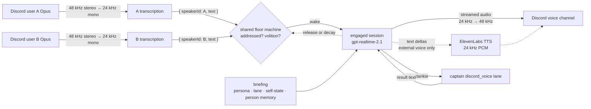
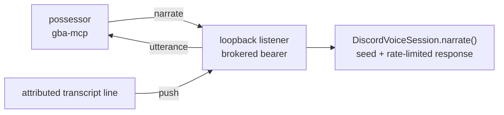

# Discord bridge

Official Discord application/bot integration only. This process never accepts a
normal-user credential: both `DISCORD_BOT_TOKEN` and `DISCORD_USER_TOKEN` are
hard startup errors, and the bot token is read from the credential broker.

Clankie's separate personal-lab user-session body lives in
[`apps/discord-user-session`](../discord-user-session/README.md)
([ADR 0048](../../docs/adr/0048-discord-user-session-transport.md)); the two
processes never share a gateway or a credential. Both consume
[`@clankie/discord-presence-core`](../../packages/discord-presence-core/README.md)
for ingress shaping, the presence lifecycle, consent, capture, and lane
addressing, so this bridge holds only bot-shaped concerns: slash commands,
voice, and the activity plane.

The bridge uses slash commands, optional bounded Discord text ingress, and
official-bot group voice. `/clankie join` discloses DAVE, the live OpenAI
realtime session's audio residency, and AI-generated speech. Under the default
`explicit` consent policy every other participant opts in with
`/clankie voice-consent`; under `presence`, room membership grants consent and
an explicit opt-out still wins. All voice-command
replies are ephemeral — the bot posts nothing into the text channel, so his
public presence is the same one a person has: sitting in the voice channel.
The residency terms reach exactly the people they bind, privately, at join
and at opt-in.

`/clankie status` reports whether the service is healthy. Everything conversational — asks, plans, ongoing work — happens through channel turns, not slash commands.

Discord is an ambient authority surface. `DISCORD_AMBIENT_ROLE_IDS` and `DISCORD_AMBIENT_USER_IDS` are comma-separated, deny-by-default bindings for the ambient command tier (person-memory); the user list names individual operators who hold that tier without a mapped role.

Voice presence is a separate tier ([ADR 0050](../../docs/adr/0050-voice-presence-authority-tier.md)). `DISCORD_VOICE_JOIN_POLICY` decides who may invoke `/clankie join` and `/clankie leave`: `ambient` (default) keeps them on the ambient binding, and `guild_members` admits any member of an allowlisted voice guild. The open policy widens voice presence only — ambient commands stay on the ambient binding. The guild allowlist is checked first either way.

Members can also just ask ([ADR 0062](../../docs/adr/0062-voice-join-by-asking.md)). The admitted message goes to the captain once, and he decides whether to call `voice_join` or `voice_leave` like any other ability. Those tools take no ids: the service stamps the authenticated actor and guild, then this bridge resolves the actor's current gateway voice channel and runs exactly the slash authority and allowlist checks before touching the media session. The official-bot tool join auto-opts-in nobody; consent still arrives through `/clankie voice-consent opt-in`. Follow-ups such as “try now” use the normal channel context rather than a separate intent model or retry state.

The enforced bridge invariant: the bot does not persist channel transcripts, infer speaker memory, or retain slash-command text after forwarding it. Message-content access is requested only when bounded text ingress is explicitly enabled. The trigger and up to the configured number of preceding messages exist only in the captain turn request and are excluded from ingress evidence.

Required configuration. First store the bot token in the credential broker:
run `clankie`, then `/auth` → “Add / update API key” → “Other…” → provider id
`discord_bot`. The token is never read from an environment variable; both
`DISCORD_BOT_TOKEN` and `DISCORD_USER_TOKEN` are hard startup errors.

The non-secret settings below can be configured once from the TUI with
`/discord` instead of a `.env`; they are stored by `@clankie/settings` at
`~/.config/clankie/settings.json`. At startup the bridge fills only _unset_
names from that file, so an explicit shell value still wins, and it logs which
names it filled. Secrets never live there — the settings schema accepts
snowflakes, booleans, and enums only, and refuses token-shaped values at the
write boundary.

```bash
DISCORD_APPLICATION_ID=...
DISCORD_GUILD_ID=...          # optional, faster command registration in development
DISCORD_AMBIENT_ROLE_IDS=...  # comma-separated roles granted the ambient command tier
DISCORD_AMBIENT_USER_IDS=...  # comma-separated user ids with the same authority, no role needed
CLANKIE_API_URL=http://127.0.0.1:4310
CLANKIE_AUTHENTICATED_SURFACE_URL=http://127.0.0.1:4310 # authenticated operator surface referenced by ingress replies
DISCORD_BRIDGE_RECEIPT_PATH=$HOME/.local/state/clankie/discord-live-receipts.jsonl # optional absolute override

# Optional bounded text ingress (requires Message Content Intent in the Discord developer portal)
DISCORD_TEXT_INGRESS_ENABLED=true
DISCORD_INGRESS_GUILD_IDS=...        # deny-by-default guild allowlist
DISCORD_INGRESS_CHANNEL_IDS=...      # optional; empty admits every channel in the allowlisted guilds
DISCORD_INGRESS_DM_POLICY=owner_only # deny | owner_only | allowlist
DISCORD_OWNER_USER_ID=...            # required for owner_only DMs to be admitted
DISCORD_INGRESS_DM_USER_IDS=...      # used only by the allowlist DM policy
DISCORD_INGRESS_CONTEXT_MESSAGES=10  # transient preceding messages, 0-50

# Optional official-bot group voice
DISCORD_VOICE_ENABLED=true
DISCORD_VOICE_GUILD_IDS=...          # deny-by-default guild allowlist
DISCORD_VOICE_CHANNEL_IDS=...        # optional; empty admits every voice channel in the allowlisted guilds
DISCORD_VOICE_JOIN_POLICY=ambient    # ambient | guild_members — who may /clankie join and /clankie leave
DISCORD_VOICE_CONSENT_POLICY=explicit # explicit | presence — who may be transcribed
DISCORD_VOICE_CHANNEL_ID=...         # one private channel used by readiness/live proof
CLANKIE_VOICE_REALTIME_MODEL=gpt-realtime-2.1       # optional; engaged conversation tier
CLANKIE_VOICE_TRANSCRIBE_MODEL=gpt-realtime-whisper # optional; dormant listener tier
CLANKIE_VOICE_REALTIME_VOICE=marin                  # optional
CLANKIE_VOICE_TTS_PROVIDER=openai    # optional; openai | elevenlabs (ADR 0070) — usually set from /voice in the TUI
CLANKIE_VOICE_ELEVENLABS_VOICE_ID=...               # required with the elevenlabs provider; public voice id
CLANKIE_VOICE_ELEVENLABS_MODEL_ID=eleven_flash_v2_5 # optional; elevenlabs provider only
CLANKIE_VOICE_STT_LANGUAGE=...       # optional; unset keeps the pinned default, empty restores auto-detect
CLANKIE_VOICE_TRUNCATION_RETENTION=0.7              # optional; session.truncation retention ratio in (0, 1]
CLANKIE_VOICE_POST_INSTRUCTIONS_TOKEN_LIMIT=12000   # optional; 1000-128000
CLANKIE_VOICE_SESSION_LIFETIME_MS=...               # optional; overrides the runtime's session lifetime cap
CLANKIE_VOICE_DECAY_WINDOW_MS=60000                 # optional; floor decay window
CLANKIE_VOICE_IDLE_LEAVE_MS=900000                  # optional; idle auto-leave, capped at 24 h
CLANKIE_VOICE_VOLITION_MODEL=gpt-4o-mini            # optional; the volition gate's text model

# Optional activity plane (ADR 0047) — rendered surfaces in a voice channel
DISCORD_ACTIVITY_APPLICATION_ID_GBA=...        # embedded application id for the gba_emulator surface

# Optional possessor voice seam (ADR 0064) — a harness driving the body, commentating
# Off by default; needs a live voice session. Persistently enabled via
# `discord.possessorVoiceEnabled: true` in the operator settings; the env name
# remains as the override.
CLANKIE_POSSESSOR_VOICE_ENABLED=true
CLANKIE_POSSESSOR_VOICE_PORT=4323              # optional; loopback listener port
```

## Activity plane

Discord blocks video publication from bot accounts, so the bot cannot Go Live.
The supported path is an **activity**: a web app in an iframe inside the voice
channel ([ADR 0047](../../docs/adr/0047-discord-activity-presence-plane.md),
served by [`apps/discord-activity`](../discord-activity/README.md)).

`discord.presence.activity_start` creates an `EMBEDDED_APPLICATION` invite for
the target voice channel and posts the launch link; `activity_stop` revokes the
channel's invites for surfaces this bridge configures. Both are
`publish-external` and run on the ordinary policy-gated presence path — no new
credential class, and `DISCORD_USER_TOKEN` remains a hard startup error.

Surfaces are deny-by-default: a surface with no configured application id cannot
be launched, so the plane stays off until an owner sets the variable above. A
model names a surface from the frozen catalog, never a Discord application id.

Stop is best-effort by design. Discord cannot evict viewers already inside a
running instance, so stop means "no further launches" — the frame stream going
dark is what actually ends the surface.

An **unverified** activity is launchable only by the app team's developers and
testers, and only in servers with fewer than 25 members.

`clankie restart` starts the clankie service and the bridge in dependency
order and health gates each one; `clankie restart discord` restarts
the bridge alone ([ADR 0055](../../docs/adr/0055-launcher-owned-local-services.md)).
Use it rather than a hand-rolled kill-and-start sequence — it refuses to signal a
pid it does not own, and it reads allowlists from settings.json instead of an env
prefix that can drift from them.

Start the clankie service once before the bridge. The service mints the
internal `clankie_discord_bridge` and `clankie_discord_voice_bridge` bearers in
the credential broker and authenticates them as the `discord_text` and
`discord_voice` captain lanes. The bridge resolves both directly from the
broker; `CLANKIE_CAPTAIN_TOKEN` is a hard startup error and no shared shell
secret is required. Voice reuses the brokered `openai` API credential;
`OPENAI_API_KEY` is a hard startup error when voice is enabled. When the
external voice is configured ([ADR 0070](../../docs/adr/0070-external-voice-via-streaming-tts.md)),
speech synthesis additionally uses the brokered `elevenlabs` API credential,
and `ELEVENLABS_API_KEY` / `XI_API_KEY` are hard startup errors the same way.

The bridge is a channel adapter. It never owns model credentials or merge authority.

Run `pnpm discord:readiness` before starting the bridge. It verifies the two
broker entries, application identity, Message Content Intent, target-guild bot
membership, ingress/presence allowlist alignment, and the authenticated
service composition. `--json` emits a content-free machine-readable
report suitable for an evidence artifact.

The bridge appends mode-0600 JSONL live receipts for gateway readiness, bounded
ingress outcomes, reply message ids, person-memory proposal/recall, and
graceful stop. Receipts contain bounded ids and typed outcomes only—never
message bodies, Discord names, or credentials.

After the live ceremony, run `pnpm discord:live-proof`. It requires an actual
admitted-and-settled text delivery with a reply id. Partial or fixture-only
receipts cannot pass this gate.

## Text ingress (ADR 0024 P2)

When `DISCORD_TEXT_INGRESS_ENABLED=true`, owner DMs and messages in the explicit guild/channel allowlists become bounded `DiscordPresenceChannelTurnRequest` values. Discord message IDs are the delivery idempotency keys. Bot/self messages, unallowlisted traffic, empty messages, and conflicting redeliveries stop before a captain turn and emit content-free ingress evidence. Context history is fetched only after policy admission, capped at 50 messages, framed as untrusted turn-only input, and never written to bridge state or ingress logs.

The service authenticates the bridge as the `discord_text` captain source and addresses the `discord_presence` lane. Trigger and context text are fenced and labelled untrusted; uploaded images and GIF-picker previews are references, with at most the newest context visual carried into a turn. Text turns are one-shot, so channel history never enters durable session state, and the adapter retains no continuation cursor after the result. A settled response becomes a typed `discord.presence.reply` and passes through the existing narrative policy, rate ledger, credential broker, and bot REST runtime.

While an addressed turn (a DM, a mention, or one of his names) is being composed, the ingress posts policy-gated `discord.presence.typing_start` writes so the channel shows him typing, refreshed until the turn settles; the reply then clears the indicator. Unprompted turns — messages he is merely reading and may decline — never signal typing, and a failed typing post stops the refresh without touching the turn.

One-shot Discord text turns have a 60-second captain deadline. A wedged model run is aborted with `captain_turn_timeout`, which settles ingress and stops the typing refresh instead of leaving the channel lit indefinitely. The bridge independently stops refreshing after 60 seconds, so a frozen service or HTTP connection cannot hold cosmetic presence open either.

`/clankie person-memory` proposes or recalls long-term person facts under the
stable guild/user identity. A proposal contains an explicit bounded fact, not a
transcript, and applies directly, upserted by fact id. Ambient Discord cannot
export or delete person memory. Recall enforces guild/channel visibility and
never returns operator-private facts. Run
`pnpm discord:person-memory-live-proof` after proposing a fact, restarting the
clankie service, and recalling that person from Discord. The gate requires the
exact generated fact id to be recalled from a different service instance,
proving the write path and durable restart behavior.

## Official-bot group voice

`@discordjs/voice` is the single media owner for the official bot
([ADR 0045](../../docs/adr/0045-official-bot-dave-group-voice.md)); the
conversation architecture is the two-tier realtime flow from
[ADR 0057](../../docs/adr/0057-realtime-voice-with-captain-handoff.md). Join
fails closed unless DAVE negotiates a positive protocol, and the bridge
subscribes only to opted-in Discord user ids, so unconsented audio never
reaches the realtime input buffer.



Dormant, one `gpt-realtime-whisper` session per permitted speaker hears that
speaker's authenticated Discord stream and answers nothing. Their attributed
transcripts converge in one shared floor. When the repository-owned floor
machine decides he has a
reason to speak — someone addressed him (the same word-boundary name matching
as the text plane, with phonetic tolerance for transcription artifacts), or a
rate-capped volition call decides he has something worth saying — the engaged
`gpt-realtime-2.1` session opens, is seeded with the service-composed
briefing plus the recent attributed JSONL transcript window, and answers with
streamed audio. Later approved utterances enter as structured text; overlapping
room audio is never interleaved and attributed by arrival order.
`response.create` is always explicit; no utterance is auto-answered. The floor
releases on an explicit closing phrase or by decay
(`CLANKIE_VOICE_DECAY_WINDOW_MS`), and the engaged session is held connected
briefly across a release so a conversation that resumes wakes instantly.

How he sounds is configurable from the TUI's `/voice` wizard
([ADR 0070](../../docs/adr/0070-external-voice-via-streaming-tts.md)). The
default is the realtime model's own voice (`CLANKIE_VOICE_REALTIME_VOICE`).
With the `elevenlabs` provider the engaged session runs in text modality and
its deltas stream through an ElevenLabs multi-context TTS WebSocket — one
context per response, flushed when the response's text completes, closed early
on barge-in — whose 24 kHz PCM feeds the same playback path. The ears, floor
machine, `ask_clankie` fence, and receipts are identical in both modes.

The engaged session uses `ask_clankie` for the unchanged continuing
`discord_voice` captain lane and bounded local tools for YouTube search and
music transport. Conversation and music control never pay a captain turn;
anything else that touches the world does. Nothing said in voice can authorize
privileged work, and the realtime model holds no privileged tool to be talked
into using.

Audio residency: local PCM buffers are memory-only and zeroed after use, and
the live OpenAI realtime session keeps the call's conversation on OpenAI's
servers for as long as the call lasts. Under the external voice, the words
Clankie chooses to say additionally transit ElevenLabs — participant audio
never does — and the disclosures say so. The ephemeral `/clankie join` and
opt-in replies state exactly that to the participant they bind, and
`/clankie voice-status` reports the DAVE version, consent and capture counts,
and the current floor posture. An idle call ends itself
after `CLANKIE_VOICE_IDLE_LEAVE_MS` with no conversational sign of life.

Barge-in is deliberate: the floor holder speaking over him, or a re-address,
truncates playback, while crosstalk between other people lets him finish.
Every transition emits a content-free receipt carrying only ids, counts,
durations, exit codes, DAVE version, and typed outcomes. A delivery id now
joins utterance, transcription outcome, floor decision, realtime response,
tool call/result, music queue, `yt-dlp`/FFmpeg, and player checkpoints without
storing the transcript, query, URL, model text, or audio. One `stayId` stamps
every receipt from join to leave. `discord.voice.response` reports first-audio latency separately for
waking and continuing turns, captain handoff latency, whether the turn took
the fast path, and realtime token counts when the provider sends them;
`discord.voice.volition` reports the offered/taken/suppressed counters, so "he
talks too much" and "he never speaks up" are both falsifiable against a
number. Play commentary that is seeded but not spoken emits
`discord.voice.possessor_narration_suppressed` (`playing` or `rate_limited`)
with the same `deliveryId` as the journal turn and the submission.

Run `pnpm discord:voice-readiness` before starting. Beyond credentials,
allowlists, native Opus, and service composition, it validates the
realtime configuration, exercises the service's voice-briefing endpoint
with zero consented ids, and runs a live wake-transition probe: a real dormant
listener session opens, then — with the listener still connected, exactly like
a wake — a real engaged session must produce a response. Run
`pnpm discord:voice-live-proof` after a session with at least three consenting
human speakers. The live evaluator requires a positive DAVE protocol, three
unique explicit consents, three attributed speakers with captain round trips,
an observed overlap plus a deliberate interruption, no failure receipt, a
clean leave, a DAVE leave/rejoin recovery, and two-way gameplay possessor seam
delivery. Receipt logs are cumulative: evaluation selects the latest ceremony
candidate, so an incomplete or failed newer session cannot be masked by old
success, while a trailing clean reconnect-only session does not displace the
main proof.

The reviewed inactive ClankVox schema-1 compatibility parser remains in
[`src/clankvox-ipc.ts`](src/clankvox-ipc.ts); no AGPL ClankVox source is
imported or executed.

## Possessor voice seam (ADR 0064)

When `CLANKIE_POSSESSOR_VOICE_ENABLED=true` and a realtime voice session exists,
the bridge binds a loopback listener on `127.0.0.1:4323/possessor`. A harness
possessing Clankie's GBA body ([`apps/gba-mcp`](../gba-mcp/README.md)) holds no
gateway and therefore no live presence claim, so it cannot speak for itself. It
reports what the body just did; the bridge — which does hold the gateway —
seeds that report into the live conversation session and lets the persona
compose the words.

Two possessors use this listener, under the same flag and the same fence: an
external MCP harness, and the service's asked-play host when Clankie is playing
because someone asked him to
([ADR 0067](../../docs/adr/0067-a-play-request-speaks-through-the-possessor-seam.md)).
With the flag off, both stay silent and both keep working.



The bearer is minted into the credential broker on first start under provider id
`clankie_possessor_voice`, exactly like the other internal Clankie bearers;
`CLANKIE_POSSESSOR_VOICE_TOKEN` is a **hard startup error**. The listener binds
loopback only and is never tunnelled.

Two things this seam deliberately cannot do: a possessor cannot choose an
audience or reach any other presence action (the wire carries `narrate` and
`utterance` and nothing else), and it cannot make him say a specific sentence —
narration is context, never a script. Hearing is push-only, so the bridge's
transcript retention stays at zero.

The bridge adds content-free `possessor_connection`, `possessor_room`,
`possessor_transcript_delivery`, `possessor_narration_submission`, and
`possessor_refusal` receipts. They carry only local delivery ids, counts,
listening state, and a bounded reason code. Narration submission is emitted only
after the live persona accepts the event; a refusal emits no success-shaped
submission and fails the two-way live gate. Transcript and narration text are
rejected by the receipt schema.

## Presence actions (ADR 0024 P1)

Policy-gated bot presence actions (reply, react, send, …) execute through the clankie service:

```bash
CLANKIE_DISCORD_PRESENCE_RUNTIME_MODULE=$PWD/apps/discord-bridge/src/presence-runtime-module.ts
DISCORD_PRESENCE_GUILD_IDS=...   # comma-separated broker grant allowlist
DISCORD_PRESENCE_CHANNEL_IDS=... # comma-separated broker grant allowlist
```

The module loads `discord_bot` only through the credential broker. Both
`DISCORD_BOT_TOKEN` and `DISCORD_USER_TOKEN` are hard startup errors; user-session
transport and Go Live are not accepted on this path.
See [`ADR 0024`](../../docs/adr/0024-discord-dual-plane-presence.md).

The bridge owns one official-bot presence session keyed by application id. Gateway readiness,
resume/reconnect/disconnect, invalidation, and the bot's own voice-state updates publish typed
phase transitions to the service over the authenticated captain channel. The service
projects that stream before exposing or executing presence actions; `degraded`, `failed`, and
`off` expose no act tools. Operator status therefore comes from semantic events rather than bot
log text, and an action payload can never manufacture the phase it requires. Each authenticated
action carries the live session id, phase, and monotonic revision. The service requires that
claim to match its latest validated session record as well as the durable exposure. A loss-phase
callback synchronously advances the live revision and fences the advertised tool catalog before
durable publication can await I/O; bounded publication retries then reconcile the durable record.
After a service restart, act execution remains fail-closed until an authenticated lifecycle
delivery revalidates the live watermark; durable session replay alone restores status only.
