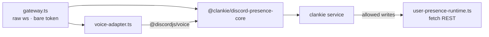

# @clankie/discord-user-session

Clankie's personal-lab Discord body: a normal-user session that participates in
text and voice as the _same_ character the official bot is
([ADR 0048](../../docs/adr/0048-discord-user-session-transport.md)).

> **Discord forbids automating normal user accounts.** This plane is off by
> default and reachable only after the owner records a durable acceptance of
> the account and ToS risk. That risk is the account owner's.
>
> `/discord` Active body chooses which process is the mouth. The launcher
> starts only that one. This process talks, watches, and Go Lives only when
> it is active.

## Why a second process

[ADR 0024](../../docs/adr/0024-discord-dual-plane-presence.md) requires that bot
and user credentials never share a gateway. A separate process makes that
structural instead of conventional, and keeps a normal-user token out of the
same process image as the official bot token. Everything above the transport —
ingress shaping, captain lane addressing, consent, capture, memory, receipts —
is `@clankie/discord-presence-core`, shared with the bot bridge.

The [credential guide](../../docs/credentials.md) distinguishes the bare normal-
user token from the official bot token and Clankie's four local bridge bearers.



## Three gates, all fail-closed

`readiness.ts` checks these in order, cheapest first. The brokered token is
resolved **last**, so a run that will be refused never materialises a user
credential in process memory.

1. `DISCORD_USER_SESSION_ENABLED=true` plus non-empty guild/channel allowlists.
2. A durable, non-revoked owner opt-in bound to the character and recorded
   scope. Configuration may narrow that scope, never widen it.
3. A brokered `discord_user_session` credential. `DISCORD_USER_TOKEN` in the
   environment is a startup error.

Run `pnpm --filter @clankie/discord-user-session readiness` to diagnose a
refusal without connecting.

## Recording the opt-in

Use the TUI's direct `/discord` flow to store the user token, set allowlists,
record the acknowledgement, and select the active body. It calls the
operator-authenticated service route without exposing the operator bearer in a
shell. Revocation stops the next action rather than waiting for grant expiry.

## Configuration

| Variable                                       | Purpose                                                                                    |
| ---------------------------------------------- | ------------------------------------------------------------------------------------------ |
| `DISCORD_USER_SESSION_ENABLED`                 | Master switch; default off                                                                 |
| `DISCORD_USER_SESSION_GUILD_IDS`               | Allowlist, comma-separated, required                                                       |
| `DISCORD_USER_SESSION_CHANNEL_IDS`             | Allowlist, comma-separated, required                                                       |
| `DISCORD_USER_SESSION_DM_POLICY`               | `deny` \| `owner_only` (default) \| `allowlist`                                            |
| `DISCORD_USER_SESSION_DM_USER_IDS`             | DM allowlist when `dmPolicy=allowlist`                                                     |
| `DISCORD_USER_SESSION_VOICE_ENABLED`           | Voice participation; default off                                                           |
| `DISCORD_USER_SESSION_VOICE_CHANNEL_IDS`       | Voice channel allowlist                                                                    |
| `DISCORD_USER_SESSION_RECEIPT_PATH`            | Absolute path outside the workspace                                                        |
| `CLANKIE_DISCORD_USER_PRESENCE_RUNTIME_MODULE` | Service load target for [`src/presence-runtime-module.ts`](src/presence-runtime-module.ts) |

At startup the plane fills unset `DISCORD_*` names from the operator settings
file (`@clankie/settings`, configured with `/discord` in the TUI), including
the lab-body allowlists. Configuration may narrow the recorded opt-in, never
widen it.

## Capability differences from the bot plane

| Capability                   | Bot | User session | Why                                                                                               |
| ---------------------------- | --- | ------------ | ------------------------------------------------------------------------------------------------- |
| Text, reactions, threads     | ✅  | ✅           | Shared catalogue, one lane, one memory                                                            |
| Group voice (DAVE, realtime) | ✅  | ✅           | Same media owner via a custom gateway adapter                                                     |
| Slash commands               | ✅  | ❌           | A user account cannot register them                                                               |
| Ambient context messages     | ✅  | ❌           | Would require reading channels wholesale                                                          |
| Embedded activities          | ✅  | ❌           | Owned by the bot application ([ADR 0047](../../docs/adr/0047-discord-activity-presence-plane.md)) |
| Watch a screen share         | ❌  | ✅           | Only when this body is active; OP20 + Vox stills                                                  |
| Go Live                      | ❌  | ✅           | Only when this body is active; OP18/OP22 + Vox                                                    |

## Watching screen shares

The official bot cannot receive Go Live video. This process can. When someone
in an allowlisted channel hits Share Screen, the lab body joins the channel,
sends OP20 `STREAM_WATCH`, and Vox decodes one JPEG per second. The service
keeps a four-frame rolling window, and the captain looks across those
chronological samples with `observe_share`; the active lab body remains the
one mouth.

This is distinct from the public Activity and from publishing Clankie's own Go
Live stream; the [Discord media guide](../../docs/discord-media.md) diagrams all
three paths.

```bash
pnpm --filter @clankie/vox build
```

Enable the body in `/discord` → Lab user body (token, allowlists that include
the voice channel, ToS opt-in), then `clankie restart`. After a real share:

```bash
pnpm --filter @clankie/discord-user-session live-proof
# or wait up to two minutes while someone shares:
pnpm --filter @clankie/discord-user-session live-proof -- --wait=120
```

The gate requires a ready receipt, `watch_connected` with `decoder=ready`, and
one decoded still of that same user after the watch. Deterministic tests cannot
mint those receipts.

## Go Live publish

`go_live_start` is refused on the official bot. On this process it:

1. Joins the target voice channel as the active lab body
2. Sends OP18 `STREAM_CREATE`, then OP22 unpause
3. Hands stream-server credentials to Vox through `@clankie/vox-client`
4. Plays an optional `sourceUrl`, or pumps the live activity PNG snapshot
   (`GET 127.0.0.1:4322/snapshot`) when he is already on the activity plane

Songs go through the model, not a chat parser. Text uses the captain's
`youtube_search` / `music_play` tools (they POST to this process on
`/music/*`); voice uses the same tool names on the realtime session. The
current Go Live URL pipeline is video-only and strips source audio. Audible
synchronized music remains unavailable on the lab body until its ordinary
voice media path moves onto Vox; the official bot is down while this body is
active. Native end-of-track completion is not connected to the shared queue on
this path, so queued tracks do not advance automatically.

Voice presence is agentic too ([ADR 0062](../../docs/adr/0062-voice-join-by-asking.md)).
The captain's argument-free `voice_join` / `voice_leave` tools POST to this
process on `/voice/*`; the gateway supplies the owner's current channel. Only
`DISCORD_OWNER_USER_ID` may move the lab body, and the recorded guild/channel
allowlists still bind the result. A new join auto-opts that authenticated owner
into live speaker-attributed transcription, which the captain discloses in his
reply.

Reactions and thread actions are grounded in the current ingress message. The
same captain `discord_watch_start` / `discord_watch_stop` tools map to Go Live
on this body, but only after the gateway freshly resolves the owner in the
active allowlisted voice channel.

Production uses `@clankie/vox` through the separately licensed
`@clankie/vox-client` process boundary. Without a running lab process,
`go_live_start` is unavailable.

**Account risk.** Automating a normal Discord account violates Discord's terms
and can get the account permanently terminated. That risk is the owner's to
accept, which is why the plane stays behind the recorded opt-in.
