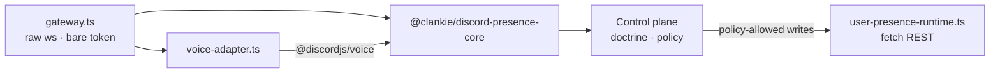

# @clankie/discord-user-session

Clankie's personal-lab Discord body: a normal-user session that participates in
text and voice as the _same_ character the official bot is
([ADR 0048](../../docs/adr/0048-discord-user-session-transport.md)).

> **Discord forbids automating normal user accounts.** This plane is off by
> default, denied outright by high-assurance and team doctrine profiles, and
> reachable only after the owner records a durable acceptance of the account and
> ToS risk. That risk is the account owner's.

## Why a second process

[ADR 0024](../../docs/adr/0024-discord-dual-plane-presence.md) requires that bot
and user credentials never share a gateway. A separate process makes that
structural instead of conventional, and keeps a normal-user token out of the
same process image as the official bot token. Everything above the transport —
ingress shaping, Eve lane addressing, consent, capture, memory, receipts — is
`@clankie/discord-presence-core`, shared with the bot bridge.



## Four gates, all fail-closed

`readiness.ts` checks these in order, cheapest first. The brokered token is
resolved **last**, so a run that will be refused never materialises a user
credential in process memory.

1. `DISCORD_USER_SESSION_ENABLED=true` plus non-empty guild/channel allowlists.
2. Doctrine permits `discord.transport.user_session_connect` (evaluated when the
   opt-in is recorded, so a denying profile means the opt-in cannot exist).
3. A durable, non-revoked owner opt-in bound to the current doctrine profile
   hash and character. Configuration may narrow its recorded scope, never widen
   it.
4. A brokered `discord_user_session` credential. `DISCORD_USER_TOKEN` in the
   environment is a startup error.

Run `pnpm --filter @clankie/discord-user-session readiness` to diagnose a
refusal without connecting.

## Recording the opt-in

Operator-authenticated, on the control plane:

```bash
curl -X POST http://127.0.0.1:4310/v1/discord/user-session/opt-in \
  -H "authorization: Bearer $CLANKIE_OPERATOR_TOKEN" \
  -H 'content-type: application/json' \
  -d '{"schemaVersion":1,"characterId":"clankie",
       "acknowledgement":"I accept Discord ToS and account risk for this lab.",
       "guildIds":["..."],"channelIds":["..."],"dmPolicy":"owner_only"}'
```

`DELETE` on the same route revokes it; revocation stops the next action rather
than waiting for grant expiry. Recompiling doctrine invalidates the opt-in — an
acceptance must not survive a policy change it was never weighed against.

## Configuration

| Variable                                       | Purpose                                                        |
| ---------------------------------------------- | -------------------------------------------------------------- |
| `DISCORD_USER_SESSION_ENABLED`                 | Master switch; default off                                     |
| `DISCORD_USER_SESSION_GUILD_IDS`               | Allowlist, comma-separated, required                           |
| `DISCORD_USER_SESSION_CHANNEL_IDS`             | Allowlist, comma-separated, required                           |
| `DISCORD_USER_SESSION_DM_POLICY`               | `deny` \| `owner_only` (default) \| `allowlist`                |
| `DISCORD_USER_SESSION_DM_USER_IDS`             | DM allowlist when `dmPolicy=allowlist`                         |
| `DISCORD_USER_SESSION_VOICE_ENABLED`           | Voice participation; default off                               |
| `DISCORD_USER_SESSION_VOICE_CHANNEL_IDS`       | Voice channel allowlist                                        |
| `DISCORD_USER_SESSION_RECEIPT_PATH`            | Absolute path outside the workspace                            |
| `CLANKIE_DISCORD_USER_PRESENCE_RUNTIME_MODULE` | Control-plane load target for `src/presence-runtime-module.ts` |

At startup the plane fills unset `DISCORD_*` names from the operator settings
file (`@clankie/settings`, configured with `/discord` in the TUI). That schema
carries no `DISCORD_USER_SESSION_*` fields yet, so today it supplies only the
shared `DISCORD_OWNER_USER_ID`; this plane's allowlists still come from the
environment and remain ceilinged by the recorded opt-in either way.

## Capability differences from the bot plane

| Capability                  | Bot | User session | Why                                                                                               |
| --------------------------- | --- | ------------ | ------------------------------------------------------------------------------------------------- |
| Text, reactions, threads    | ✅  | ✅           | Shared catalogue, one lane, one memory                                                            |
| Group voice (DAVE, STT/TTS) | ✅  | ✅           | Same media owner via a custom gateway adapter                                                     |
| Slash commands              | ✅  | ❌           | A user account cannot register them                                                               |
| Mission threads/projector   | ✅  | ❌           | Bot-shaped ceremony                                                                               |
| Ambient context messages    | ✅  | ❌           | Would require reading channels wholesale                                                          |
| Embedded activities         | ✅  | ❌           | Owned by the bot application ([ADR 0047](../../docs/adr/0047-discord-activity-presence-plane.md)) |
| Go Live                     | ❌  | ✅\*         | Requires the optional GPL selfbot stack — see below                                               |

\* Implemented, but inert until an operator installs the optional stack.

## Go Live media (VUH-841)

Discord blocks video from bot accounts, so publishing a stream requires a
**selfbot** transport. `discord.js-selfbot-v13` is **GPL-3.0**; this repository
is Apache-2.0, and [ADR 0045](../../docs/adr/0045-official-bot-dave-group-voice.md)
already refused an AGPL import on exactly that basis.

The dependency is therefore **not declared in this workspace**. `go-live-media.ts`
imports it dynamically at runtime, so the Apache-2.0 dependency graph, the
committed lockfile, and CI stay free of copyleft transport, and the capability
stays as opt-in as ADR 0024 requires. Tests inject a fake module pair, so the
whole publication path is exercised without ever importing it.

To enable it, deliberately:

```bash
pnpm --filter @clankie/discord-user-session add \
  @dank074/discord-video-stream discord.js-selfbot-v13
```

Then allow the native build scripts in `pnpm-workspace.yaml`, or the stream
fails at runtime with no useful error:

```yaml
allowBuilds:
  node-av: true
  node-datachannel: true
```

Without the install, `go_live_start` throws
`discord_presence_go_live_media_unavailable` with the install hint. Failing
closed is deliberate: silently succeeding would report a stream nobody can
watch.

**Account risk.** Automating a normal Discord account violates Discord's terms
and can get the account permanently terminated. The library also tracks a
reverse-engineered protocol and breaks when Discord changes it. That risk is the
owner's to accept, which is why this path is lab-profile-only and denied by the
high-assurance and team profiles.
