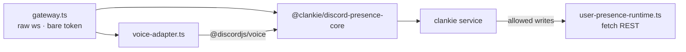

# @clankie/discord-user-session

Clankie's personal-lab Discord body: a normal-user session that participates in
text and voice as the _same_ character the official bot is
([ADR 0048](../../docs/adr/0048-discord-user-session-transport.md)).

> **Discord forbids automating normal user accounts.** This plane is off by
> default and reachable only after the owner records a durable acceptance of
> the account and ToS risk. That risk is the account owner's.
>
> `/discord` Active body chooses which process is the mouth. The launcher
> starts only that one. This process talks, watches, and Go Lives only when
> it is active.

## Why a second process

[ADR 0024](../../docs/adr/0024-discord-dual-plane-presence.md) requires that bot
and user credentials never share a gateway. A separate process makes that
structural instead of conventional, and keeps a normal-user token out of the
same process image as the official bot token. Everything above the transport —
ingress shaping, captain lane addressing, consent, capture, memory, receipts —
is `@clankie/discord-presence-core`, shared with the bot bridge.



## Three gates, all fail-closed

`readiness.ts` checks these in order, cheapest first. The brokered token is
resolved **last**, so a run that will be refused never materialises a user
credential in process memory.

1. `DISCORD_USER_SESSION_ENABLED=true` plus non-empty guild/channel allowlists.
2. A durable, non-revoked owner opt-in bound to the current profile hash and
   character. Configuration may narrow its recorded scope, never widen it.
3. A brokered `discord_user_session` credential. `DISCORD_USER_TOKEN` in the
   environment is a startup error.

Run `pnpm --filter @clankie/discord-user-session readiness` to diagnose a
refusal without connecting.

## Recording the opt-in

Operator-authenticated, on the clankie service:

```bash
curl -X POST http://127.0.0.1:4310/v1/discord/user-session/opt-in \
  -H "authorization: Bearer $CLANKIE_OPERATOR_TOKEN" \
  -H 'content-type: application/json' \
  -d '{"schemaVersion":1,"characterId":"clankie",
       "acknowledgement":"I accept Discord ToS and account risk for this lab.",
       "guildIds":["..."],"channelIds":["..."],"dmPolicy":"owner_only"}'
```

`DELETE` on the same route revokes it; revocation stops the next action rather
than waiting for grant expiry. The opt-in is bound to the profile hash recorded
at acceptance, and a mismatch invalidates it.

## Configuration

| Variable                                       | Purpose                                                  |
| ---------------------------------------------- | -------------------------------------------------------- |
| `DISCORD_USER_SESSION_ENABLED`                 | Master switch; default off                               |
| `DISCORD_USER_SESSION_GUILD_IDS`               | Allowlist, comma-separated, required                     |
| `DISCORD_USER_SESSION_CHANNEL_IDS`             | Allowlist, comma-separated, required                     |
| `DISCORD_USER_SESSION_DM_POLICY`               | `deny` \| `owner_only` (default) \| `allowlist`          |
| `DISCORD_USER_SESSION_DM_USER_IDS`             | DM allowlist when `dmPolicy=allowlist`                   |
| `DISCORD_USER_SESSION_VOICE_ENABLED`           | Voice participation; default off                         |
| `DISCORD_USER_SESSION_VOICE_CHANNEL_IDS`       | Voice channel allowlist                                  |
| `DISCORD_USER_SESSION_RECEIPT_PATH`            | Absolute path outside the workspace                      |
| `CLANKIE_DISCORD_USER_PRESENCE_RUNTIME_MODULE` | Service load target for `src/presence-runtime-module.ts` |

At startup the plane fills unset `DISCORD_*` names from the operator settings
file (`@clankie/settings`, configured with `/discord` in the TUI), including
the lab-body allowlists. Configuration may narrow the recorded opt-in, never
widen it.

## Capability differences from the bot plane

| Capability                   | Bot | User session | Why                                                                                               |
| ---------------------------- | --- | ------------ | ------------------------------------------------------------------------------------------------- |
| Text, reactions, threads     | ✅  | ✅           | Shared catalogue, one lane, one memory                                                            |
| Group voice (DAVE, realtime) | ✅  | ✅           | Same media owner via a custom gateway adapter                                                     |
| Slash commands               | ✅  | ❌           | A user account cannot register them                                                               |
| Ambient context messages     | ✅  | ❌           | Would require reading channels wholesale                                                          |
| Embedded activities          | ✅  | ❌           | Owned by the bot application ([ADR 0047](../../docs/adr/0047-discord-activity-presence-plane.md)) |
| Watch a screen share         | ❌  | ✅           | Only when this body is active; OP20 + ClankVox stills                                             |
| Go Live                      | ❌  | ✅           | Only when this body is active; OP18/OP22 + ClankVox                                               |

## Watching screen shares

The official bot cannot receive Go Live video. This process can. When someone
in an allowlisted channel hits Share Screen, the lab body joins muted/deafened,
sends OP20 `STREAM_WATCH`, and — if a ClankVox binary is configured — decodes
sampled JPEGs. The captain looks with `observe_share`. The bot keeps talking.

```bash
# Build ClankVox from its own AGPL tree, then:
cp /path/to/clankvox ~/.clankie/bin/clankvox
# or
export CLANKVOX_BIN=/path/to/clankvox
```

Enable the body in `/discord` → Lab user body (token, allowlists that include
the voice channel, ToS opt-in), then `clankie restart`. After a real share:

```bash
pnpm --filter @clankie/discord-user-session live-proof
# or wait up to two minutes while someone shares:
pnpm --filter @clankie/discord-user-session live-proof -- --wait=120
```

The gate requires a ready receipt, `watch_connected` with `decoder=ready`, and
one decoded still of that same user after the watch. Deterministic tests cannot
mint those receipts.

## Go Live publish

`go_live_start` is refused on the official bot. On this process it:

1. Joins the target voice channel muted and deafened
2. Sends OP18 `STREAM_CREATE`, then OP22 unpause
3. Hands stream-server credentials to ClankVox
4. Plays an optional `sourceUrl`, or pumps the live activity PNG snapshot
   (`GET 127.0.0.1:4322/snapshot`) when he is already on the activity plane

Songs go through the model, not a chat parser. Text uses the captain's
`youtube_search` / `music_play` tools (they POST to this process on
`/music/*`); voice uses the same tool names on the realtime session. Both
hit one queue. On this body the sink is Go Live video. On the official bot
the same queue plays audio in voice. One track never uses both sinks.

Voice presence is agentic too ([ADR 0062](../../docs/adr/0062-voice-join-by-asking.md)).
The captain's argument-free `voice_join` / `voice_leave` tools POST to this
process on `/voice/*`; the gateway supplies the owner's current channel. Only
`DISCORD_OWNER_USER_ID` may move the lab body, and the recorded guild/channel
allowlists still bind the result. A new join auto-opts that authenticated owner
into live speaker-attributed transcription, which the captain discloses in his
reply.

A leftover optional GPL selfbot publisher (`go-live-media.ts`) can still be
injected in tests. Production uses ClankVox. Without a running lab process,
`go_live_start` throws `discord_presence_go_live_media_unavailable`.

**Account risk.** Automating a normal Discord account violates Discord's terms
and can get the account permanently terminated. That risk is the owner's to
accept, which is why the plane stays behind the recorded opt-in.
