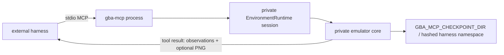

# Isolated GBA emulator MCP harness

`@clankie/gba-mcp` is a contract sandbox for coding harnesses. Every stdio
process owns one private emulator core, adapter, `EnvironmentRuntime`, session,
temporary runtime parent, and default checkpoint directory. Clean EOF, SIGINT,
and SIGTERM remove invocation-local state. SIGKILL cannot run cleanup and may
leave an OS temporary directory behind.

```bash
pnpm --filter @clankie/gba-mcp start
pnpm --filter @clankie/gba-mcp probe
```

The deterministic core double is the default. Real media is opt-in and explicit:

- `GBA_MCP_ROM_PATH`
- `GBA_MCP_SAVESTATE_PATH`
- `GBA_MCP_SCENARIO_PATH`

Shared-body paths and default ROM discovery are intentionally ignored. Set
`GBA_MCP_CHECKPOINT_DIR` to preserve checkpoints outside the temporary runtime;
this also requires a stable, 1-64 character `GBA_MCP_HARNESS_ID`. The ID is
hashed into a child namespace under that directory. Reusing an ID resumes that
harness's checkpoints; another ID cannot list or load them. The extra namespace
also keeps harness checkpoints invisible when the configured parent is
Clankie's checkpoint root. Without a configured directory, checkpoints vanish
on clean shutdown.

These four `GBA_MCP_*` paths and `GBA_MCP_HARNESS_ID` are the complete
media/checkpoint configuration for the harness. It does not inspect
`CLANKIE_GBA_*` defaults or Clankie's local runtime directories.

## Ownership boundary

Launching this server creates a new body; it never attaches to Clankie's body.
The harness has no Activity producer, `@clankie/play-voice` dependency, Discord
credential, room-input subscription, body lock, possession operation, or
cross-process lease. Its `EnvironmentRuntime` session/capability lease only
fences calls inside this private runtime and is not possession
([ADR 0129](../../docs/adr/0129-each-player-owns-a-body.md)).



## Tools

The server publishes exactly six tools:

- `gba_emulator_observe`
- `gba_emulator_start_action`
- `gba_emulator_pause`
- `gba_emulator_resume`
- `gba_emulator_save_state`
- `gba_emulator_load_state`

`gba_emulator_start_action` accepts the shared canonical shape:

```json
{
  "action": { "kind": "button_press", "button": "up", "holdFrames": 16 }
}
```

It returns the complete shared `EnvironmentActionResult`. Observation kinds,
actions, pause reasons, checkpoint labels, and checkpoint ids use the shared
interactive-environment/emulator schemas directly. All tool calls run through
one process-local queue, including checkpoint restore. None of the six tools
addresses Clankie's live play session, voice, Activity, or hosted-world seat.
