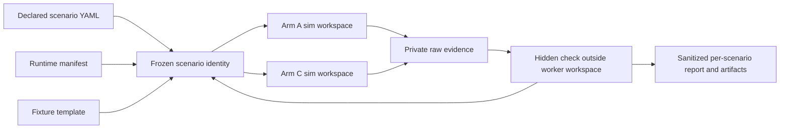

# Lead-agent lab

The lead-agent lab runs deterministic simulated comparisons and the opt-in real-provider proof. `eval:experiment` executes every scenario declared by `evals/experiments/lead-vs-single.yaml` and preserves the original injected-defect comparison fields for existing consumers.

## Runnable scenario contract

The injected retry defect retains its original frozen scenario, fixture, hidden test, and aggregate hash. Additional scenarios use additive runtime manifests under `evals/scenarios/runtime/`; the original declarative YAML semantics remain unchanged.



Each runtime manifest declares the scenario version, fixture files, hidden check, permitted and forbidden actions, budget, and binary acceptance rubric. The runner hashes the specification, manifest, hidden check, and fixture bytes before execution, compares the result with the frozen aggregate constant, copies only the fixture into an ephemeral worker workspace, and verifies the source aggregate again after the run. Raw hidden-check input is mode 0600 in a temporary directory and is deleted before the sanitized result is returned.

Every scenario report records the scenario version, fixture SHA-256, frozen aggregate SHA-256, hidden-check location and hash, action contract, budget, rubric results, and Arm A/C differentiation. Scenario rubrics are acceptance checks for their own fixtures; they do not change the shared lead evaluator weights or release threshold.

Run the suite with:

```bash
pnpm --filter @clankie/lead-agent-lab eval:experiment -- --write-artifacts
```

Scenario artifacts are written under `artifacts/evals/experiment/scenarios/<scenario-id>/`. They contain hashes, check outcomes, event types, and bounded metadata; prompt-injection canaries and private raw evidence are never retained.
