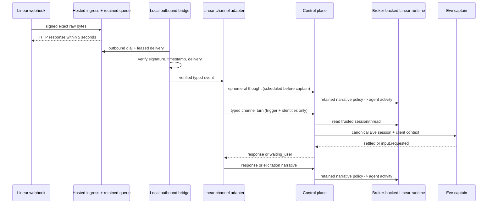

# Linear channel bridge

This credential-free adapter turns a verified Linear `AgentSessionEvent` into one bounded Eve captain turn. It owns channel delivery idempotency, self-loop and identity checks, fixed-window issue/workspace caps, the immediate acknowledgement attempt, result mapping, and ambient-channel approval refusal. It owns no mission state, model access, OAuth token, tracker authority mutation, or privileged-action authority.

The adapter consumes only `VerifiedLinearAgentSessionEvent` values emitted by the VUH-800 local bridge. It nevertheless treats every parsed webhook field as untrusted: configured workspace/app identity, session identity, issue/root-comment binding, and human trigger identity are checked again. Created triggers use the root comment; prompted triggers use the human prompt activity. Self-authored events and cross-issue roots are acknowledged by the delivery queue but cause no tracker/model action. The trusted runtime paginates the authoritative activity thread up to its 500-activity context bound and rechecks identities on every page. Returned narrative activities are separately checked against the configured app identity by `CredentialBrokerLinearAgentRuntime`.

An eligible delivery calls `writeTrackerNarrative()` immediately, before approval inspection or `submitCaptainChannelTurn()`. The acknowledgement scheduling target is 10 seconds from ingress receipt. `Linear-Delivery` is the end-to-end idempotency key; derived suffixes make acknowledgement and final writes independently repeatable. Completed delivery records remain for seven hours, covering Linear’s roughly 1-minute, 1-hour, and 6-hour retry schedule, then expire instead of leaking runtime memory. Invalid identity traffic is rejected before retention, and the seven-hour ledger has a hard 50,000-entry default: new eligible deliveries raise backpressure for bounded queue retry/dead-letter handling while retained retries remain deduplicated. The adapter defaults to 20 eligible events per issue and 100 per workspace in a 60-second fixed window. The retained doctrine evaluator in the control plane enforces the separate mission narrative-write volume policy.

Approval-shaped input never reaches Eve. Structurally identified Eve tool approvals and approval-shaped `waiting_user` output are converted to a refusal, and the pending approval cursor is abandoned so later Linear text cannot resolve it. Refusals point to the configured authenticated approval surface; Linear cannot answer, grant, or execute the approval.

## Runtime configuration

`pnpm --filter @clankie/linear-bridge start` runs the actual composition in `src/main.ts`: it loads a trusted outbound transport factory, constructs `LinearWebhookLocalBridge` and `LinearChannelAdapter`, and continuously passes `processNext()` verified events into the adapter. `dev` runs the same entrypoint under the repository watcher. The process requires:

- a credential-free `ClankieApiClient` targeting the loopback control plane;
- mission, task, worker-run, doctrine-profile, workspace, and app-user identities from trusted runtime configuration; each delivery supplies its independently verified correlation ID;
- an HTTPS approval surface, or loopback HTTP for development;
- an absolute `CLANKIE_LINEAR_TRANSPORT_MODULE` exporting `createLinearWebhookOutboundTransport()`; the module privately owns authenticated transport state;
- `LINEAR_WEBHOOK_SIGNING_SECRET`, the only secret held by the bridge, for local raw-byte re-verification.

The bridge does not read Linear OAuth tokens, tracker mutation credentials, model credentials, runner/captain/operator tokens, privileged connector credentials, or mission authority. Structured runtime logs contain mission/task/run/correlation identifiers and fixed outcomes only; webhook bodies and narrative content are never logged.

The control plane loads `CLANKIE_LINEAR_AGENT_RUNTIME_MODULE`, an absolute local module path exporting `createLinearAgentRuntime()`. That trusted module constructs the broker-backed client from opaque installation references. Tokens and OAuth client secrets are not bridge/control-plane inputs. `CLANKIE_CAPTAIN_URL` names the loopback Eve endpoint and defaults to `http://127.0.0.1:4321`.

The hosted ingress transport remains outbound-only from the local machine. The process-local VUH-800 queue is deterministic evidence, not a production durability claim; a live deployment supplies a durable implementation of the same outbound delivery contract.

## Live opt-in smoke

Credential-free CI uses recorded events and fake broker responses through the real ingress, API client, control-plane policy, trusted runtime, and Eve HTTP contracts. A live smoke is owner/lead opt-in only: install the Linear OAuth app with `actor=app`, put the installation in the credential broker, provide the trusted runtime module, start Eve and the loopback control plane, connect the local outbound bridge, and mention Clankie on a disposable issue. Do not expose a local listener or place tokens in bridge environment variables.

The relay and tracker connector directly prove the same production-shaped webhook contract. Both untouched recorded `created` and `prompted` fixtures traverse exact signed raw ingress, the opaque delivery receipt, local signature verification, the runnable adapter/control-plane seam, the trusted full-thread read, Eve, and the final policy-evaluated response. Tests never add compatibility-only webhook fields.
