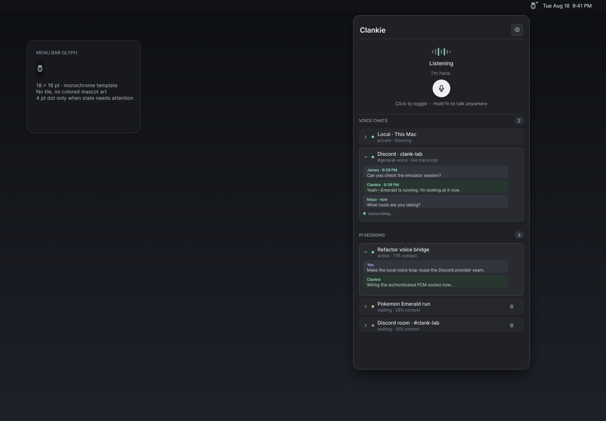
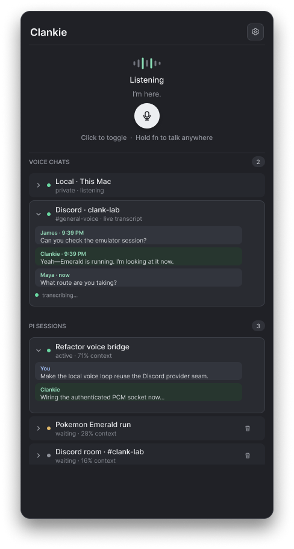

# Clankie menu bar

The native macOS menu-bar app opens a private local voice chat and shows live
operator and Discord voice transcripts. Click the microphone to toggle a
conversation, or hold <kbd>Fn</kbd> to talk momentarily from any app. The
template menu-bar glyph is the finalized monochrome Clankie mark.

## Design

The editable source is the
[Clankie menu-bar Figma file](https://www.figma.com/design/ZNQUle993XNCWGS7Oqdz8k?node-id=1-2).
The checked-in exports preserve the approved design alongside the implementation.





```sh
pnpm --filter @clankie/menu-bar test
pnpm --filter @clankie/menu-bar bundle
open apps/menu-bar/.build/Clankie.app
```

The app reads the `clankie_captain` API credential from the macOS Keychain and
connects to `http://127.0.0.1:4310`. `CLANKIE_BASE_URL` and
`CLANKIE_CAPTAIN_TOKEN` are development overrides. macOS requests microphone
permission on first use; the global Fn gesture uses session keyboard flags and
does not request Input Monitoring access.

The session list and expandable tails use `/operator/v1/dispatch`. Local voice
uses `/operator/v1/voice-chat`; raw 24 kHz mono PCM remains in memory. Discord
speech appears only when `discord.voiceTranscriptLoggingEnabled` is enabled in
owner settings, through `/v1/discord/voice-transcripts`.

Each inactive, non-default Pi session has a trash button that clears that one
session through the shared conversation close operation. Active sessions and
the default session remain available.
