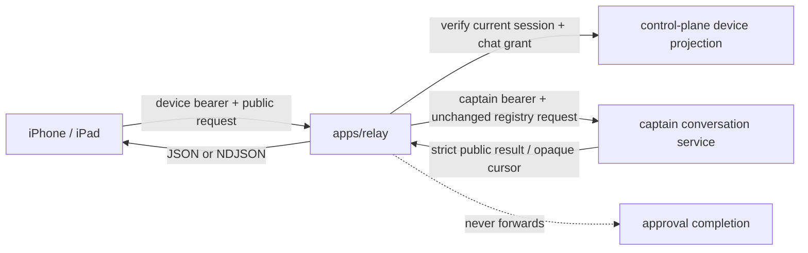

# Remote relay

The relay exposes two deliberately separate boundaries for remote Apple clients.

- Operator conversations use authenticated HTTP and NDJSON. Device session credentials are verified against the control-plane's durable device projection on every request, between tail polls, and immediately before each tail page is emitted, so expiry, revocation, and grant removal take effect without waiting for a reconnect.
- The legacy local-development WebSocket carries `control` and `terminal` planes. It binds to loopback, is disabled unless `CLANKIE_RELAY_DEV_TOKEN` is configured, and is not an application authorization boundary.

Tailscale may transport either connection, but Tailscale identity is never accepted as relay authorization. The runner makes outbound connections; the relay never exposes a local PTY or Herdr socket directly to the public internet.

## Operator conversation boundary

The HTTP surface composes the unchanged `@clankie/protocol` operator-conversation registry contract:

- `POST /operator/v1/dispatch` accepts strict `list`, `get`, `create`, `send`, and `replay` requests.
- `POST /operator/v1/tail` accepts the same strict `tail` request and emits newline-delimited `{ kind: "event", event }`, `{ kind: "recovery", recovery }`, or terminal `{ kind: "auth_failure", failure }` frames.

Each request carries a control-plane device session bearer. The relay checks the current device record and `chat` grant, then uses its own captain service credential for the upstream hop. Device credentials never cross that hop. Captain responses pass the strict public schema and the runner-aligned authorization/token/credential value redactor before emission, which excludes private values even when they are embedded in an otherwise allowed string such as a title. Eve session IDs, continuation tokens, provider credentials, and arbitrary provider payloads do not cross the boundary.

Turn submission retains the registry's `expectedRevision` fence. Duplicate delivery of the same authenticated device request is collapsed to one in-flight or retained result; a stale fence returns the registry's typed `revision_conflict` result. Replay and tail cursors remain opaque and surface-scoped. A dropped stream resumes from the last emitted event cursor, while expired or reset cursors produce one typed recovery frame and close.

Approval completion is outside this boundary. No approval route or callable operation exists, and both the HTTP router and legacy opaque control tunnel deny completion-shaped traffic.

Structured logs contain bounded, value-redacted route, operation, device, conversation, surface, status, and recovery metadata only. They never include message text or either bearer credential.

Recorded React Native consumer fixtures live in `test/fixtures/operator-conversations.json` and `test/fixtures/operator-conversation-tail.ndjson`.

Configuration:

- `CLANKIE_CONTROL_PLANE_URL` defaults to `http://127.0.0.1:4310`.
- `CLANKIE_CAPTAIN_URL` defaults to `http://127.0.0.1:4321`.
- `CLANKIE_CAPTAIN_TOKEN` enables the authenticated captain hop; conversation requests fail closed when absent.
- `CLANKIE_RELAY_HOST` defaults to loopback; set it to a specific tailnet interface for direct physical-device access.
- `CLANKIE_RELAY_DEV_TOKEN` optionally enables the legacy loopback WebSocket.

## Linear agent-session webhook boundary

The Linear webhook components are exported from `src/linear-webhook.ts`:

- `LinearWebhookIngress` verifies exact raw request bytes and produces a bounded envelope.
- `RetainedLinearWebhookQueue` provides delivery-ID dedupe, bounded backpressure, retention, retry, and an outbound-dial transport contract.
- `LinearWebhookLocalBridge` dials that transport and independently verifies the original bytes before emitting a typed agent-session event.

The ingress keeps the webhook signing secret but no Linear OAuth credential. The local bridge opens the connection; the hosted side never opens a listener on the local machine. See [`../../docs/linear-agent-webhook-ingress.md`](../../docs/linear-agent-webhook-ingress.md) for the trust boundary, response behavior, dev tunnel, and production limits.
