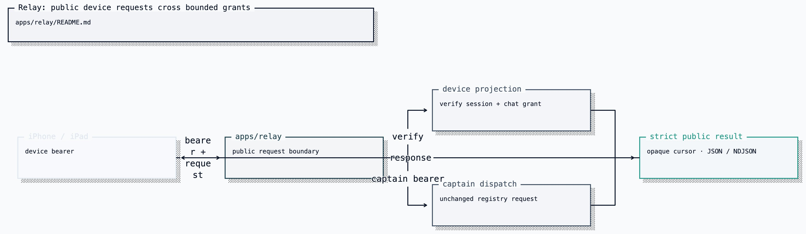

# Remote relay

The relay is the HTTP-only operator-conversation boundary for remote Apple
clients. Tailscale may carry the connection, but network identity is not
authorization: every request carries a device-session bearer.

## Operator conversation boundary

The HTTP surface composes the unchanged `@clankie/protocol` operator-conversation registry contract:

- `POST /operator/v1/dispatch` accepts strict `list`, `roster`, `get`, `create`, `close`, `send`, and `replay` requests. Seat-scoped creates and sends use the same authenticated boundary.
- `POST /operator/v1/tail` accepts the same strict `tail` request and emits newline-delimited `{ kind: "event", event }`, `{ kind: "recovery", recovery }`, or terminal `{ kind: "auth_failure", failure }` frames.

The relay checks the current device record and `chat` grant against the clankie
service on every request, between tail polls, and immediately before emitting a
tail page. Expiry, revocation, and grant removal therefore take effect without a
reconnect. It uses its own captain service credential for the upstream hop;
device credentials never cross it.

Responses pass the strict public schema and value redaction before emission.
Captain session IDs, continuation tokens, provider credentials, and arbitrary
provider payloads do not cross the boundary.

Turn submission retains the registry's `expectedRevision` fence. Duplicate delivery of the same authenticated device request is collapsed to one in-flight or retained result; a stale fence returns the registry's typed `revision_conflict` result. Replay and tail cursors remain opaque and surface-scoped. A dropped stream resumes from the last emitted event cursor, while expired or reset cursors produce one typed recovery frame and close.
Transient `seat_offline` refusals collapse concurrently but are not retained, so a retry observes a pane that has returned.



[Editable Turbopuffer tldraw source](../../docs/diagrams/clankie-docs-diagrams-2.tldraw)

## Run

```bash
pnpm --filter @clankie/relay start
```

Configuration:

- `CLANKIE_CONTROL_PLANE_URL` defaults to `http://127.0.0.1:4310` (device verification; the env name is a compatibility alias for the clankie service URL).
- `CLANKIE_CAPTAIN_URL` defaults to `http://127.0.0.1:4310` (conversation dispatch on the same service).
- `CLANKIE_CAPTAIN_TOKEN` enables the authenticated captain hop; conversation requests fail closed when absent, and the relay refuses to start with a token under 16 characters.
- `CLANKIE_RELAY_HOST` defaults to loopback; set it to a specific tailnet interface for direct physical-device access.
- `PORT` defaults to `4320`.

Structured logs contain bounded, redacted route, operation, device,
conversation, surface, status, and recovery metadata only. They never include
message text or either bearer credential.
