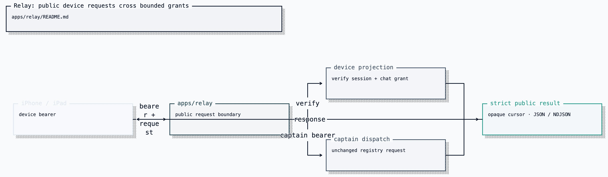

# Remote relay

The launcher supervises the relay like every other member of the stack:
`clankie restart relay` owns it, `clankie status` reports it, and it restarts
with the clankie service whose brokered captain bearer it holds. Pairing goes
further and guarantees it: `clankie pair` and `/pair` reuse a healthy relay,
start a stopped one, and mint no offer at all if it will not come up, so a
paired device never points at a relay nobody started. A Clankie service that is
not this machine runs its own relay; pairing says so instead of starting a
local one that proves nothing. The headless command contract is
[`docs/cli.md`](../../docs/cli.md). In the
[hosted deployment](../../infra/hosted/README.md), Compose owns the process and
shares the captain's private state volume. Direct starts resolve the same brokered
captain credential without a launcher-provided environment token.

It listens on `CLANKIE_RELAY_PORT` (default 4321 — 4320 belongs to the
activity surface). The origin remote devices should reach it on is
owner-authored settings (`relay.url` in `~/.config/clankie/settings.json`, or
the `CLANKIE_RELAY_URL` override): when set, the service advertises it
in pairing and session-refresh responses, so paired devices follow a moved
relay without a rebuild.

The relay is the HTTP-only operator-conversation boundary for remote Apple
clients. Tailscale may carry the connection, but network identity is not
authorization: every request carries a device-session bearer.

## Operator conversation boundary

The HTTP surface composes the strict `@clankie/protocol` operator service contract:

- `POST /operator/v1/dispatch` accepts the strict operator service contract,
  including the cursor-long-polled `fleet` snapshot and persona, roster,
  channel, terminal, and conversation operations. Seat-scoped creates and sends
  use the same authenticated boundary.
- `POST /operator/v1/tail` accepts the same strict `tail` request and emits newline-delimited `{ kind: "event", event }`, `{ kind: "recovery", recovery }`, or terminal `{ kind: "auth_failure", failure }` frames.
- `POST /operator/v1/terminal-tail` accepts a strict `terminal_tail` request and emits bounded native-consumable ANSI `frame`, `reset`, `unavailable`, or `auth_failure` items.

The relay verifies the ordinary device bearer and current operation grant against
`GET /v1/devices/self` after reading each request and before dispatch, between tail
polls, and before returning upstream results, file bytes, or tail pages. It also
rejects an invalid bearer before reading the request. Authorization from before a
sleep or a control-plane restart is never reused to admit a delayed request or
release a pending result. If verification is unavailable, traffic fails closed;
a valid device can reconnect once control has replayed its durable device records.
Expiry, revocation, and grant removal therefore take effect without a reconnect. It uses its own captain service credential for the upstream hop;
device credentials never cross it.

The `connections` operation requires `steer` for inventory and mutations. It
projects bounded runtime/Swarm metadata and recorded provider identity; private
socket paths, raw diagnostics and credentials remain on the service. Named runtime
connect, reconnect and disconnect reuse the local API's manager. Only the operator
captain lane can serve this operation.

Terminal tails apply the same checks with the distinct `terminalObserve` grant.
They address Herdr panes by stable terminal id and end with a typed reset when a
native surface must reconnect for a fresh full redraw.

Terminal input rides the plain dispatch path under the distinct
`terminalControl` grant: `terminal_control` manages one exclusive renewable
input lease per terminal and `terminal_input` writes bounded raw VT bytes under
it. The relay only maps the ops to the grant; lease arbitration lives with the
captain.

Responses pass the strict public schema and value redaction before emission.
Captain session IDs, continuation tokens, provider credentials, and arbitrary
provider payloads do not cross the boundary.

Turn submission retains the registry's `expectedRevision` fence. Duplicate delivery of the same authenticated device request is collapsed to one in-flight or retained result; a stale fence returns the registry's typed `revision_conflict` result. Replay and tail cursors remain opaque and surface-scoped. A dropped stream resumes from the last emitted event cursor, while expired or reset cursors produce one typed recovery frame and close.
Transient `seat_offline` refusals collapse concurrently but are not retained, so a retry observes a pane that has returned.



[Editable Turbopuffer tldraw source](../../docs/diagrams/clankie-docs-diagrams-2.tldraw)

## Run

```bash
pnpm --filter @clankie/relay start
```

Configuration:

- `CLANKIE_CONTROL_PLANE_URL` defaults to `http://127.0.0.1:4310` (device verification; the env name is a compatibility alias for the clankie service URL).
- `CLANKIE_CAPTAIN_URL` defaults to `http://127.0.0.1:4310` (conversation dispatch on the same service).
- The captain bootstraps its service credential in the shared broker; the relay resolves it on startup. `CLANKIE_CAPTAIN_TOKEN` explicitly overrides that credential. Conversation requests fail closed when neither source is available, and the relay refuses a token under 16 characters.
- `CLANKIE_RELAY_HOST` defaults to loopback; set it to a specific tailnet interface for direct physical-device access.
- `CLANKIE_RELAY_PORT` defaults to `4321`; `PORT` is its deployment-platform fallback.

Structured logs contain bounded, redacted route, operation, device,
conversation, surface, status, and recovery metadata only. They never include
message text or either bearer credential.

## Direct fallback for gateway-paired devices

The app can recover from a gateway outage through explicitly configured private
endpoints. Control and relay are separate services; their ports are never inferred.
Configure addresses that the device can already reach:

```sh
clankie gateway direct --control-plane-url http://my-mac.tailnet.ts.net:4310 --relay-url http://my-mac.tailnet.ts.net:4321
clankie restart captain
```

The TUI exposes the same settings under `/remote-access` → **Configure direct
fallback**. These commands save `relay.controlPlaneUrl` and `relay.url`;
`CLANKIE_DIRECT_CONTROL_PLANE_URL` and `CLANKIE_RELAY_URL` override them.
Configuration advertises endpoints; it does not create ingress or change binds.
Both must be direct HTTP(S) origins without credentials, paths, query or fragment.

Completion, session refresh, and device self responses carry the optional
`directRoute` metadata, including through the authenticated encrypted gateway.
Open an already-paired app once while its gateway route works to learn it. A device
that never learned those addresses cannot recover an unknown route during an outage.
Gateway encryption and secure QR pairing remain mandatory (ADR 0173). Direct
requests retain device bearer authorization, expiry, revocation, and grant checks.

## Direct pairing without an account

The same direct route lets the App Store app pair a self-hosted Mac with no
account (ADR 0204): `clankie pair` puts the control origin in the QR, and the
app uses it when there is no gateway, or the gateway cannot answer. The store
build reaches plain HTTP only on the LAN (`.local`, single-label or private IP
addresses), so serve a tailnet name over HTTPS.

The service binds loopback, so a phone on the LAN reaches it through the
opt-in device doorway, which serves only the device routes:

```sh
# LAN
CLANKIE_DEVICE_HOST=0.0.0.0 CLANKIE_RELAY_HOST=0.0.0.0 clankie restart captain  # also restarts the relay
clankie gateway direct --control-plane-url http://my-mac.local:4311 --relay-url http://my-mac.local:4321

# Tailscale (HTTPS)
CLANKIE_DEVICE_HOST=127.0.0.1 clankie restart captain
tailscale serve --bg --https=14311 http://127.0.0.1:4311
tailscale serve --bg --https=14321 http://127.0.0.1:4321
clankie gateway direct --control-plane-url https://my-mac.tailnet.ts.net:14311 --relay-url https://my-mac.tailnet.ts.net:14321
```
