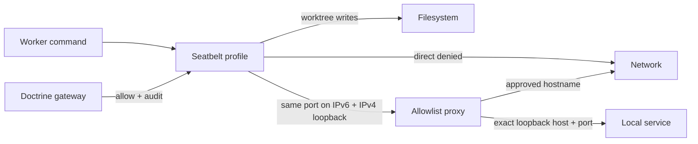

# Local runner

The runner is the trust boundary that owns worktrees, worker processes, PTYs, provider-native sessions, credentials, network restrictions, and control leases. It connects outbound to the control plane or relay.

The production runner creates one `TerminalManager`. Generic interactive commands run in a native `node-pty` terminal with runner-supplied environment only; Codex App Server JSON-RPC, Claude Agent SDK, and Pi RPC retain their protocol-native control transports and are never relabeled as PTYs. The manager owns ordered raw-byte replay, headless `@xterm/headless` state, `@xterm/addon-serialize` VT restore snapshots at parser-quiescent boundaries, live-attempt correlation, bounded observers, and the single renewable human-control lease. Closed terminals leave discovery deterministically; restart marks non-reattachable PTY records orphaned and closed. Do not put merge, deployment, or organization-wide connector tokens inside worker environments.

## Worker transcript projection

`WorkerTranscriptProjection` is the runner authority for garden-safe worker
activity. It projects only structured semantic events and runner settlement
facts into private mode-0600 NDJSON under
`CLANKIE_WORKER_TRANSCRIPT_ROOT` (default:
`$CLANKIE_RUNNER_STATE/worker-transcripts`). Redaction and closed-schema
reduction happen before persistence; raw terminal/model output, arbitrary
provider summaries, prompts, chain-of-thought, credentials, tokens, and audio
never enter the store. `CLANKIE_WORKER_TRANSCRIPT_MAX_ENTRIES` defaults to 500
entries per run.

The loopback-only transcript gateway listens on
`CLANKIE_WORKER_TRANSCRIPT_PORT` (default `4313`) and uses the configured runner
bearer credential. It exposes internal snapshot and NDJSON-tail routes for the
control-plane injected reader. Cursors survive restart and yield typed
retention-expired or worker-run-replaced recovery instead of guessing a replay
position.

`pnpm --filter @clankie/runner terminal:lifecycle-evidence` runs the immutable interactive
terminal contract and writes a reproducible evidence manifest under
`artifacts/runner/terminal-lifecycle/`. The manifest contains only safe phase identifiers,
exit state, and hashes; terminal bytes, input, credentials, and lease tokens are never retained.

## Interactive environments

`createRunnerEnvironmentLifecycle()` composes a concrete environment adapter
with `@clankie/environment-runtime`. The runtime owns the durable single-body
lease, capability expiry, action idempotency, cancellation, emergency stop, and
restart attachment boundary. Concrete Minecraft protocol and account handling
remain outside the runner until their dedicated tasks land.

## Mission pull worker

Set `CLANKIE_REPO_PATH`, `CLANKIE_RUNNER_TOKEN`, and `CLANKIE_VERIFICATION_CHECKS` to enable outbound mission execution. Verification checks are a JSON array of trusted `{id, command, args, dependencyRoots?}` records and run without a shell. Dependency roots are exact, runner-declared read-only inputs; broad or runner-private roots fail closed. Verification gets a synthetic worktree-local home and temporary directory, can read only the candidate, declared dependencies, and required system/toolchain runtime paths, and has no network access. Check output is represented by byte counts and SHA-256 fingerprints rather than copied into mission evidence.

Coding providers are opt-in and fail closed. Enable/configure `CLANKIE_CODEX_*`, `CLANKIE_CLAUDE_*`, and `CLANKIE_PI_*` independently. Only providers that pass executable, authentication configuration, model, tool-boundary, and isolation readiness are advertised. These startup checks do not claim that a remote token/model request has succeeded. Codex requires a private, owner-controlled, structurally valid file-backed `CODEX_HOME/auth.json`, followed by a bounded `login status` forced to the file credential store. The file is opened with no-follow semantics, validated through that handle, and validated again after the probe with the same device, inode, and content digest; ambient Keychain state, symlink swaps, and atomic file replacement cannot make an empty or substituted file ready. Current ChatGPT auth may use managed tokens or a complete registered agent-identity record. Claude accepts only an Anthropic API key or complete Bedrock/Vertex environment configuration; consumer OAuth/Max and partial cloud variables remain unavailable. The heterogeneous descriptors are `codex-implementation`, read-only `claude-verification`, and `pi-debugging`. Pi additionally requires an exact `CLANKIE_PI_OLLAMA_URL` localhost origin, a locally available pinned `CLANKIE_PI_MODEL`, successful sandboxed Ollama tags, and pinned RPC state/model initialization with a nonempty session ID and a session file canonically confined beneath the configured runner session root. Readiness does not invoke model inference.

Setting `CLANKIE_SIM_WORKERS=1` replaces the readiness-gated provider fleet with simulated `sim-planner`, `sim-implementer`, `sim-verifier`, and `sim-debugger` descriptors so the full task graph can dry-run under runner isolation on an isolated port with zero provider credentials; sim behavior is declared per task in `task.metadata.sim` (`{files?, status?, summary?, diagnosis?}`), scripted writes land inside the candidate only, and each sim run binds a synthetic `sim:<workerRunId>` native session.

The runner creates one worktree from an immutable base for the first writing task, atomically manifests it, retains it across process-lease reclamation, and gives dependent verification the same path read-only.

For every attempt the runner collects Git changes since the base across commits, HEAD, index identity, working tree, untracked and ignored files, and renames. It normalizes and validates paths against `TaskSpec.writeScope`, atomically writes a private `0600` SHA-256 diff artifact behind an opaque reference, and rejects provider success when scope or read-only state is violated. Ignored content is hashed for change detection but never written to the diff artifact. Settlement exclusively publishes a private validated runner-authored evidence bundle with Git/check/session/correlation facts, syncs it durably, treats identical retries as idempotent, rejects concurrent conflicts, and attaches only its opaque reference and hash.

Codex's parent receives `CODEX_HOME`, but model tools receive a synthetic home/temp environment and strict positive filesystem roots for the candidate and exact executable directories. Startup proves an arbitrary outside sentinel is unreadable. Claude receives a synthetic home plus approved SDK authentication; it has no Bash tool, and its always-on path hook limits Read/Glob/Grep to the candidate before the SDK sandbox adds credential/private-path denial. Glob-like inputs reject traversal, absolute paths, tilde expansion, backslashes, braces, and extglobs before canonical candidate containment is checked. Pi receives a private runner-owned home/config/session/temp tree and runs entirely behind a positive read-root shell sandbox. Pi reads only the candidate, its state, sanitized executable roots, safe system runtime, and the bounded canonical dependency closure of its pinned pnpm package; it writes only the candidate and Pi state, and reaches only the exact Ollama endpoint. Runner, captain, connector, organization, and arbitrary sentinel variables are not inherited by provider tools.

The runner heartbeats active work before candidate acquisition and retries claims, semantic events, and settlements with bounded backoff and their original idempotency identities. Unexpected `waiting_user` blocks noninteractive runs unless explicitly allowed. Candidates are retained for inspection; this slice does not merge, deploy, or update a tracker.

While an assignment is live, the mission worker pulls only typed, control-plane-rendered commands bound to
its exact run and attempt. It invokes `WorkerAdapter.steer` instead of writing
text into a terminal when the provider exposes typed steering. Codex maps this
to App Server `turn/steer` with the durable command ID as
`clientUserMessageId`. The durable command store makes claim a one-way
transition: an unacknowledged claim is reconciled to explicit non-delivery on
control-plane restart and is never replayed to that attempt. Unsupported
adapters and provider failures also settle as explicit non-delivery outcomes.
An injected human-control lease authority rejects automated captain commands
until handback.

## Shell sandbox

`ShellWorkerAdapter` runs through `ShellSandbox` by default on macOS:

The general restricted profile keeps host-toolchain reads available. Provider-specific
positive profiles enumerate their candidate, state, safe system/runtime, and exact
package dependency roots without ambient data or metadata reads. Writes are limited to
the canonical worktree, approved state roots, and safe devices. Exact loopback targets,
hostnames, and non-loopback targets use the exact-match runner proxy; Seatbelt exposes
one numeric proxy port, which the runner reserves on both IPv6 and IPv4 loopback so no
other process can occupy the alternate address family. The host syslog socket is content-denied
without delivery, while all other prohibited network and file operations retain
force-termination. All raw TCP and proxy-unaware clients stay denied.

Network hosts, extra write roots, and bypass require an `allow` decision recorded
with its reason and obligations before relaxation. Missing dependencies,
unsupported obligations, other effects, and all kernel/proxy denials fail closed
with `sandbox.denied` events and `sandbox-denial` evidence.
