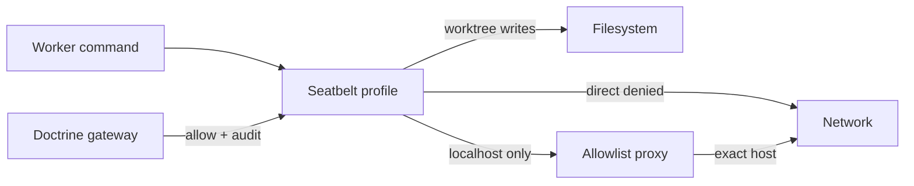

# Local runner

The runner is the trust boundary that owns worktrees, worker processes, PTYs, provider-native sessions, credentials, network restrictions, and control leases. It connects outbound to the control plane or relay.

The skeleton contains a non-PTY shell adapter and the interfaces needed for native PTY, Herdr, tmux, Codex App Server, Claude Agent SDK, and Pi RPC adapters. Do not put merge, deployment, or organization-wide connector tokens inside worker environments.

## Shell sandbox

`ShellWorkerAdapter` runs through `ShellSandbox` by default on macOS:

```mermaid
flowchart LR
    W[Worker command] --> S[Seatbelt profile]
    S -->|worktree writes| F[Filesystem]
    S -->|direct denied| N[Network]
    S -->|localhost only| P[Allowlist proxy] -->|exact host| N
    D[Doctrine gateway] -->|allow + audit| S
```

The restricted profile keeps host-toolchain reads available, limits writes to
the canonical worktree and safe devices, denies direct egress, and builds a safe
environment instead of inheriting runner secrets. Hostname allowlists use an
exact-match runner proxy because Seatbelt only sees its localhost port; raw TCP
and proxy-unaware clients stay denied.

Network hosts, extra write roots, and bypass require an `allow` decision recorded
with its reason and obligations before relaxation. Missing dependencies,
unsupported obligations, other effects, and all kernel/proxy denials fail closed
with `sandbox.denied` events and `sandbox-denial` evidence.
