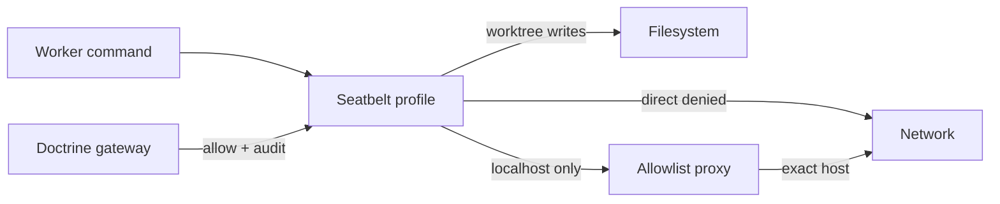

# Local runner

The runner is the trust boundary that owns worktrees, worker processes, PTYs, provider-native sessions, credentials, network restrictions, and control leases. It connects outbound to the control plane or relay.

The skeleton contains a non-PTY shell adapter and the interfaces needed for native PTY, Herdr, tmux, Codex App Server, Claude Agent SDK, and Pi RPC adapters. Do not put merge, deployment, or organization-wide connector tokens inside worker environments.

## Mission pull worker

Set `SAPLING_REPO_PATH`, `SAPLING_RUNNER_TOKEN`, and `SAPLING_VERIFICATION_CHECKS` to enable outbound mission execution. Verification checks are a JSON array of trusted `{id, command, args, dependencyRoots?}` records and run without a shell. Dependency roots are exact, runner-declared read-only inputs; broad or runner-private roots fail closed. Verification gets a synthetic worktree-local home and temporary directory, can read only the candidate, declared dependencies, and required system/toolchain runtime paths, and has no network access. Check output is represented by byte counts and SHA-256 fingerprints rather than copied into mission evidence. The runner advertises separate `codex-implementer` and `codex-verifier` descriptors. It creates one worktree from an immutable base for the first writing task, atomically manifests it, retains it across process-lease reclamation, and gives dependent verification the same path read-only.

For every attempt the runner collects Git changes since the base across commits, HEAD, index identity, working tree, untracked and ignored files, and renames. It normalizes and validates paths against `TaskSpec.writeScope`, writes a SHA-256 diff artifact behind an opaque reference, and rejects provider success when scope or read-only state is violated. Ignored content is hashed for change detection but never written to the diff artifact.

Codex receives a complete allowlisted child environment containing only required host, toolchain, locale, and Codex-home values. Runner, captain, connector, organization, and arbitrary sentinel variables are not inherited. The runner heartbeats active work and retries claims, semantic events, and settlements with their original idempotency identities. Candidates are retained for inspection; this slice does not merge, deploy, update a tracker, or implement persistent provider-session steering.

## Shell sandbox

`ShellWorkerAdapter` runs through `ShellSandbox` by default on macOS:

```mermaid
flowchart LR
    W[Worker command] --> S[Seatbelt profile]
    S -->|worktree writes| F[Filesystem]
    S -->|direct denied| N[Network]
    S -->|localhost only| P[Allowlist proxy] -->|exact host| N
    D[Doctrine gateway] -->|allow + audit| S
```

The restricted profile keeps host-toolchain reads available, limits writes to
the canonical worktree and safe devices, denies direct egress, and builds a safe
environment instead of inheriting runner secrets. Hostname allowlists use an
exact-match runner proxy because Seatbelt only sees its localhost port; raw TCP
and proxy-unaware clients stay denied.

Network hosts, extra write roots, and bypass require an `allow` decision recorded
with its reason and obligations before relaxation. Missing dependencies,
unsupported obligations, other effects, and all kernel/proxy denials fail closed
with `sandbox.denied` events and `sandbox-denial` evidence.
