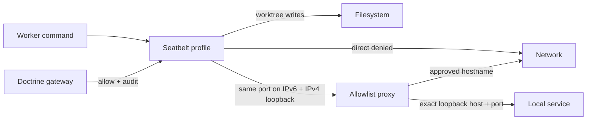

# Local runner

The runner is the trust boundary that owns worktrees, worker processes, PTYs, provider-native sessions, credentials, network restrictions, and control leases. It connects outbound to the control plane or relay.

## Asked-play host (ADR 0063)

Beside the mission worker, the runner hosts asked embodiment: `src/play-host.ts` polls the control plane's embodiment claim endpoint, and on a claimed start owns a FireRed free-play session end to end — body lock under a `captain-play` holder id, resume from the newest compatible checkpoint, frames and overlay to the activity producer, a checkpoint minted on stop, and every lifecycle transition reported back as content-free scalars. Checkpoints carry his notes and standing objective, so a resumed session restores the mind with the world rather than waking him amnesiac; autosave checkpoints bank an uncapped marathon every `CLANKIE_PLAY_AUTOSAVE_TURNS` turns (default 50, `0` disables), so a crash loses minutes rather than the session. Each gameplay-mind and gameplay-voice model stream is bounded to 60 seconds so a lost provider response cannot freeze the body; `CLANKIE_PLAY_MODEL_REQUEST_TIMEOUT_MS` overrides that bound and invalid values fall back to the default. Rewinding is his: the host wires a checkpoint port so `load_checkpoint` and `restart_game` are play choices ([ADR 0075](../../docs/adr/0075-rewinding-is-a-play-choice.md)), each banking a `before-rewind` checkpoint first. The host never blocks the claim loop, so a stop ask or SIGINT/SIGTERM lands at the next turn boundary, reports `stopping`, writes the final journal summary and checkpoint, releases the body, and only then exits. `CLANKIE_PLAY_SHUTDOWN_DEADLINE_MS` defaults to 15 seconds; expiry records a forced failed terminal state and exits nonzero. On startup it reconciles a live session attributed to a dead predecessor as `lease_lapsed`, and body-lock liveness reclaims the predecessor's stale lock before new play. A missing activity producer degrades to counted dropped frames; a held body refuses `body_held`; a missing ROM, fixture, or model refuses `environment_unavailable`.

`scripts/free-play-live.ts` (`pnpm gba:free-play-live`) is the development alias: the same `src/play-execution.ts` composition driven by a locally fabricated session, so a playthrough is watchable without a control plane or a Discord ask.

### Current-activity projection (ADR 0077)

Each settled free-play turn replaces one memory-only activity observation. The
strict schema keeps Clankie's bounded objective, intent, and commentary under
`selfAuthored`, while the adapter outcome, effect, progress counters, and
framebuffer digest remain under `runnerObserved`. Raw frames, decoded emulator
state, prompts, action payloads, and gameplay continuation authority cannot be
represented.

The exact-loopback gateway listens on
`CLANKIE_ACTIVITY_OBSERVATION_PORT` (default `4314`) and authenticates with the
runner bearer. It serves only the current snapshot and returns not-found before
the first settled turn or after the matching session clears. The durable journal
remains the historical debugging artifact; the projection is present-tense and
is never persisted.

### Agent census and adoption (ADR 0078)

The runner accounts for agents it did not start. After lease reconciliation at
boot it lists the Herdr transport and classifies every hosted agent as `owned`,
`adopted`, `lapsed`, or `unclaimed`. It reports and never adopts: an unclaimed
agent is an offer, and leaving it alone is a valid outcome. An unreachable
transport is reported as `transportAvailable: false` rather than an empty
census, and it lapses nothing — "I cannot see" is not evidence that an agent
stopped.

The census discovers every running local Herdr session with
`herdr session list --json`; an inherited `HERDR_SOCKET_PATH` is only a fallback.
It runs independently of `CLANKIE_HERDR_TERMINAL_SOURCE_ENABLED`, which gates
the observe-only terminal _data_ plane. Each entry keeps `runnerObserved`
(sanitized label, harness, native session id, transport instance, workspace,
status, cwd) apart from `selfDeclared` (a bounded record an agent may write into
`<state>/agent-declarations/`, read only while fresh, well-formed, and bound to
the same transport instance, terminal, and workspace). Pane scrollback is never
context.

Adoption binds `(transport, transportInstanceId, terminalId, harness,
agentSessionId, workspaceId, canonicalWorkspaceRoot)`. `observed` grants
knowledge only. `directed` requires an authenticated operator approval and a
declared expected write scope, grants bounded operator-parity steering through
Herdr's `agent.prompt`, and reserves the whole bound workspace from new mission
write tasks. A foreign adopted process is not an executable worker and never
receives a mission assignment or acts as verifier of record.

The exact-loopback gateway listens on `CLANKIE_AGENT_CENSUS_PORT` (default
`4315`) with the runner bearer and serves `/v1/agents/census`, `/v1/agents/adopt`,
`/v1/agents/direct`, and `/v1/agents/release`. Direction re-verifies the binding
against the live transport immediately before delivering, and records that
direction happened and how long it was — never what was said.

```bash
# What is running on this machine right now, read-only, adopting nothing.
pnpm --filter @clankie/runner census:probe
```

### The durable trail (ADR 0068)

Every playthrough journals itself: one append-only JSONL per run under `~/.local/state/clankie/gba-play/` — a header with the run identity and resume lineage, every `FreePlayTurn` (monologue, intent, objective, action, outcome, effect) as it settles, and a summary carrying the metrics the content-free receipt cannot (progress, volition, coherence). The same metrics land in the runner log as `embodiment playthrough finished`, and the play host narrates each lifecycle transition (`claimed`, `running`, `settled`, `refused`, stop asks) so the log tells the same story the control-plane events record. An unwritable journal degrades to an unrecorded playthrough that still runs; the log says so. See [`docs/08-observability-debugging.md`](../../docs/08-observability-debugging.md) for the full artifact map.

### Speaking and hearing while he plays (ADR 0067, ADR 0074)

A playthrough is audible as well as watchable: **what happened** goes out through the [possessor voice seam](../../docs/adr/0064-possessor-voice-seam.md) — the turn's own effect, never a sentence — and what the room says comes back as an interjection at the next turn boundary. The runner holds no gateway, so it reports and the bridge's persona composes the words. That is the same fence an MCP possessor plays under, and the reason this path cannot put a chosen sentence in his mouth.

It used to send his authored `speak` and `reply` lines instead, which is the defect [ADR 0074](../../docs/adr/0074-the-room-hears-one-voice.md) repairs: a seam that carries events was handed finished quips, and the far side did what it always does with an event — replied to it, at length. While a room is listening the realtime session is the sole author of what that room hears, so the [ADR 0056](../../docs/adr/0056-voice-is-a-separate-agent-from-the-player.md) Voice agent is not consulted at all; it authors for the activity overlay and the journal when nobody is in voice.

It is deny-by-default and off unless the bridge enables the possessor seam — `possessorVoiceEnabled: true` in the operator settings' `discord` block, or the `CLANKIE_POSSESSOR_VOICE_ENABLED=true` env override — and holds a live voice session. Absent credential, absent bridge, or a rejected line all degrade to a silent playthrough that still runs and is still watchable; the first rejection logs once per session.

The listener records only seam lifecycle and counters: attach/detach, listening
room-state delivery, transcript delivery, narration submission, and a bounded
refusal code. The gameplay interjection and narration text stay off receipts.

The production runner creates one `TerminalManager`. Generic interactive commands run in a native `node-pty` terminal with runner-supplied environment only; Codex App Server JSON-RPC, Claude Agent SDK, and Pi RPC retain their protocol-native control transports and are never relabeled as PTYs. The manager owns ordered raw-byte replay, headless `@xterm/headless` state, `@xterm/addon-serialize` VT restore snapshots at parser-quiescent boundaries, live-attempt correlation, bounded observers, and the single renewable human-control lease. Closed terminals leave discovery deterministically; restart marks non-reattachable PTY records orphaned and closed. Do not put merge, deployment, or organization-wide connector tokens inside worker environments.

## Worker transcript projection

`WorkerTranscriptProjection` is the runner authority for garden-safe worker
activity. It projects only structured semantic events and runner settlement
facts into private mode-0600 NDJSON under
`CLANKIE_WORKER_TRANSCRIPT_ROOT` (default:
`$CLANKIE_RUNNER_STATE/worker-transcripts`). Redaction and closed-schema
reduction happen before persistence; raw terminal/model output, arbitrary
provider summaries, prompts, chain-of-thought, credentials, tokens, and audio
never enter the store. `CLANKIE_WORKER_TRANSCRIPT_MAX_ENTRIES` defaults to 500
entries per run.

The loopback-only transcript gateway listens on
`CLANKIE_WORKER_TRANSCRIPT_PORT` (default `4313`) and uses the configured runner
bearer credential. It exposes internal snapshot and NDJSON-tail routes for the
control-plane injected reader. Cursors survive restart and yield typed
retention-expired or worker-run-replaced recovery instead of guessing a replay
position.

### Terminal source capability mapping

The internal `TerminalSourceProvider` composes runner-owned PTYs and optional Herdr panes behind the same frozen terminal wire. Set `CLANKIE_HERDR_TERMINAL_SOURCE_ENABLED=1` and provide the runner-only `HERDR_SOCKET_PATH` to add the Herdr source to the development terminal gateway. The socket path, Herdr pane ID, session metadata, working directory, and credentials never enter discovery, logs, or wire messages. Herdr's stable `terminal_id` is the public terminal identity; its compact, session-local `pane_id` is resolved again after discovery and stays inside the adapter.

Herdr titles are presentation-only. A title containing an absolute path, the private pane ID, or a Herdr pane/session/socket marker is replaced by the generic `Herdr pane` label before it enters the provider-neutral session summary.

| Source                                   | Observe | Resume / VT restore | Control lease | Input | Resize |
| ---------------------------------------- | ------- | ------------------- | ------------- | ----- | ------ |
| Runner PTY                               | yes     | yes                 | yes           | yes   | yes    |
| Herdr pane, default                      | yes     | yes                 | no            | no    | no     |
| Herdr pane, runner policy grants control | yes     | yes                 | yes           | yes   | no     |
| Development gateway intersection         | yes     | yes                 | no            | no    | no     |

Herdr control is fail-closed: a host-injected ownership predicate must grant it, and every `pane.send_input` still requires the adapter's active terminal lease. The observe-only gateway intersects source capability with its device authority, so enabling Herdr does not add a remote control route.

Native PTYs retain node-pty's process/session ownership and `pty.kill()` close semantics. Shell-worker timeout cancellation opts into a bounded process-table sweep that signals observed descendants by PID, including descendants that create a new session with `setsid(2)`, without replacing the PTY root's native termination path. The sweep is best-effort rather than OS-level containment; if an observed descendant remains live or inspection cannot complete, the runner emits a typed `terminal.process_tree_sweep` event and a structured warning containing aggregate counts, never command content or process identifiers.

`pnpm --filter @clankie/runner terminal:lifecycle-evidence` runs the immutable interactive
terminal contract and writes a reproducible evidence manifest under
`artifacts/runner/terminal-lifecycle/`. The manifest contains only safe phase identifiers,
exit state, and hashes; terminal bytes, input, credentials, and lease tokens are never retained.

## Interactive environments

`createRunnerEnvironmentLifecycle()` composes a concrete environment adapter
with `@clankie/environment-runtime`. The runtime owns the durable single-body
lease, capability expiry, action idempotency, cancellation, emergency stop, and
restart attachment boundary.

`createRunnerMinecraftEnvironmentLifecycle()` is the production Minecraft
composition. The trusted runner owns the durable lifecycle and the
`MineflayerMinecraftAdapter`; the real motor and runner-private account
configuration remain inside `integrations/minecraft-mineflayer`. An adapter
disconnect cannot reattach after process loss, so recovery fails the stale
session and requires a fresh governed join.

## Mission pull worker

The normal `clankie start` launcher supplies `CLANKIE_REPO_PATH` and dependency-free architecture/docs-link checks, while the runner resolves its brokered credential. Explicit operator `CLANKIE_REPO_PATH`, `CLANKIE_RUNNER_TOKEN`, and `CLANKIE_VERIFICATION_CHECKS` values still override those defaults. Verification checks are a JSON array of trusted `{id, command, args, dependencyRoots?}` records and run without a shell. Dependency roots are exact, runner-declared read-only inputs; broad or runner-private roots fail closed. Verification gets a synthetic worktree-local home and temporary directory, can read only the candidate, declared dependencies, and required system/toolchain runtime paths, and has no network access. Check output is represented by byte counts and SHA-256 fingerprints rather than copied into mission evidence.

`CLANKIE_RUNNER_MAX_CONCURRENCY` sets the local pull-lane ceiling (default
`4`, range `1..32`). Control-plane doctrine remains the global ceiling. Every
attempt runs in a task-scoped worktree; roots start at the configured immutable
base, one-parent tasks start at that parent's sealed output commit, and
multi-parent tasks merge sealed dependency commits in stable task-id order
before provider execution. Successful writer state becomes a runner-authored
snapshot commit. Read-only tasks publish only an unchanged input commit, and
ignored-file changes never enter a dependency snapshot. See
[ADR 0041](../../docs/adr/0041-task-scoped-runner-candidates.md).

Coding providers are opt-in and fail closed. Enable/configure `CLANKIE_CODEX_*`, `CLANKIE_CLAUDE_*`, and `CLANKIE_PI_*` independently. Only providers that pass executable, authentication configuration, model, tool-boundary, and isolation readiness are advertised. These startup checks do not claim that a remote token/model request has succeeded. Codex requires a private, owner-controlled, structurally valid file-backed `CODEX_HOME/auth.json`, followed by a bounded `login status` forced to the file credential store. The file is opened with no-follow semantics, validated through that handle, and validated again after the probe with the same device, inode, and content digest; ambient Keychain state, symlink swaps, and atomic file replacement cannot make an empty or substituted file ready. Current ChatGPT auth may use managed tokens or a complete registered agent-identity record. Claude accepts only an Anthropic API key, including the brokered `anthropic` API credential resolved inside the runner, or complete Bedrock/Vertex environment configuration; consumer OAuth/Max and partial cloud variables remain unavailable. A brokered key is injected only into the Claude provider process, is included in the live-evaluation redaction set, and never enters readiness output, another provider, a worker prompt, or evidence. The heterogeneous descriptors are `codex-implementation`, read-only `claude-verification`, and `pi-debugging`. Pi additionally requires an exact `CLANKIE_PI_OLLAMA_URL` localhost origin, a locally available pinned `CLANKIE_PI_MODEL`, successful sandboxed Ollama tags, and pinned RPC state/model initialization with a nonempty session ID and a session file canonically confined beneath the configured runner session root. Readiness does not invoke model inference.

Setting `CLANKIE_SIM_WORKERS=1` replaces the readiness-gated provider fleet with simulated `sim-planner`, `sim-implementer`, `sim-verifier`, and `sim-debugger` descriptors so the full task graph can dry-run under runner isolation on an isolated port with zero provider credentials; sim behavior is declared per task in `task.metadata.sim` (`{files?, status?, summary?, diagnosis?}`), scripted writes land inside the candidate only, and each sim run binds a synthetic `sim:<workerRunId>` native session.

The runner creates one isolated worktree per attempt and atomically records
each safe task output. Dependent verification receives a different worktree at
the exact same candidate commit, so sibling branches cannot leak into its
view. Failed or unsafe attempts remain preserved for inspection but are never
published as dependency inputs.

For every attempt the runner collects Git changes since the base across commits, HEAD, index identity, working tree, untracked and ignored files, and renames. It normalizes and validates paths against `TaskSpec.writeScope`, atomically writes a private `0600` SHA-256 diff artifact behind an opaque reference, and rejects provider success when scope or read-only state is violated. Ignored content is hashed for change detection but never written to the diff artifact. Settlement exclusively publishes a private validated runner-authored evidence bundle with Git/check/session/correlation facts, syncs it durably, treats identical retries as idempotent, rejects concurrent conflicts, and attaches only its opaque reference and hash.

Codex's parent receives `CODEX_HOME`, but model tools receive a synthetic home/temp environment and strict positive filesystem roots for the candidate and exact executable directories. Startup proves an arbitrary outside sentinel is unreadable. Claude receives a synthetic home plus approved SDK authentication; it has no Bash tool, and its always-on path hook limits Read/Glob/Grep to the candidate before the SDK sandbox adds credential/private-path denial. Glob-like inputs reject traversal, absolute paths, tilde expansion, backslashes, braces, and extglobs before canonical candidate containment is checked. Pi receives a private runner-owned home/config/session/temp tree and runs entirely behind a positive read-root shell sandbox. Pi reads only the candidate, its state, sanitized executable roots, safe system runtime, and the bounded canonical dependency closure of its pinned pnpm package; it writes only the candidate and Pi state, and reaches only the exact Ollama endpoint. Runner, captain, connector, organization, and arbitrary sentinel variables are not inherited by provider tools.

The runner heartbeats active work before candidate acquisition and retries claims, semantic events, and settlements with bounded backoff and their original idempotency identities. Unexpected `waiting_user` blocks noninteractive runs unless explicitly allowed. Candidates are retained for inspection; this slice does not merge, deploy, or update a tracker.

While an assignment is live, the mission worker pulls only typed, control-plane-rendered commands bound to
its exact run and attempt. It invokes `WorkerAdapter.steer` instead of writing
text into a terminal when the provider exposes typed steering. Codex maps this
to App Server `turn/steer` with the durable command ID as
`clientUserMessageId`. The durable command store makes claim a one-way
transition: an unacknowledged claim is reconciled to explicit non-delivery on
control-plane restart and is never replayed to that attempt. Unsupported
adapters and provider failures also settle as explicit non-delivery outcomes.
An injected human-control lease authority rejects automated captain commands
until handback.

## Shell sandbox

`ShellWorkerAdapter` runs through `ShellSandbox` by default on macOS:


```mermaid
flowchart LR
    W[Worker command] --> S[Seatbelt profile]
    S -->|worktree writes| F[Filesystem]
    S -->|direct denied| N[Network]
    S -->|same port on IPv6 + IPv4 loopback| P[Allowlist proxy]
    P -->|exact loopback host + port| O[Local service]
    P -->|approved hostname| N
    D[Doctrine gateway] -->|allow + audit| S
```

The general restricted profile keeps host-toolchain reads available. Provider-specific
positive profiles enumerate their candidate, state, safe system/runtime, and exact
package dependency roots without ambient data or metadata reads. Writes are limited to
the canonical worktree, approved state roots, and safe devices. Exact loopback targets,
hostnames, and non-loopback targets use the exact-match runner proxy; Seatbelt exposes
one numeric proxy port, which the runner reserves on both IPv6 and IPv4 loopback so no
other process can occupy the alternate address family. The host syslog socket is content-denied
without delivery, while all other prohibited network and file operations retain
force-termination. All raw TCP and proxy-unaware clients stay denied.

Network hosts, extra write roots, and bypass require an `allow` decision recorded
with its reason and obligations before relaxation. Missing dependencies,
unsupported obligations, other effects, and all kernel/proxy denials fail closed
with `sandbox.denied` events and `sandbox-denial` evidence.
