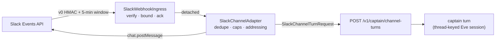

# @clankie/slack-bridge

Slack ingress for Clankie ([ADR 0080](../../docs/adr/0080-slack-is-a-channel-not-a-second-captain.md)).
A third instance of the existing channel shape, alongside Linear and Discord —
it introduces no new decision-making surface.



## What each piece owns

| Module                     | Owns                                                      | Never owns                   |
| -------------------------- | --------------------------------------------------------- | ---------------------------- |
| `slack-webhook-ingress.ts` | signature, replay window, body bounds, the 3-second ack   | what an event means          |
| `slack-channel-adapter.ts` | dedupe, caps, addressing, conversation address, the reply | planning, routing, approval  |
| `slack-reply-transport.ts` | the bot token and `chat.postMessage`                      | anything the adapter decides |

## Boundaries worth knowing

- **The thread is the conversation address.** `(teamId, channelId, threadTs)`
  maps to one durable Eve session, so a follow-up in the same thread continues
  the same conversation and a new thread starts a new one. The lane comes from
  the channel, not the transport ([ADR 0048](../../docs/adr/0048-discord-user-session-transport.md)).
- **Only addressed events become turns.** App mentions, thread replies, and DMs.
  An ordinary channel message between humans is ignored (`not_addressed`), so
  unaddressed workplace conversation never becomes model input.
- **The ack is a transport deadline, not a work deadline.** Slack retries
  anything unacknowledged within three seconds, so the turn runs detached. A
  slow mission never becomes a retry storm.
- **Approvals do not have a Slack path.** An approval-bearing turn replies with a
  link to the authenticated approval surface. No lane may widen approval
  authority.
- **Failures answer in-thread.** Silence is indistinguishable from being
  ignored, so a failed turn says so — without the error code, which is
  diagnostic detail rather than something a channel should carry.

## Configuration

| Variable                       | Purpose                                            |
| ------------------------------ | -------------------------------------------------- |
| `SLACK_SIGNING_SECRET`         | verifies the `v0=` request signature               |
| `SLACK_BOT_TOKEN`              | posts replies; held only by the reply transport    |
| `SLACK_APP_USER_ID`            | the installed bot user; gates authorization checks |
| `CLANKIE_PROFILE_HASH`         | doctrine profile stamped on every turn             |
| `CLANKIE_APPROVAL_SURFACE_URL` | where an approval request sends the asker          |
| `CLANKIE_API_URL`              | loopback control plane (default `127.0.0.1:4310`)  |
| `SLACK_BRIDGE_PORT`            | loopback listen port (default `4316`)              |

The process binds loopback only. Slack reaches it through the same public
termination the Linear webhook uses; the bridge is never exposed directly.

## Tests

```bash
pnpm --filter @clankie/slack-bridge test
```

Covers signature verification against the versioned basestring (a body-only
signature is refused), replay-window rejection, the URL-verification handshake,
detached acknowledgement, dedupe of retried deliveries, per-channel caps,
addressing rules, and every reply disposition.
