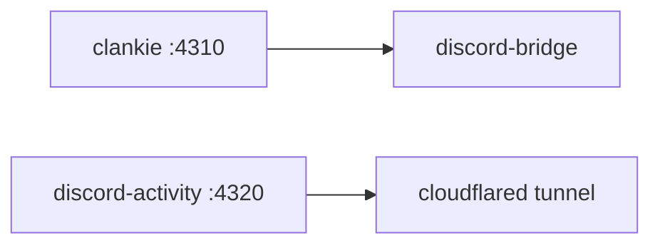

# Clankie operator console (`@clankie/tui`)

The operator console wears the v1 clankie face: a fullscreen `@earendil-works/pi-tui` layout (differential renderer, scrollback preserved) with the banner, transcript viewport, status bar, slash-command typeahead, Ctrl+/ command workbench, guided modal flows, and the agent-spinners loader — ported verbatim from clankie snapshot `04734df9` (VUH-755).

The TUI talks to **one backend**: the clankie service on port `4310`
(`apps/clankie`), which hosts the captain, the operator conversation dispatch
(`POST /operator/v1/dispatch`, the shared `OperatorConversationService*`
contract in `@clankie/protocol`), the lane listing (`GET /captain/v1/lanes`),
and the operator APIs (health, devices, pairing, presence, embodiment,
activity). `CLANKIE_CONTROL_PLANE_URL` overrides the base URL (default
`http://127.0.0.1:4310`; `CLANKIE_CAPTAIN_URL` is honored as a legacy alias).
Plain prompts ride the selected server-owned conversation over the dispatch
route with a durable per-surface replay cursor; there is no local scheduler and
no state inference from terminal text. Type `$` at a token boundary to search
Clankie's available skills, then complete `$skill-name` before the task. When
Clankie loads a skill, the transcript records one compact `skill loaded` receipt
instead of exposing the underlying `SKILL.md` read as a generic tool call.

Run after installing with Node 24. The fullscreen face requires a TTY; the
control subcommands are non-interactive:

```bash
clankie                         # via the bin/clankie.ts launcher (~/.local/bin symlink)
clankie --chat <conversationId> # select an existing server-owned conversation
clankie status                  # service probe plus every launcher-owned service
clankie restart                 # restart every service in dependency order
clankie restart captain         # restart the clankie service (+ the bridge that claims against it)
clankie down                    # stop them in reverse dependency order
clankie trace                   # render-only reasoning/tool stream (transport pending)
clankie pair                    # one-time QR + code to pair a device
clankie devices                 # list paired devices (revoke <id> to revoke)
clankie operator-credential rotate
clankie play status|stop        # live embodiment session controls
pnpm --filter @clankie/tui dev  # from the repo
```

`clankie` starts the clankie service when it is not already answering
`GET /health`, then opens the face. The service stays up when one TUI face
exits, so sibling Herdr panes do not disconnect one another. Service logs stay
out of the fullscreen terminal at
`${XDG_STATE_HOME:-~/.local/state}/clankie/clankie.log`. Direct
`pnpm --filter @clankie/tui dev` expects the service to be started separately.

## Supervised local services

`clankie` owns the long-lived local processes and restarts them in dependency
order ([ADR 0055](../../docs/adr/0055-launcher-owned-local-services.md)):



`restart` walks that order and stops at the first failure; `down` walks the
reverse. Each service keeps an atomic mode-0600 pid record at
`${XDG_STATE_HOME:-~/.local/state}/clankie/<id>-service.json` and logs to
`<id>.log` beside it. Before signalling, the launcher re-reads the recorded
pid's live command and refuses if it no longer looks like the service it
started, so a stale record can never kill a process that inherited the pid.

Start is health gated: it returns when the service's probe reports healthy, not
when the child spawns. The clankie service probes `GET /health`; the bridge —
which serves no HTTP — reports process state enriched with the presence phase it
publishes via the operator-readable `GET /v1/discord/presence-status`; the
tunnel probe is end-to-end against the public hostname. `clankie restart
captain` (aliases: `clankie`, `eve`, `cp`, `control-plane`) restarts the single
service and carries the Discord bridge with it, because the bridge's live
presence claim is only valid against the service instance that issued it.

Guild and channel allowlists come from `~/.config/clankie/settings.json`, not an
env prefix; the launcher supplies only `CLANKIE_DISCORD_PRESENCE_RUNTIME_MODULE`
(a repository path rather than a preference) and the brokered
`CLANKIE_CAPTAIN_TOKEN` half of the dispatch-auth secret — which is stripped
from the bridge's env, whose identity is brokered separately.

### `clankie trace` (read-only live thinking surface)

`clankie trace` is a **render-only** stream renderer with lane tags, redaction,
and an identity-only cursor. The pi-based clankie service does not expose a
per-event captain session stream yet, so the command currently has no live
transport and reports that plainly; the rendering pipeline (`processTraceStream`,
`src/session/trace-renderer.ts`) is kept as the seam a future stream plugs into.

- **Lane tags from typed context only.** Every rendered line is prefixed with a
  typed captain lane (`tui`, `discord_voice`, `discord_presence`, `gameplay`),
  from session context or an explicit `--lane` — never inferred from prose.
- **No payload persistence.** The mode-0600 checkpoint at
  `${XDG_STATE_HOME:-~/.local/state}/clankie/captain-trace-session.json` holds
  only sanitized continuation identity (`generation`, `sessionId`,
  `streamIndex`, `lane`, `active`).
- **Render-time redaction.** Tool inputs/outputs pass through
  `@clankie/observability`'s `sanitizeForSupportBundle` so secrets such as
  `Authorization` headers render as `[REDACTED]`.
- **`--json`.** One redacted JSON object per renderable event; human mode dims
  reasoning and prints `name(args-summary)` tool lines.
- **Herdr pane.** Inside Herdr (`HERDR_ENV=1`), the process calls
  `herdr pane report-agent` / `report-metadata` so the pane shows trace status.

### `/trace` (watching the rooms you are not in)

`/trace` in the fullscreen face watches any other captain lane — each Discord
server and channel he answers in, voice, gameplay
([ADR 0083](../../docs/adr/0083-every-room-he-thinks-in-is-watchable.md)).

```text
/trace                      list every room, its state, and which are watched
/trace discord_presence     watch a whole lane
/trace 1234:5678            watch one room by guild:channel (or any substring)
/trace all                  watch every room except this conversation
/trace off                  stop watching
```

Rooms come from `GET /captain/v1/lanes`, the service's authenticated
identity-only listing: lane, target id, bound session id, state, and last
update — no message, reasoning, tool, or continuation field. A watched room is
polled for changes and renders its session rotations and state transitions as
room-tagged transcript lines. Watching is a subscription and nothing else: no
send, no steering, and a watched room never drives the turn loader or status
bar. Per-event reasoning/tool rendering for watched rooms returns when the
service exposes lane transcripts.

## Layout

```text
src/face/    Ported v1 face components (theme, banner, spinners, outline,
             transcript viewport + blocks, command UI, interactive flow,
             autocomplete, chrome selection, SGR mouse, clipboard, bash escape).
             Verbatim ports — fix bugs upstream-style, don't restyle.
src/shell/   The face shell: layout assembly, central input router, overlay +
             selection plumbing, SetupFlow wizard engine, status bar, turn
             loader, prompt history. Extracted from v1's scripts/clankie.ts.
src/commands.ts   Console slash commands (/help /conversation /trace /activity
                  /layout /clear /status /exit).
src/connect-commands.ts  /connect (alias /integrations) for Linear, email, and
                  Discord ([ADR 0093](../../docs/adr/0093-owner-authored-service-connections.md)).
src/provider-commands.ts  /auth /provider /model /effort wizards (VUH-760) plus
                  the positional /image-model and /video-model (ADR 0085), over
                  @clankie/model-registry, @clankie/credential-broker, and
                  @clankie/model-provider (clankie.json config).
src/session/      Operator conversation client (dispatch wire contract over
                  plain fetch), conversation renderer, lane observation,
                  trace renderer + cursors, herdr reporting.
src/observation/  Presence poller for the status bar and the Herdr pane roster.
bin/              The clankie launcher, service registry/supervisor, and the
                  headless commands (health, restart, down, trace, pair,
                  devices, operator-credential, play).
```

## Interactions

- Type `/` for the command typeahead; Tab completes, Enter runs.
- `/conversation` lists the server-owned conversation registry and
  `/conversation <conversationId>` selects an existing conversation. Each face
  keeps an independent replay cursor; selection never creates a local chat ID.
- `/activity` reads Clankie's authenticated current-activity projection. It
  labels model-authored goal/commentary/intent separately from runner-observed
  outcome/effect/progress and prints the loopback watch URL for live frames.
  `CLANKIE_ACTIVITY_PORT` selects the viewer port (default `4320`). The command
  neither reads the gameplay transcript nor controls the emulator.
- `/status` shows the polled presence phase, the selected conversation, activity
  availability, and — inside Herdr — the sibling pane worker roster.
- `clankie health` reports operator-credential presence and env/store
  consistency without fingerprints or secret content. A mismatch fails the
  health command while the explicit env value remains the runtime override.
- `clankie operator-credential rotate` replaces the stored credential and
  invalidates existing operator requests immediately. Remove an active
  `CLANKIE_OPERATOR_TOKEN` override before rotating.
- `Ctrl+/` opens the fuzzy command workbench; `Ctrl+T` toggles transcript focus.
- `!` on an empty input enters the inline shell escape (Esc exits; Ctrl+C kills the running command).
- Esc detaches from an in-flight turn; the durable server-side turn continues
  and the face re-tails the conversation before sending another prompt.
- Mouse: wheel scrolls, drag selects (OSC-52 copy), scrollbar gutter drags, and clicking a tool block toggles its full arguments or result. With the keyboard, `Ctrl+T` focuses the transcript and Enter/Space toggles the selected block; Alt+Enter does the same without moving focus.
- `/layout` moves the input/status bands, toggles the header, and picks the spinner (`CLANKIE_TUI_*` env vars seed the defaults).
- `/connect` is how an owner gives him Linear, email, and Discord. Linear signs in with Linear's MCP OAuth (browser, no API key); an API key is an advanced fallback. Email takes IMAP/SMTP plus an app password (Gmail/iCloud/Fastmail/Outlook presets). Mail stays at the console. Discord is still a body: `/connect discord` opens `/discord`, which now includes a portal primer and `/discord invite`. `/auth mcp` redirects here ([ADR 0093](../../docs/adr/0093-owner-authored-service-connections.md)).
- `/auth` manages provider credentials (masked API-key entry into the Keychain broker — LLM providers plus the featured `elevenlabs` voice credential — ChatGPT/Codex browser or device OAuth, Claude Pro/Max manual-code OAuth, local credential removal, and harness-login guidance). `/auth status` lists only owner keys and subscriptions — auto-minted `clankie_*` process identities stay out of this surface — and does not reprint redacted secret prefixes. `/provider` chooses a provider context per model role; `/model` picks an actual model from that provider in the models.dev registry; `/effort` sets reasoning variants. `/image-model` and `/video-model` are positional rather than wizards (`/image-model openai gpt-image-2`, `/video-model xai grok-imagine-video-1.5`, plus `status` and `unset`) because each supported provider has one usable model; the service reads the resulting ref per request, so a change takes effect without a restart ([ADR 0085](../../docs/adr/0085-a-picture-he-made-is-something-he-said.md)). Provider intent stays process-local and is reconstructed from the configured `provider/model` ref after restart, so non-secret config has one authority in `~/.config/clankie/clankie.json`.
- OpenAI API-key access is `openai/<model>`; ChatGPT subscription access is the
  explicit `openai-codex/<model>` provider. They never borrow each other's
  credentials. While a subscription credential is stored it supersedes the API
  key for the models the Codex backend serves: `/model` and `/model status`
  show the redirect (`openai/gpt-5.5 → openai-codex/gpt-5.5`), and `/auth`
  logout is what restores metered access.
- The conversation selection and tail cursors are stored atomically with mode
  0600 under `.data/tui/operator-conversation*.json`. They are capability-like
  local state and are excluded from support bundles; a corrupt store raises
  rather than silently attaching the operator to the wrong conversation.

The `clankie` command runs `bin/clankie.ts` under Node's native type stripping, so the whole dependency graph stays erasable TypeScript (no enums, namespaces, or constructor parameter properties) — enforced repo-wide by `erasableSyntaxOnly` in `tsconfig.base.json`.

Known gap from the v1 port: drag-and-drop attachment paste rewriting stayed behind (`tui-attachments.ts` is coupled to the v1 brain's attachment pipeline); it returns with the service-side attachment path.
