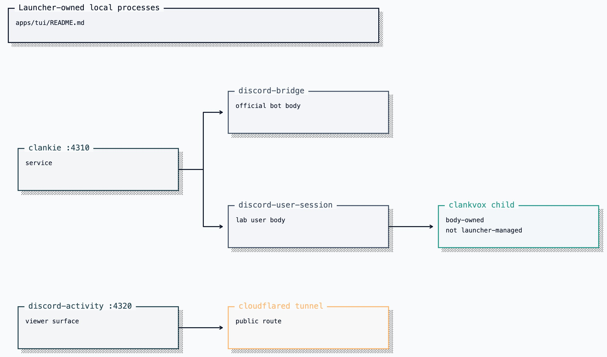

# Clankie TUI (`@clankie/tui`)

The TUI is Clankie's local chat and tool workspace. The chat surface is pi's,
in pi's fullscreen mode: messages, tool executions, the working indicator, and
the footer render with pi's own interactive components in a scrollable
transcript (mouse wheel, scrollbar, drag text selection, `Ctrl+Shift+F`
search) above an editor docked to the bottom of the terminal. Clicking a tool
or bash block toggles its full output (`Ctrl+O` toggles them all), clicking a
herdr pane id jumps the session to that pane, and the transcript is left in
scrollback on exit. Around it sits Clankie's chrome —
the banner, slash-command typeahead, guided setup flows, and the `Ctrl+/`
command workbench — dressed in pi's dark palette
([ADR 0137](../../docs/adr/0137-the-face-wears-pis-chat-surface.md)).

It talks to one backend: the clankie service on port `4310`. Plain prompts use
the shared operator-conversation dispatch contract at
`POST /operator/v1/dispatch`; lane observation uses
`GET /captain/v1/lanes`; health, devices, pairing, presence, embodiment,
activity, and memory use the operator APIs in the
[HTTP catalog](../clankie/openapi.yaml). `CLANKIE_CONTROL_PLANE_URL` overrides
the default `http://127.0.0.1:4310`; `CLANKIE_CAPTAIN_URL` remains a
compatibility alias.

## Run

The fullscreen console requires a TTY. Install the launcher with
`pnpm cli:install`, then use:

```bash
clankie                         # start the core service and open the console
clankie --chat <conversationId> # select a server-owned conversation
clankie status                  # probe every launcher-owned service
clankie doctor                  # this install: checkout vs release, models, credentials, optional herdr
clankie restart [service]       # restart in dependency order
clankie down [service]          # stop in reverse dependency order
clankie pair                    # show a one-time device pairing QR and code
clankie devices                 # list paired devices
clankie devices revoke <id>
clankie operator-credential rotate
clankie play status|stop
```

From the repository, `pnpm --filter @clankie/tui dev` opens only the console and
expects the service to be running already.

## Workspaces

Where `clankie` is typed decides the scope of the fresh room it creates
([ADR 0104](../../docs/adr/0104-clankie-works-where-you-launched-him.md)). A
launch outside this repository creates a conversation for that project —
its checkout root, or the directory itself when it is not a checkout — and the
captain's session runs its tools there. A launch inside this repository opens
a fresh global conversation whose session works in this repository. Use
`--chat <conversationId>` to resume instead.

`/cd <path>` moves to the newest retained conversation for another project,
opening its first on first visit; `/cd` alone names the current one. The
console's own `!` shell escape, path completion, footer, and `/status` follow the
same directory. The process keeps its selection in memory rather than
persisting a second session pointer.

The service retains recent inactive conversation directories for explicit
resume: at most 64 conversations, 30 days of inactivity, and 256 MiB. A
conversation's public replay log retains at most 500 events. Active, newly
created, and default-global conversations are protected from automatic removal.

The service stays up when a console exits, so sibling Herdr panes do not
disconnect each other. Logs live under
`${XDG_STATE_HOME:-~/.local/state}/clankie/` rather than entering the fullscreen
display.

## Supervised services

The launcher owns the long-lived local processes and restarts them in dependency
order ([ADR 0055](../../docs/adr/0055-launcher-owned-local-services.md)):



[Editable Turbopuffer tldraw source](../../docs/diagrams/clankie-docs-diagrams-2.tldraw)

Each process has a mode-0600 pid record and adjacent log. Before signalling a
pid, the launcher re-reads its live command and refuses if it no longer matches
the service it started. Starts are health-gated; the activity tunnel is probed
through its public hostname. A restart requested inside an active operator turn
waits for that durable turn to settle, and the console reconnects without
re-running the prompt. Generic services receive ten seconds to stop after
`SIGTERM`. Clankie receives its configured
`CLANKIE_PLAY_SHUTDOWN_DEADLINE_MS` plus a two-second reporting cushion, so the
supervisor cannot force-kill an active playthrough before its terminal telemetry
settles.

Guild/channel settings come from `~/.config/clankie/settings.json`. The launcher
injects repository paths and local service credentials where required, while
Discord body identities resolve directly from the credential broker. The
launcher starts only the selected Discord body; that body owns one `clankvox`
child through `@clankie/vox-client`, so Vox is not a separately supervised
credential holder.

## Operator behavior

- `/conversation` opens a searchable dialog for retained conversations;
  `/conversation <name-or-path>` switches directly. `/chat` remains an alias.
  Press `x` to close the highlighted inactive conversation; active and default
  conversations stay protected. Switching rebuilds the visible transcript from
  the retained conversation log, then continues from the console's bounded
  replay cursor; it never creates a device-local session.
- `/new [title]` starts and selects a conversation with fresh model context in
  the current workspace. The previous conversation remains available through
  `/conversation`.
- `/btw [question]` (alias `/side`) opens an ephemeral side conversation from
  the current Pi branch. Its inherited history is reference-only; Ctrl+C
  discards the fork and restores the main transcript.
- `/goal` shows the selected conversation's durable goal. `/goal <objective>`
  starts one; `--tokens <n>` gives it a hard model-token budget, and
  `pause|resume|clear` remain owner controls. Clankie proposes goals in chat;
  proposals do not activate themselves.
- `/autonomy on|off` controls autonomous goal continuations and scheduled
  self-wakes globally. `/autonomy clear` removes the selected conversation's
  pending wake without changing its goal.
- `/cd` opens the conversation for another directory and moves the console's
  shell escape and completion with it.
- Type `/skill-name` for direct skill invocation or `$` at a token boundary for
  the skill picker. The transcript records a compact `skill loaded` receipt.
- `/activity` shows the current goal, commentary, intent, observed outcome, and
  the loopback watch URL without controlling the emulator.
- `/games` opens a toggle dialog for both PokeAgent modes; move to a game and
  press Enter to enable or disable it. `/games solo on|off` and `/games mmo
on|off` remain available for direct use. Restart Clankie to apply a change.
  Both may be enabled, with one live session across them.
- `/saves` browses Clankie's receipt-validated local Pokémon checkpoints. Selecting a
  save shows its game, capture time, position, and id; deletion requires a
  separate confirmation. Hosted-world saves remain on their world server.
- `/memory` browses and edits episodes and permitted Discord person facts through
  operator-only APIs.
- `/vt` (aliases `/voice-log`, `/voice-transcripts`) opens a live overlay of
  retained Discord voice transcripts. `Ctrl+Shift+V` toggles the same view;
  Esc or `/vt off` closes it. Exact speech appears only when
  `discord.voiceTranscriptLoggingEnabled` is on ([ADR 0121](../../docs/adr/0121-development-voice-transcripts-are-explicit.md));
  otherwise the overlay points at `/discord`. This is not `/trace`: voice lanes
  there are captain handoffs, not the Discord conversation.
- `/status` shows presence, conversation, workspace, model context, activity
  availability, and the Herdr pane roster when seated inside Herdr.
- `/board`, `/board focus`, and `/board close` manage the herdr-lead companion
  board. A seated turn receives the current agent census.
- `/connect` configures Linear and email and can open Discord setup; use direct
  `/discord` for the complete lab-user opt-in flow and either body's non-secret ids
  ([ADR 0093](../../docs/adr/0093-owner-authored-service-connections.md)).
- `/auth` writes provider keys and OAuth credentials to the credential broker.
  `/auth status` may also report compatibility provider environment fallbacks;
  Discord and body credentials remain broker-only except documented
  operator/captain test overrides.
- `/voice` selects OpenAI Realtime, Grok Voice, or OpenAI plus ElevenLabs and
  configures the active model, voice, xAI reasoning effort, and brokered API
  keys. `/voice status` shows the effective settings and environment overrides.
- YouTube music is an ordinary prompt, not a slash command. Audible playback is
  on the active Discord body's Vox primary-voice role; see the
  [Discord media guide](../../docs/discord-media.md).
- `/provider`, `/model`, and `/effort` select the captain. The header carries
  the effective Pi model and effort after subscription routing, effective-ref
  variant precedence, and model-supported clamping. `/image-model` and
  `/video-model` select generation models. Non-secret model configuration lives
  in `~/.config/clankie/clankie.json`.
- `/provider` → "add a local endpoint…" declares an OpenAI-compatible local
  runtime (Ollama, LM Studio, vLLM) by base URL, reads its model list from
  `GET {baseURL}/models`, and needs no credential. The service picks the new
  provider up on `clankie restart captain`.
- `/layout` shows or hides the header banner.
- `/jump <pane|agent>` focuses a herdr agent (`herdr agent focus`), and any
  pane id in the transcript — `w18:p1J`, wherever Clankie or a tool wrote it —
  is clickable for the same jump. Only a refusal reaches the transcript; a
  working jump moves the session, which says it better. `/status` lists the
  pane ids to aim at.
- `!` on empty input opens the inline shell. `Ctrl+O` toggles tool and bash
  output between preview and full; clicking a block toggles just that one.
  Esc interrupts an in-flight turn: the service aborts Clankie's live model
  turn and the run settles as `cancelled` in the durable log. When the run
  cannot be cancelled (an older service, or it already settled) — or on a
  second Esc — the console detaches instead and the service continues the
  turn.
- `clankie health` reports operator credential source and env/store consistency
  without fingerprints or secret values. Remove an active
  `CLANKIE_OPERATOR_TOKEN` override before rotating the stored credential.

## Transcript rendering

A frame renders every block in the transcript, so block cost is paid on every
keystroke and must not grow with the length of the session
([ADR 0112](../../docs/adr/0112-a-frame-costs-the-same-at-turn-one-thousand.md)).
A block component returns a stable array while its content is unchanged —
memoize through `ClankieRenderCache`, and clear it in `invalidate` and in every
setter. The viewport uses that array's identity to skip re-decorating the block.
A component that rebuilds its array each call still renders correctly, but it
re-pays its own cost every frame.

Measure before and after any change to the render path:

```bash
node apps/tui/bench/transcript-render.ts          # default 10..500 blocks
node apps/tui/bench/transcript-render.ts 1000     # a specific scrollback size
```

The launcher runs TypeScript through Node's native type stripping; the repo's
`erasableSyntaxOnly` setting enforces the supported syntax.
