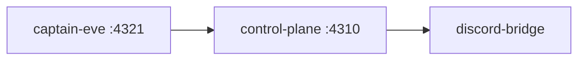

# Clankie operator console (`@clankie/tui`)

The operator console wears the v1 clankie face: a fullscreen `@earendil-works/pi-tui` layout (differential renderer, scrollback preserved) with the banner, transcript viewport, status bar, slash-command typeahead, Ctrl+/ command workbench, guided modal flows, and the agent-spinners loader — ported verbatim from clankie snapshot `04734df9` (VUH-755).

The TUI is an Eve session client for captain conversation and a semantic
control-plane client for authoritative mission data. It must not become a
second scheduler or infer task state by scraping terminal text; `arch:check`
forbids importing `@clankie/mission-engine`.

The mission observer is read-only. It replays the control plane's authoritative
local SQLite event log by global sequence, projects the mission list/task tree/
worker roster/event tail and captain presence for the status bar, and saves a
sanitized mode-0600 cursor checkpoint at `.data/tui/mission-observer.json`. The SQLite connection is opened with
`readOnly` and `PRAGMA query_only`; the observer exposes only mission selection
and next/previous navigation. `CLANKIE_EVENT_STORE` overrides the default
`artifacts/control-plane/events.db` path.

The log is partitioned by `missionId`, but reserved streams share it — presence
sessions, embodiment sessions, devices, triggers. The observer routes on
`streamKind` ([ADR 0065](../../docs/adr/0065-event-streams-declare-their-kind.md)),
so only real missions reach the mission list and its default selection. Discord
presence gets its own section showing the newest sessions and their phase; a
bridge restart mints a new session id, so older ones age out rather than
accumulating. Other reserved kinds are not rendered. The checkpoint is version 2;
an older checkpoint is rejected and replayed from sequence 0.

Run after installing with Node 24. The fullscreen face requires a TTY; captain
control subcommands are non-interactive:

```bash
clankie                        # via the bin/clankie.ts launcher (~/.local/bin symlink)
clankie --chat <conversationId> # select an existing server-owned conversation
clankie status                 # captain probe plus every launcher-owned service
clankie restart                # restart all three services in dependency order
clankie restart discord        # restart one (captain | control-plane | discord)
clankie down                   # stop them in reverse dependency order
clankie msg "status report"    # submit on the isolated headless session
clankie watch --timeout 600    # JSONL events until the turn settles
clankie wait --timeout 600     # final boundary only
clankie trace                  # live reasoning/tool stream; stays across turns
clankie trace --json           # machine-readable NDJSON (redacted)
clankie trace --lane gameplay  # typed session-context lane label
pnpm --filter @clankie/tui dev # from the repo
```

`clankie` attaches to a healthy captain at `CLANKIE_CAPTAIN_URL` (default
`http://127.0.0.1:4321`) or builds and starts one shared `eve start` process. The
built runtime keeps durable sessions independent of hot-reload snapshot cleanup. Captain
logs stay out of the fullscreen terminal at
`${XDG_STATE_HOME:-~/.local/state}/clankie/captain-eve.log`. The service remains
available when one TUI face exits, so sibling Herdr panes do not disconnect one
another. Before the fullscreen face opens, the launcher displays its current
startup stage. An occupied but unhealthy endpoint fails immediately with
recovery guidance instead of waiting for the startup deadline. Direct
`pnpm --filter @clankie/tui dev` expects the captain service to be started
separately.

The same executable has a non-interactive `--recovery-probe` mode for the M1
crash/reconnect gate. It reads mission state through `@clankie/api-client`,
consumes sequenced terminal replay from the runner's semantic boundary, writes
an atomic cursor checkpoint, and remains alive so the drill can crash the real
TUI process. This is a CI proof surface, not an alternate operator interface.

## Supervised local services

`clankie` owns the three long-lived processes that put Clankie in Discord, and
restarts them in dependency order ([ADR 0055](../../docs/adr/0055-launcher-owned-local-services.md)):



`restart` walks that order and stops at the first failure; `down` walks the
reverse. Each service keeps an atomic mode-0600 pid record at
`${XDG_STATE_HOME:-~/.local/state}/clankie/<id>-service.json` and logs to
`<id>.log` beside it. Before signalling, the launcher re-reads the recorded pid's
live command and refuses if it no longer looks like the service it started, so a
stale record can never kill a process that inherited the pid.

### Restarting a captain the launcher did not start

`clankie restart` adopts an unowned **captain** rather than refusing it, because
refusing left the operator unable to restart Clankie's own captain whenever it
had been started by hand or outlived the run that spawned it — the remedy was a
manual `lsof` and `kill`. Adoption never trusts the endpoint's word for it: the
listening pid is read from the port, and its live command must contain the
`appRoot` that captain itself reported (or match the launcher's own start
command) before anything is signalled. A listener that cannot be proven to be
this checkout's captain-eve is still reported and never killed. The other
services are unchanged — reported, never adopted.

### Identity and currency are different questions

A captain is inspected for two things, and they have opposite remedies:

| Question                        | Answered by                   | When it fails                                         |
| ------------------------------- | ----------------------------- | ----------------------------------------------------- |
| Is this Clankie's captain?      | agent name + ready eve health | `unhealthy` — a stranger on the port, never signalled |
| Is it built from this checkout? | authored tool inventory       | `stale` — ours, rebuilt by `clankie restart`          |

Keeping the tool inventory out of the identity check is load-bearing. While it
was part of identity, adding any captain tool made the running captain fail to
identify as the authored captain, and `restart` refused to touch it — a captain
that had merely fallen behind read as an intruder. A `stale` inspection names
which tools drifted, so the message says what is old rather than that something
is wrong.

Start is health gated: it returns when the service's probe reports healthy, not
when the child spawns. The captain probes `/eve/v1/health` and `/eve/v1/info`,
the control plane probes `GET /health`, and the bridge — which serves no HTTP —
reports process state enriched with the presence phase it publishes to the
control plane via the operator-readable `GET /v1/discord/presence-status`.

Guild and channel allowlists come from `~/.config/clankie/settings.json`, not an
env prefix; the launcher supplies only `CLANKIE_DISCORD_PRESENCE_RUNTIME_MODULE`,
which is a repository path rather than a preference.

The headless captain commands are a supported operator surface, not a recovery
fixture. `health`/`status` never start a service and never probe the nonexistent
`GET /health` route on the captain. `msg` does not echo message content; `watch` and `wait`
consume the Eve semantic stream from a private mode-0600 cursor under
`${XDG_STATE_HOME:-~/.local/state}/clankie/`, separate from the fullscreen
face's `.data/tui/captain-session.json` cursor.

### `clankie trace` (read-only live thinking surface)

`clankie trace` is a **render-only** subscriber of the live Eve `/eve/v1/session`
NDJSON stream (same source as `watch`). It is not a second control surface: no
steering, no scheduling, no mission-engine imports, and no state inference from
terminal text.

- **Stays across turns.** Unlike `watch`/`wait`, a turn boundary
  (`session.waiting` / `session.completed`) does not exit the process. The
  client reconnects with its identity-only cursor so consecutive turns keep
  streaming in one pane.
- **Lane tags from typed context only.** Every rendered line is prefixed with a
  typed captain lane (`tui`, `discord_voice`, `discord_presence`, `gameplay`).
  Lane labels come from session context (default HTTP headless path → `tui` per
  captain-eve channel mapping, or an explicit `--lane` value). They are never
  inferred from model/reasoning prose. The public Eve stream event body does not
  stamp lane per event; multi-lane fan-in of concurrent sessions would need a
  public session→lane listing API before a live multi-session merge can be
  trustworthy without operator/session context.
- **No payload persistence.** The mode-0600 checkpoint at
  `${XDG_STATE_HOME:-~/.local/state}/clankie/captain-trace-session.json` holds
  only sanitized continuation identity (`generation`, `sessionId`, `streamIndex`,
  `lane`, `active`). Reasoning text, prompts, tool inputs, and tool outputs are
  never written to disk by the trace client.
- **Render-time redaction.** Tool inputs/outputs pass through
  `@clankie/observability`'s `sanitizeForSupportBundle` so secrets such as
  `Authorization` headers render as `[REDACTED]` (same central key list as
  support bundles — no forked redaction table).
- **`--json`.** Emits one redacted JSON object per renderable event for machine
  consumers; human mode dims reasoning and prints `name(args-summary)` tool
  lines.
- **Herdr pane.** Inside Herdr (`HERDR_ENV=1`), the process calls
  `herdr pane report-agent` / `report-metadata` so the pane shows captain-trace
  status and siblings can wait on it. Outside Herdr those calls are inert.

Dedicated Herdr pane (from a sibling pane):

```bash
NEW=$(herdr pane split --direction right --no-focus | python3 -c 'import sys,json; print(json.load(sys.stdin)["result"]["pane"]["pane_id"])')
herdr pane run "$NEW" "clankie trace"
```

The `clankie` command runs `bin/clankie.ts` under Node's native type stripping, so the whole dependency graph stays erasable TypeScript (no enums, namespaces, or constructor parameter properties) — enforced repo-wide by `erasableSyntaxOnly` in `tsconfig.base.json`.

## Layout

```text
src/face/    Ported v1 face components (theme, banner, spinners, outline,
             transcript viewport + blocks, command UI, interactive flow,
             autocomplete, chrome selection, SGR mouse, clipboard, bash escape).
             Verbatim ports — fix bugs upstream-style, don't restyle.
src/shell/   The face shell: layout assembly, central input router, overlay +
             selection plumbing, SetupFlow wizard engine, status bar, turn
             loader, prompt history. Extracted from v1's scripts/clankie.ts.
src/commands.ts   Console slash commands (/help /mission /doctrine /approvals
                  /eval /layout /clear /new /status /exit).
src/approval-inbox.ts  Authenticated pending-request review, mission evidence,
                  and typed approve/deny decisions through the control plane.
src/provider-commands.ts  /auth /provider /model /effort wizards (VUH-760) over
                  @clankie/model-registry, @clankie/credential-broker, and
                  @clankie/model-provider (clankie.json config).
src/session/      Durable Eve client cursor, replay-safe stream renderer, and
                  console state outside the read-only mission observer.
src/observation/  Read-only sequenced event source, durable observer cursor,
                  and mission/task/worker projections.
```

## Interactions

- Type `/` for the command typeahead; Tab completes, Enter runs.
- `/conversation` lists the injected server registry and
  `/conversation <conversationId>` selects an existing conversation. Each face
  keeps an independent replay cursor; selection never creates a local chat ID.
- `/mission` opens the live observer; `/mission list`, `/mission next`,
  `/mission prev`, and `/mission <id>` provide read-only selection/navigation.
- `/approvals` loads pending requests from the control plane, shows the policy
  rationale plus plan/check/diff/artifact evidence, and records an approve or
  deny reason. The launcher and TUI load the broker-owned local operator
  credential automatically; first control-plane start creates it when absent.
  `CLANKIE_OPERATOR_TOKEN` is an explicit CI/test override.
  `CLANKIE_CONTROL_PLANE_URL` defaults to `http://127.0.0.1:4310`. The console
  records decisions only—connector execution returns through the policy path.
- `clankie health` reports operator-credential presence and env/store
  consistency without fingerprints or secret content. A mismatch fails the
  health command while the explicit env value remains the runtime override.
- `clankie operator-credential rotate` replaces the stored credential and
  invalidates existing operator requests immediately. Remove an active
  `CLANKIE_OPERATOR_TOKEN` override before rotating.
- `Ctrl+/` opens the fuzzy command workbench; `Ctrl+T` toggles transcript focus.
- `!` on an empty input enters the inline shell escape (Esc exits; Ctrl+C kills the running command).
- Esc detaches from an in-flight captain turn. Eve has no server-side cancel
  route, so the durable turn continues and the TUI reconnects before sending
  another prompt.
- Mouse: wheel scrolls, drag selects (OSC-52 copy), scrollbar gutter drags, click collapses tool blocks.
- `/layout` moves the input/status bands, toggles the header, and picks the spinner (`CLANKIE_TUI_*` env vars seed the defaults).
- `/auth` manages provider credentials (masked API-key entry into the Keychain broker — LLM providers plus the featured `elevenlabs` voice credential — ChatGPT/Codex browser or device OAuth, Claude Pro/Max manual-code OAuth, local credential removal, and harness-login guidance); `/provider` chooses a provider context per model role; `/model` picks an actual model from that provider in the models.dev registry; `/effort` sets reasoning variants. Provider intent stays process-local and is reconstructed from the configured `provider/model` ref after restart, so non-secret config has one authority in `~/.config/clankie/clankie.json`.
- OpenAI API-key access is `openai/<model>`; ChatGPT subscription access is the
  explicit `openai-codex/<model>` provider. They never borrow each other's
  credentials. While a subscription credential is stored it supersedes the API
  key for the models the Codex backend serves: `/model` and `/model status`
  show the redirect (`openai/gpt-5.5 → openai-codex/gpt-5.5`), and `/auth`
  logout is what restores metered access.
- The Eve cursor is stored atomically with mode 0600 under
  `.data/tui/captain-session.json`. It is capability-like local state and is
  excluded from mission events and support bundles. Its hashed build generation
  prevents a cursor from crossing incompatible captain artifacts: settled
  conversations reset visibly, while active turns require explicit `/new`
  abandonment after mission-state inspection.

Known gap from the v1 port: drag-and-drop attachment paste rewriting stayed behind (`tui-attachments.ts` is coupled to the v1 brain's attachment pipeline); it returns with the control-plane attachment path.
