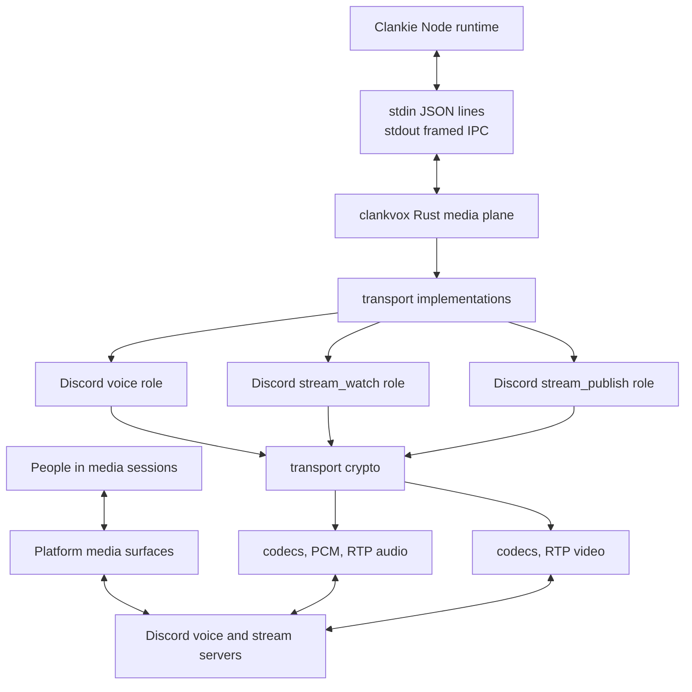

# ClankVox Diagram

This is the media-plane map for how `clankvox` fits under Clankie. ClankVox is
Clankie's presence plane: the native media plane for voice and Go Live. Discord
is the only platform it targets today, and the roles below are its Discord
transport.

## Ownership Split

- Clankie owns prompts, settings, platform gateway control, tools, and product
  behavior.
- `clankvox` owns native media sockets, UDP/RTP, codec framing, transport
  encryption, audio capture, playback pacing, and platform media telemetry.
- The Discord transport adds Discord voice/stream sockets, DAVE, and native Go
  Live watch/publish roles.
- IPC is the boundary. Stdin accepts JSON lines, stdout emits framed IPC
  messages, and stderr is transport logging.

## Discord Runtime Roles

- `voice`: the anchor voice connection for capture and playback.
- `stream_watch`: inbound Go Live receive.
- `stream_publish`: outbound Go Live send.

For the written model, see [Architecture](./architecture.md), [Audio Pipeline](./audio-pipeline.md), and [Go Live](./go-live.md).
