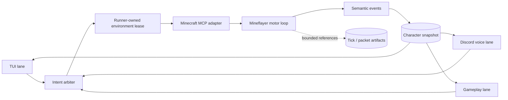
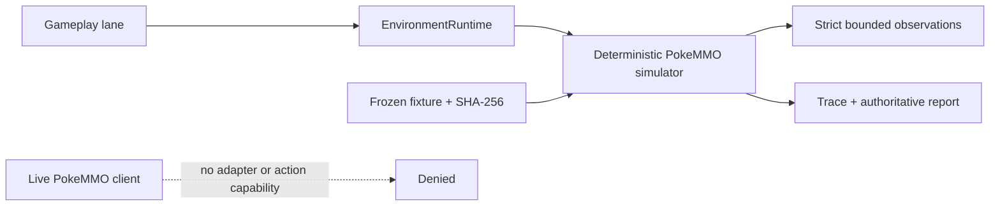
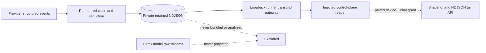

# Architecture

## System diagram

```text
Discord text/voice      Pi TUI       iOS/Android/macOS garden/graph/terminal
        │                  │                       │
        └────────── commands, approvals, queries ─┘
                                   │
                         Captain / Eve boundary
              persona · conversation · planning · critique · synthesis
                                   │
                       Mission control plane (trusted)
       event store · DAG scheduler · doctrine · policy · budgets · approvals
                                   │
                         Versioned worker protocol
                                   │
                         Local runner (trusted)
   worktrees · PTYs · native sessions · sandbox · capability exchange · leases
          │                  │                  │                │
   Codex App Server   Claude Agent SDK       Pi RPC       shell/local adapters
          │                  │                  │                │
          └──────────── structured events + artifacts ──────────┘
                                   │
                   Herdr/tmux/native PTY presentation adapters
```

## Trust boundaries

### Untrusted/model-controlled

- model text and tool arguments;
- repository files and instructions;
- external tracker/design/chat content;
- terminal output and ANSI sequences;
- downloaded skills/plugins;
- persona and skin content (`soul.md`, asset packs);
- worker summaries and self-reported success.

### Trusted deterministic services

- mission state machine;
- doctrine compiler and action policy;
- approval store;
- credential broker;
- runner process/worktree ownership;
- terminal control leases;
- event sequencing and audit chain;
- acceptance-test results and artifact hashing.

## Interactive environments

Embodied integrations use one logical character with separate durable captain
lanes for TUI, Discord voice, and gameplay. The lanes share a versioned
character projection, not continuation tokens or copied transcripts. A
deterministic intent arbiter compares `goalVersion` before a command reaches a
runner-owned environment lease.



Session phase and lane determine tool exposure. An inactive Minecraft session
exposes `join` and `status`. Only an active `gameplay` lane receives observation
and motor-action tools; TUI and Discord retain status, steering, pause, and
disconnect controls. Pause, disconnect, lease loss, or failure removes the
gameplay surface without waiting for a model turn.

All environment commands carry source lane, principal and authority tier,
correlation identity, and expected goal version. Long-running work returns an
action handle immediately. Mineflayer and Paper types remain behind adapters;
the shared protocol contains only versioned provider-neutral schemas.

Session and lease contracts use strict provider-profiled v2 resource bounds.
The compatibility boundary dual-reads the frozen Minecraft-shaped v1 contract,
normalizes it, and single-writes v2 runtime records. Minecraft retains server,
dimension, distance, and block bounds; the PokeMMO simulator uses simulator,
allowed-map, navigation, menu, battle-turn, duration, and typed capability
bounds. A provider never reuses another provider's field under a new meaning.

### PokeMMO simulator and live boundary

The executable PokeMMO profile is a deterministic simulator adapter under
`integrations/pokemmo-simulator`. It runs through `EnvironmentRuntime`, so the
same runner-owned lease, stale-goal, idempotency, cancellation, timeout,
restart, and emergency-stop invariants apply. The frozen
`scenarios/pokemmo/navigation-trainer-battle/v1` fixture pins exact bytes and
produces a bounded hash-chained trace plus a simulator-authoritative final-state
report.



PokeMMO observations cover overworld, menu, party, inventory, battle, dialog,
danger, and action state. Simulator actions cover bounded navigation,
interaction, menu choice, battle move, party switch, item use, and wait; shared
action status and cancellation retain the environment lifecycle. Dormant
simulator sessions expose join/status only, active gameplay receives
observe/start/status/cancel, and TUI or voice receives supervision only.

The live PokeMMO boundary contains only read-only observation and coaching
capability names. No live adapter or client action path exists. Keyboard, mouse,
controller, accessibility, packet, memory, process, login, remote connection,
tampering, reverse-engineering, anti-cheat, human-timing imitation, CAPTCHA,
social, and economy capabilities fail closed. This boundary follows PokeMMO's
[macroing policy](https://support.pokemmo.com/knowledgebase/article/macroing-faq),
[penalty policy](https://support.pokemmo.com/knowledgebase/article/penalty-policy),
and [Terms of Service](https://pokemmo.com/en/tos/). Raw frames and credentials
never enter semantic events; visual evidence uses bounded opaque artifact
references.

## Discord voice media plane

The Discord bridge is the single writer for the official-bot presence session. Gateway and bot
voice callbacks emit `discord.presence.session.phase_changed` semantic events to the control
plane, whose replayed projection gates the transport-agnostic presence catalog. Disconnect,
lease loss, and failure remove act capability immediately; operator views render the event data
and never scrape gateway logs or infer lifecycle from action payloads.

Discord voice separates official-bot gateway signaling from native media ownership. The bridge
registers callbacks directly through `guild.voiceAdapterCreator`, sends gateway OP4 join/leave
payloads through the returned adapter, and combines the bot's voice-server and voice-state updates
into a typed ClankVox `session_open`. It does not start `@discordjs/voice` networking for a
ClankVox-backed session; ClankVox alone owns the Discord voice WebSocket, UDP, RTP/Opus, transport
AEAD, DAVE, PCM conversion, mixing, and 20 ms send cadence.

The bridge owns the schema-1 process boundary in
[`apps/discord-bridge/src/clankvox-ipc.ts`](../apps/discord-bridge/src/clankvox-ipc.ts). Commands
are capped NDJSON; sidecar output is a capped lane-plus-u32-little-endian frame. Discord media is
48 kHz Opus. The governed voice brain sends and receives model-facing 24 kHz mono s16le PCM by
default; the sidecar owns conversion in both directions. Raw audio remains outside mission and
captain semantic event streams.

The accepted placement is `apps/clankvox/`. VUH-805 creates the complete Cargo crate and pnpm
package facade atomically after the upstream AGPL-3.0-or-later versus repository Apache-2.0
licensing disposition is recorded. This schema-1, official-bot boundary deliberately excludes
Go Live/video, user-session paths, v1 Realtime orchestration, and v1 music/YouTube/player-control
IPC. Go Live watch and publish remain in v2 as isolated, explicitly enabled personal-lab
capabilities: VUH-836 owns the separate user-session transport, VUH-840 owns bounded stream
observation, and VUH-841 owns governed publishing. Those paths require a new versioned media
boundary and may not make the bot and user-session transports co-own a voice/media session. See
[`ADR 0024`](adr/0024-discord-dual-plane-presence.md) and
[`ADR 0025`](adr/0025-clankvox-placement-and-ipc.md).

## Terminal data plane

Terminal traffic uses the strict provider-neutral v1 contract in
`@clankie/terminal-protocol` ([ADR 0033](adr/0033-terminal-wire-and-vt-restore-snapshots.md)).
The trusted runner is the only owner of real PTYs, ordered replay state, headless
VT state, and the one renewable control lease. It applies PTY bytes to
`@xterm/headless`, serializes visible state with `@xterm/addon-serialize`, and
publishes the resulting VT restore sequence with geometry at an exact,
parser-quiescent terminal sequence boundary. A raw byte tail is not a snapshot.

Authenticated clients connect either directly to the runner gateway or through
the relay. The relay transports validated terminal messages but never owns a
PTY, sequence history, VT emulator, or control lease. TypeScript at the runner
boundary owns sequencing, resume, duplicate/gap handling, snapshot publication,
idempotent input/resize, and lease expiry.

Discovery, subscribe, snapshot-resync delivery, and resync-required responses
carry explicit open/closed lifecycle state, including the original sequenced
closure identity. Attached clients receive complete revisioned
capabilities plus a positive revision atomically on every subscribe, resume, or
resync acknowledgement, followed by `terminal.capabilities_changed` pushes only
at greater revisions independently of the terminal data sequence. Canonical byte validation and byte helpers require no Node globals,
so the same schema surface is safe in React Native and browser-like clients.

Terminal output, restore sequences, input, and resize remain a high-volume data
plane. They never become semantic mission events and never enter structured
logs, analytics, crash reports, or ordinary support bundles. Only bounded
metadata such as terminal identity, geometry, sequence boundaries, capability
flags, lease lifecycle, and typed error codes crosses the semantic/diagnostic
boundary; artifacts use their separately authenticated retrieval plane.

## Worker transcript projection

Garden-facing worker activity comes from a runner-owned semantic projection,
not terminal bytes, provider streams, Eve operator history, or reconstructed
pane text. The projection is keyed by `missionId + taskId + workerRunId` and
contains ordered status, bounded narrative, action, artifact, blocker, and
completion entries. Every entry carries correlation/profile identity,
visibility, redaction classification, and runner or worker-summary provenance.



The runner reduces untrusted fields to a closed schema before the first disk
write. Authorization headers, tokens, credentials, private prompts,
chain-of-thought, raw audio, and unbounded output cannot be persisted as entry
payloads. Worker-authored progress uses typed status templates; arbitrary
provider prose is never accepted as a transcript summary.

Each run retains the newest 500 entries by default. An opaque cursor binds a
generation and sequence. Readers receive typed `cursor_expired` recovery when
retention removes their replay floor and typed `run_replaced` recovery when a
task has a newer worker run. The control plane only proxies the injected runner
reader, filters to garden visibility, and fails closed unless the paired device
currently holds the `chat` grant. Transcript files are excluded from support
bundles, analytics, crash reports, and the mission event store.

## Control flow

1. A channel normalizes user intent into a command.
2. The captain requests context and proposes a typed `MissionPlan`.
3. The control plane validates DAG, budgets, write conflicts, risk, and doctrine.
4. The user approves the plan when required.
5. The scheduler leases ready tasks to eligible workers.
6. The runner creates isolation and starts the native provider session.
7. Provider events are normalized into domain events while raw logs remain optional diagnostics.
8. Results produce evidence and artifacts; dependent tasks become ready.
9. Independent verification and review decide whether success criteria are met.
10. Privileged actions pass through `ActionRequest → ActionDecision → Approval → Connector`.
11. The evaluator scores the mission and records recommendations.

## Package dependency direction

```text
protocol
  ↑
terminal-protocol   interactive-environment   analytics   observability   jsonl-rpc
  ↑                      ↑           ↑             ↑
worker-sdk   doctrine   garden-model   event-store   status-resolver   credential-broker
  ↑             ↑             ↑
provider adapters       mission-engine
       ↑                    ↑
runner / control-plane / captain / TUI / Discord / lab
  (graphical command-center app: private clankie-app product monorepo)
```

Rules:

- `protocol` imports no workspace package.
- provider adapters do not import the mission engine or doctrine evaluator.
- the captain calls narrow control-plane tools; it does not spawn processes directly.
- UIs do not mutate mission state locally; they send typed commands.
- only the runner/privileged connectors hold execution or provider credentials.

## State model

### Operational state

Authoritative, event-sourced mission/task/worker/approval/artifact data.

### Visual state

Disposable animation, camera, layout, selection, and interpolation state.

### Progression state

Persistent cosmetics and historical achievements derived from verified outcomes; never an authority source.

## Persistence roadmap

- V0: in-memory mission engine + JSONL hash-chained event artifacts.
- V1: SQLite local control plane with transactional outbox and replay.
- Team: PostgreSQL event/relational projections, object storage for artifacts, Redis/NATS only where operationally justified.

The event schema is versioned before the database choice becomes a product API.
