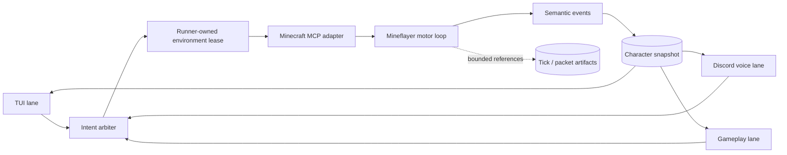

# Architecture

## System diagram

```text
Discord text/voice      Pi TUI       iOS/macOS garden/graph/terminal
        │                  │                       │
        └────────── commands, approvals, queries ─┘
                                   │
                         Captain / Eve boundary
              persona · conversation · planning · critique · synthesis
                                   │
                       Mission control plane (trusted)
       event store · DAG scheduler · doctrine · policy · budgets · approvals
                                   │
                         Versioned worker protocol
                                   │
                         Local runner (trusted)
   worktrees · PTYs · native sessions · sandbox · capability exchange · leases
          │                  │                  │                │
   Codex App Server   Claude Agent SDK       Pi RPC       shell/local adapters
          │                  │                  │                │
          └──────────── structured events + artifacts ──────────┘
                                   │
                   Herdr/tmux/native PTY presentation adapters
```

## Trust boundaries

### Untrusted/model-controlled

- model text and tool arguments;
- repository files and instructions;
- external tracker/design/chat content;
- terminal output and ANSI sequences;
- downloaded skills/plugins;
- persona and skin content (`soul.md`, asset packs);
- worker summaries and self-reported success.

### Trusted deterministic services

- mission state machine;
- doctrine compiler and action policy;
- approval store;
- credential broker;
- runner process/worktree ownership;
- terminal control leases;
- event sequencing and audit chain;
- acceptance-test results and artifact hashing.

## Interactive environments

Embodied integrations use one logical character with separate durable captain
lanes for TUI, Discord voice, and gameplay. The lanes share a versioned
character projection, not continuation tokens or copied transcripts. A
deterministic intent arbiter compares `goalVersion` before a command reaches a
runner-owned environment lease.


```mermaid
flowchart LR
  T[TUI lane] --> I[Intent arbiter]
  V[Discord voice lane] --> I
  G[Gameplay lane] --> I
  C[(Character snapshot)] --> T
  C --> V
  C --> G
  I --> L[Runner-owned environment lease]
  L --> M[Minecraft MCP adapter]
  M --> B[Mineflayer motor loop]
  B --> E[Semantic events]
  E --> C
  B -. bounded references .-> A[(Tick / packet artifacts)]
```

Session phase and lane determine tool exposure. An inactive Minecraft session
exposes `join` and `status`. Only an active `gameplay` lane receives observation
and motor-action tools; TUI and Discord retain status, steering, pause, and
disconnect controls. Pause, disconnect, lease loss, or failure removes the
gameplay surface without waiting for a model turn.

All environment commands carry source lane, principal and authority tier,
correlation identity, and expected goal version. Long-running work returns an
action handle immediately. Mineflayer and Paper types remain behind adapters;
the shared protocol contains only versioned provider-neutral schemas.

## Control flow

1. A channel normalizes user intent into a command.
2. The captain requests context and proposes a typed `MissionPlan`.
3. The control plane validates DAG, budgets, write conflicts, risk, and doctrine.
4. The user approves the plan when required.
5. The scheduler leases ready tasks to eligible workers.
6. The runner creates isolation and starts the native provider session.
7. Provider events are normalized into domain events while raw logs remain optional diagnostics.
8. Results produce evidence and artifacts; dependent tasks become ready.
9. Independent verification and review decide whether success criteria are met.
10. Privileged actions pass through `ActionRequest → ActionDecision → Approval → Connector`.
11. The evaluator scores the mission and records recommendations.

## Package dependency direction

```text
protocol
  ↑
terminal-protocol   interactive-environment   analytics   observability   jsonl-rpc
  ↑                      ↑           ↑             ↑
worker-sdk   doctrine   garden-model   event-store   credential-broker
  ↑             ↑             ↑
provider adapters       mission-engine
       ↑                    ↑
runner / control-plane / captain / TUI / Apple / Discord / lab
```

Rules:

- `protocol` imports no workspace package.
- provider adapters do not import the mission engine or doctrine evaluator.
- the captain calls narrow control-plane tools; it does not spawn processes directly.
- UIs do not mutate mission state locally; they send typed commands.
- only the runner/privileged connectors hold execution or provider credentials.

## State model

### Operational state

Authoritative, event-sourced mission/task/worker/approval/artifact data.

### Visual state

Disposable animation, camera, layout, selection, and interpolation state.

### Progression state

Persistent cosmetics and historical achievements derived from verified outcomes; never an authority source.

## Persistence roadmap

- V0: in-memory mission engine + JSONL hash-chained event artifacts.
- V1: SQLite local control plane with transactional outbox and replay.
- Team: PostgreSQL event/relational projections, object storage for artifacts, Redis/NATS only where operationally justified.

The event schema is versioned before the database choice becomes a product API.
