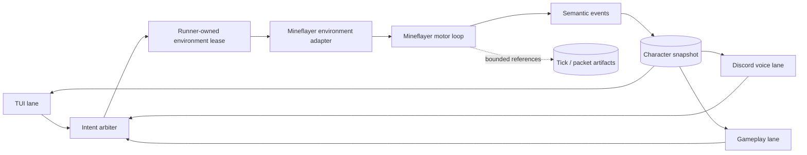
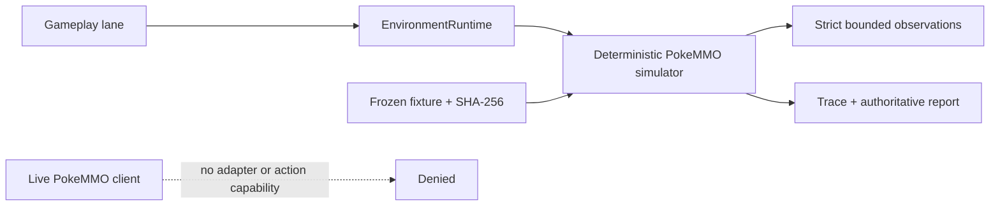
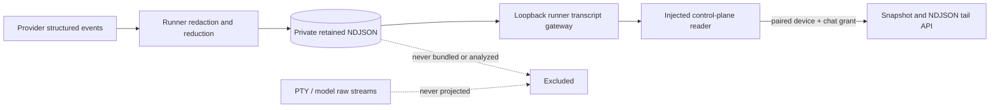

# Architecture

## System diagram

```text
Discord text/voice      Pi TUI       iOS/Android/macOS garden/graph/terminal
        │                  │                       │
        └────────── commands, approvals, queries ─┘
                                   │
                         Captain / Eve boundary
              persona · conversation · planning · critique · synthesis
                                   │
                       Mission control plane (trusted)
       event store · DAG scheduler · doctrine · policy · budgets · approvals
                                   │
                         Versioned worker protocol
                                   │
                         Local runner (trusted)
   worktrees · PTYs · native sessions · sandbox · capability exchange · leases
          │                  │                  │                │
   Codex App Server   Claude Agent SDK       Pi RPC       shell/local adapters
          │                  │                  │                │
          └──────────── structured events + artifacts ──────────┘
                                   │
                   Herdr/tmux/native PTY presentation adapters
```

## Trust boundaries

### Untrusted/model-controlled

- model text and tool arguments;
- repository files and instructions;
- external tracker/design/chat content;
- terminal output and ANSI sequences;
- downloaded skills/plugins;
- persona and skin content (`soul.md`, asset packs);
- worker summaries and self-reported success.

### Trusted deterministic services

- mission state machine;
- doctrine compiler and action policy;
- approval store;
- credential broker;
- runner process/worktree ownership;
- terminal control leases;
- event sequencing and audit chain;
- acceptance-test results and artifact hashing.

## Interactive environments

Embodied integrations use one logical character with separate durable captain
lanes for TUI, Discord voice, and gameplay. The lanes share a versioned
character projection, not continuation tokens or copied transcripts. A
deterministic intent arbiter compares `goalVersion` before a command reaches a
runner-owned environment lease.


```mermaid
flowchart LR
  T[TUI lane] --> I[Intent arbiter]
  V[Discord voice lane] --> I
  G[Gameplay lane] --> I
  C[(Character snapshot)] --> T
  C --> V
  C --> G
  I --> L[Runner-owned environment lease]
  L --> M[Mineflayer environment adapter]
  M --> B[Mineflayer motor loop]
  B --> E[Semantic events]
  E --> C
  B -. bounded references .-> A[(Tick / packet artifacts)]
```

Session phase and lane determine tool exposure. An inactive Minecraft session
exposes `join` and `status`. Only an active `gameplay` lane receives observation
and motor-action tools; TUI and Discord retain status, steering, pause, and
disconnect controls. Pause, disconnect, lease loss, or failure removes the
gameplay surface without waiting for a model turn.

All environment commands carry source lane, principal and authority tier,
correlation identity, and expected goal version. Long-running work returns an
action handle immediately; adapter work settles out of band so control
operations do not wait behind pathfinding. Mineflayer and Paper types remain
behind adapters; the shared protocol contains only versioned provider-neutral
schemas.

Session and lease contracts use strict provider-profiled v2 resource bounds.
The compatibility boundary dual-reads the frozen Minecraft-shaped v1 contract,
normalizes it, and single-writes v2 runtime records. Minecraft retains server,
dimension, distance, and block bounds; the PokeMMO simulator uses simulator,
allowed-map, navigation, menu, battle-turn, duration, and typed capability
bounds. A provider never reuses another provider's field under a new meaning.

The production Minecraft composition lives in
`integrations/minecraft-mineflayer` and the runner composition seam
([ADR 0044](adr/0044-runner-owned-mineflayer-private-paper-gameplay.md)).
It accepts literal loopback Paper destinations only, keeps offline-lab and
Microsoft profile-cache auth runner-private, and advertises no public-server,
combat, command, or verifier-control capability. The frozen collect/craft/place
controller uses ordinary survival actions; only the console-owned Paper
verifier can declare the goal result. Disconnect requires a fresh governed
session, while cancellation and emergency stop clear path goals, controls, and
digging immediately.

### PokeMMO simulator and live boundary

The executable PokeMMO profile is a deterministic simulator adapter under
`integrations/pokemmo-simulator`. It runs through `EnvironmentRuntime`, so the
same runner-owned lease, stale-goal, idempotency, cancellation, timeout,
restart, and emergency-stop invariants apply. The frozen
`scenarios/pokemmo/navigation-trainer-battle/v1` fixture pins exact bytes and
produces a bounded hash-chained trace plus a simulator-authoritative final-state
report.


```mermaid
flowchart LR
  G[Gameplay lane] --> R[EnvironmentRuntime]
  R --> S[Deterministic PokeMMO simulator]
  F[Frozen fixture + SHA-256] --> S
  S --> O[Strict bounded observations]
  S --> E[Trace + authoritative report]
  L[Live PokeMMO client] -. no adapter or action capability .-> X[Denied]
```

PokeMMO observations cover overworld, menu, party, inventory, battle, dialog,
danger, and action state. Simulator actions cover bounded navigation,
interaction, menu choice, battle move, party switch, item use, and wait; shared
action status and cancellation retain the environment lifecycle. Dormant
simulator sessions expose join/status only, active gameplay receives
observe/start/status/cancel, and TUI or voice receives supervision only.

The live PokeMMO boundary contains only read-only observation and coaching
capability names. No live adapter or client action path exists. Keyboard, mouse,
controller, accessibility, packet, memory, process, login, remote connection,
tampering, reverse-engineering, anti-cheat, human-timing imitation, CAPTCHA,
social, and economy capabilities fail closed. This boundary follows PokeMMO's
[macroing policy](https://support.pokemmo.com/knowledgebase/article/macroing-faq),
[penalty policy](https://support.pokemmo.com/knowledgebase/article/penalty-policy),
and [Terms of Service](https://pokemmo.com/en/tos/). Raw frames and credentials
never enter semantic events; visual evidence uses bounded opaque artifact
references.

### GBA emulator embodiment

The `gba_emulator` profile is the rules-clean home for real input control: a
locally-run Game Boy Advance game driven through an emulator core, touching no
networked service. `integrations/gba-emulator` implements the adapter behind
`EnvironmentRuntime`, so the same lease, stale-goal, idempotency, cancellation,
and emergency-stop invariants govern every button press. Emulator bounds carry
core identity, savestate identity digest, RNG seed, and per-action input/frame
quotas; actions cover bounded press-for-frames button input, frame advance, and
cancellable wait; observations cover overworld, menu, party, inventory, battle,
dialog, danger, action state, and bounded `artifact://` framebuffer/RAM
references.
A state-derived driver proves the frozen
`scenarios/emulator/verdant-path-trainer-battle/v1` scenario with byte-identical
report, evidence trace, and decision traces across runs. Two cores implement
the adapter-facing seam
([ADR 0039](adr/0039-gba-emulator-embodiment-and-deterministic-core-boundary.md)):
the clearly-labeled deterministic core test double that keeps CI ROM-free, and
the real headless mGBA WASM core
([ADR 0040](adr/0040-real-mgba-core-behind-the-emulator-seam.md)) that runs an
operator-supplied Pokémon FireRed ROM in-process — version- and
content-pinned, frame-stepped from a pinned savestate. The FireRed US v1.0
gameplay profile
([ADR 0043](adr/0043-version-pinned-firered-gameplay-profile.md)) decodes
overworld, encrypted party and inventory records, dialog, start/party/bag
menus, and trainer battle state from EWRAM, IWRAM, and the pinned ROM. Its
state-derived controller proves the complete decision loop in ROM-free CI and
the `firered-oaks-lab-rival` fixture proves it against two fresh real cores:
party and bag observation, lab navigation, dialog, move selection, and decoded
victory all pass with byte-identical evidence and zero network attempts. ROM,
BIOS, and savestate bytes never enter the repository, fixtures, events, or
reports — only SHA-256 identity digests.

## Discord voice media plane

The Discord bridge is the single writer for the official-bot presence session. Gateway and bot
voice callbacks emit `discord.presence.session.phase_changed` semantic events to the control
plane, whose replayed projection gates the transport-agnostic presence catalog. Disconnect,
lease loss, and failure remove act capability immediately; operator views render the event data
and never scrape gateway logs or infer lifecycle from action payloads.

`@discordjs/voice` is the single official-bot media owner
([ADR 0045](adr/0045-official-bot-dave-group-voice.md)). It owns the voice
WebSocket, UDP, RTP/Opus, transport encryption, and DAVE; a positive negotiated
DAVE protocol is required before the session accepts audio. The bridge
subscribes only to explicitly consented Discord user ids, caps each utterance,
and zeroes raw PCM after the memory-only brokered speech request.

Speaker-attributed text enters a continuing `discord_voice` Eve lane. The
control plane adds only approved guild/user person-memory projection; the
request cannot manufacture trusted memory. Spoken responses return as
memory-only 24 kHz mono PCM, are converted to Discord's 48 kHz stereo stream,
and disclose an AI-generated voice. Overlap and barge-in are explicit: another
speaker can interrupt a stale synthesized response, while response playback is
serialized. Receipts contain ids, counts, DAVE version, duration, and typed
outcomes, never audio or text.

The ClankVox schema-1 parser and golden fixtures remain inactive compatibility
artifacts. No AGPL ClankVox source is imported.

Clankie has two Discord bodies and one character. The official bot lives in
`apps/discord-bridge`; the isolated personal-lab user session lives in
`apps/discord-user-session` ([ADR 0048](adr/0048-discord-user-session-transport.md)).
Both consume `@clankie/discord-presence-core`, and both derive their Eve lane
address from the channel rather than the transport, so a conversation continues
across a body swap instead of forking into two streams of consciousness. The
user session is off by default, denied by high-assurance and team profiles, and
gated behind a durable operator opt-in bound to the doctrine profile hash. Its
transport is proven by which broker-owned bearer authenticated, never by a
request body. The two transports never co-own a voice or media session. Go Live
watch and publish remain isolated, explicitly enabled personal-lab capabilities
under [ADR 0024](adr/0024-discord-dual-plane-presence.md).

The current supported Discord surfaces do not expose Go Live watch/publish to
a bot or the Social SDK, and normal-user automation remains forbidden. The
versioned capability evaluator therefore reports screen media as an explicit
API/policy blocker rather than advertising the transport stubs as working.

## Discord person-memory projection

Long-term social memory is separate from mission memory. The durable key is the
stable Discord `(guildId, userId)` identity; display names are presentation
only. Text and voice may submit an explicit bounded proposal whose provenance
asserts `rawTranscript: false`, but `memory.profile.write` and an authenticated
operator approval remain the only commit path.

Guild, channel, and operator-private visibility are evaluated at read time.
Expiry maintenance, approved correction, operator export, and hard deletion
have explicit store/control-plane boundaries and semantic receipts. A user id
never carries facts across guilds. See
[`ADR 0042`](adr/0042-discord-person-memory-projection.md).

## Terminal data plane

Terminal traffic uses the strict provider-neutral v1 contract in
`@clankie/terminal-protocol` ([ADR 0033](adr/0033-terminal-wire-and-vt-restore-snapshots.md)).
The trusted runner is the only owner of real PTYs, ordered replay state, headless
VT state, and the one renewable control lease. It applies PTY bytes to
`@xterm/headless`, serializes visible state with `@xterm/addon-serialize`, and
publishes the resulting VT restore sequence with geometry at an exact,
parser-quiescent terminal sequence boundary. A raw byte tail is not a snapshot.

Authenticated clients connect either directly to the runner gateway or through
the relay. The relay transports validated terminal messages but never owns a
PTY, sequence history, VT emulator, or control lease. TypeScript at the runner
boundary owns sequencing, resume, duplicate/gap handling, snapshot publication,
idempotent input/resize, and lease expiry.

Discovery, subscribe, snapshot-resync delivery, and resync-required responses
carry explicit open/closed lifecycle state, including the original sequenced
closure identity. Attached clients receive complete revisioned
capabilities plus a positive revision atomically on every subscribe, resume, or
resync acknowledgement, followed by `terminal.capabilities_changed` pushes only
at greater revisions independently of the terminal data sequence. Canonical byte validation and byte helpers require no Node globals,
so the same schema surface is safe in React Native and browser-like clients.

Terminal output, restore sequences, input, and resize remain a high-volume data
plane. They never become semantic mission events and never enter structured
logs, analytics, crash reports, or ordinary support bundles. Only bounded
metadata such as terminal identity, geometry, sequence boundaries, capability
flags, lease lifecycle, and typed error codes crosses the semantic/diagnostic
boundary; artifacts use their separately authenticated retrieval plane.

## Worker transcript projection

Garden-facing worker activity comes from a runner-owned semantic projection,
not terminal bytes, provider streams, Eve operator history, or reconstructed
pane text. The projection is keyed by `missionId + taskId + workerRunId` and
contains ordered status, bounded narrative, action, artifact, blocker, and
completion entries. Every entry carries correlation/profile identity,
visibility, redaction classification, and runner or worker-summary provenance.


```mermaid
flowchart LR
  P[Provider structured events] --> R[Runner redaction and reduction]
  R --> S[(Private retained NDJSON)]
  S --> G[Loopback runner transcript gateway]
  G --> C[Injected control-plane reader]
  C -->|paired device + chat grant| A[Snapshot and NDJSON tail API]
  T[PTY / model raw streams] -. never projected .-> X[Excluded]
  S -. never bundled or analyzed .-> X
```

The runner reduces untrusted fields to a closed schema before the first disk
write. Authorization headers, tokens, credentials, private prompts,
chain-of-thought, raw audio, and unbounded output cannot be persisted as entry
payloads. Worker-authored progress uses typed status templates; arbitrary
provider prose is never accepted as a transcript summary.

Each run retains the newest 500 entries by default. An opaque cursor binds a
generation and sequence. Readers receive typed `cursor_expired` recovery when
retention removes their replay floor and typed `run_replaced` recovery when a
task has a newer worker run. The control plane only proxies the injected runner
reader, filters to garden visibility, and fails closed unless the paired device
currently holds the `chat` grant. Transcript files are excluded from support
bundles, analytics, crash reports, and the mission event store.

## Garden mission-event feed

Garden mission state comes from an authenticated schema-v1 read projection of
the canonical control-plane event store ([ADR 0038](adr/0038-authenticated-mission-event-feed.md)).
The latest `mission.execution.started` event selects the current mission. A
paired device with the existing `chat` grant discovers that selection, reads a
bounded current snapshot, and resumes an ordered NDJSON replay/tail with an
opaque cursor bound to the mission execution generation.

The projection preserves canonical mission, task, worker-run, correlation,
causation, profile, event, and event-store sequence identities but reconstructs
each visible payload through a closed public schema. Additive internal event
data is private by default. Provider/model details, worker prose, plan bodies,
credentials, private prompts, chain-of-thought, and terminal bytes therefore do
not become app input. Retention expiry, invalid cursors, and mission replacement
are explicit recovery states. `GardenWorld` remains the only spatial/state
projection; the feed is ordered evidence, not a second world model.

`@clankie/garden-model` directly interprets the closed feed vocabulary. It
creates worker identity from `worker.started` or `worker.leased`, consumes only
the sanitized summaries, applies resolved state and `attentionRaised`, and
maps every settlement result to completed, failed, or blocked presentation.
The app adapter changes only the envelope key from `eventId` to `id`; it does
not own semantic mappings. Failed, blocked, and offline workers therefore
cannot remain visually working because a client omitted an internal-event
translation.

Ordinary appends and optimistic `appendExpected` writers share the same global
hash chain. The feed serializes low-latency append hints with authoritative
store reconciliation: every discovery, snapshot, and tail open rereads and
verifies the canonical log, while a live hint behind a sequence gap reconciles
before advancing. This classifies every global sequence, including private and
future out-of-band event types, without exposing filtered payloads. Missing,
forked, corrupt, regressed, or unreadable authority fails the read explicitly
instead of returning a stale process-local projection.

## Paired-device worker steering

A paired device may submit only the existing finite `WorkerSteerIntent` set.
The API client prefers captain and then operator credentials before using its
device session. The control plane verifies that identity-only session against
the durable device projection and its current `steer` grant before request
parsing, policy evaluation, or command persistence. Accepted device commands
carry the honest principal `{kind: "device", id: deviceId}` and the
server-selected `api` lane; token claims, request bodies, and persisted command
records never supply grants.

## Control flow

1. A channel normalizes user intent into a command.
2. The captain requests context and proposes a typed `MissionPlan`.
3. The control plane validates DAG, budgets, write conflicts, risk, and doctrine.
4. The user approves the plan when required.
5. The scheduler leases ready tasks to eligible workers.
6. The runner creates isolation and starts the native provider session.
7. Provider events are normalized into domain events while raw logs remain optional diagnostics.
8. Results produce evidence and artifacts; dependent tasks become ready.
9. Independent verification and review decide whether success criteria are met.
10. Privileged actions pass through `ActionRequest → ActionDecision → Approval → Connector`.
11. The evaluator scores the mission and records recommendations.

## Unified live capability evaluation

The lead-agent lab runs the strict nine-row manifest under
`evals/capabilities/v1/manifest.yaml`
([ADR 0046](adr/0046-versioned-unified-capability-evaluation.md)). Readiness
gates run before live work, deterministic checks remain visible when an
external service is unavailable, and missing human/operator input is distinct
from implementation failure. The overall result is non-averagable: every row
must pass.

Command output is bounded and discarded after hashing. The durable report
contains only gate ids, typed status/issue codes, exit status, durations, and
output hashes. Existing FireRed evidence is verified from its operator-local
receipt by recomputing every artifact hash; copyrighted bytes are not reopened
or copied into the report.

## Package dependency direction

```text
protocol
  ↑
terminal-protocol   interactive-environment   analytics   observability   jsonl-rpc
  ↑                      ↑           ↑             ↑
worker-sdk   doctrine   garden-model   event-store   status-resolver   credential-broker
  ↑             ↑             ↑
provider adapters       mission-engine
       ↑                    ↑
runner / control-plane / captain / TUI / Discord / lab
  (graphical command-center app: private clankie-app product monorepo)
```

Rules:

- `protocol` imports no workspace package.
- provider adapters do not import the mission engine or doctrine evaluator.
- the captain calls narrow control-plane tools; it does not spawn processes directly.
- UIs do not mutate mission state locally; they send typed commands.
- only the runner/privileged connectors hold execution or provider credentials.

## State model

### Operational state

Authoritative, event-sourced mission/task/worker/approval/artifact data.

### Visual state

Disposable animation, camera, layout, selection, and interpolation state.

### Progression state

Persistent cosmetics and historical achievements derived from verified outcomes; never an authority source.

## Persistence roadmap

- V0: in-memory mission engine + JSONL hash-chained event artifacts.
- V1: SQLite local control plane with transactional outbox and replay.
- Team: PostgreSQL event/relational projections, object storage for artifacts, Redis/NATS only where operationally justified.

The event schema is versioned before the database choice becomes a product API.
