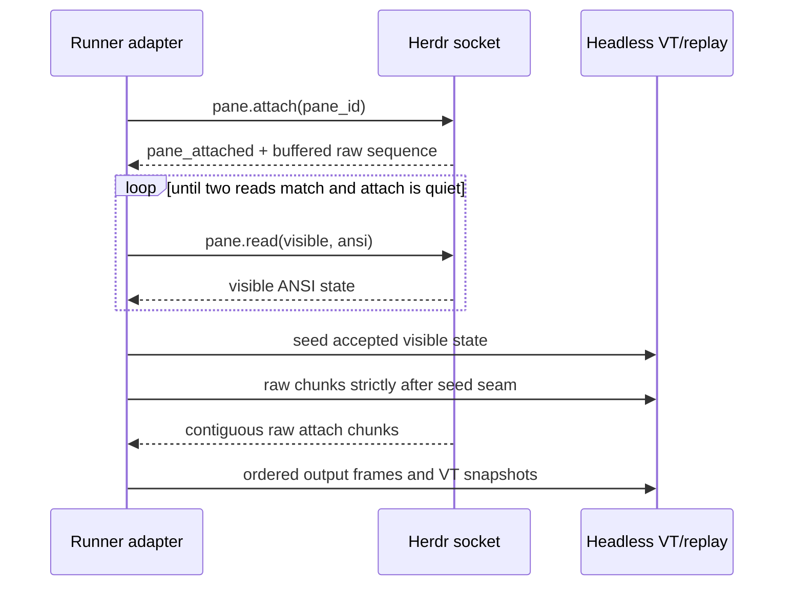

# Worker and terminal runtime

## Worker identity

A worker run is canonical. It may have a native provider session, PTY, branch, worktree, terminal pane, artifacts, and subagents. A pane is only one view.

```text
Mission → Task → WorkerRun
                  ├── nativeSessionId
                  ├── worktree/branch
                  ├── terminalSessionId
                  ├── artifacts/evidence
                  └── child runs
```

## Provider adapters

- **Codex:** App Server JSON-RPC. A turn carries `workerRunId:attempt` as its client message identity, preserves thread/turn IDs, and converts authoritative completed command/file items into minimized semantic facts.
- **Claude Agent SDK:** streamed `query()` session with an explicit environment, enforced SDK sandbox, protected parent authentication, and role-bounded tools. Verification and review expose no Edit or Write tool.
- **Pi:** repository-pinned strict LF-delimited JSONL RPC. The runner owns persistent session/config directories, prepares the entire process behind `ShellSandbox`, and requires a native session ID for success.
- **Generic shell/local:** PTY escape hatch; semantic confidence is lower when state must be inferred.

Provider-native approval prompts do not replace product policy. The runner withholds privileged credentials and confines filesystem/network capability.

### Connector tools (MCP and web research)

Workers gain external tools only through the doctrine-projected MCP registry ([ADR 0027](adr/0027-mcp-worker-tool-projection.md), `doctrine/mcp-registry.example.yaml`). At fleet build the runner evaluates every registered tool as `mcp.<server>.<tool>` against the compiled profile and injects only exact `allow` grants: per-tool for Claude (`mcp__<server>__<tool>` allowlist plus a PreToolUse hook that denies ungranted non-filesystem tools), per-server for Codex strict config (a server with any withheld tool is dropped), and never for Pi, which stays offline. Registry servers may be scoped to task kinds; server processes receive only their declared static and credential-allowlist environment. With `CLANKIE_CLAUDE_WEB_RESEARCH_ENABLED=true` and a doctrine allow for the read-class `web.search`/`web.fetch` actions, the Claude worker additionally exposes native WebSearch/WebFetch on `research` tasks and advertises the `research` kind. The runner logs allowed and withheld projections at startup.

With `CLANKIE_BROWSER_ENABLED=true`, a compiled-doctrine allow for the read-class `web.browse` action, and a ready `agent-browser` binary and daemon, Codex shell workers additionally receive read-only browser control ([ADR 0028](adr/0028-worker-browser-control.md)). The runner starts the daemon outside the worker sandbox and gives the network-disabled worker only its namespaced local IPC endpoint. A daemon-enforced deny-by-default policy permits navigation and observation but denies clicks, form input, evaluation, upload/download, browser state mutation, and network interception. Form submission and publishing remain privileged connector actions rather than direct worker capabilities. Missing doctrine, a deny decision, an off flag, or failed binary/daemon readiness withholds the path and is logged at fleet startup.

### Readiness and advertisement

Provider configuration is opt-in. The runner advertises a descriptor only when executable/version, authentication, model, and enforced-isolation readiness all pass. Stable readiness issue codes explain unavailable providers without copying credential content or raw subprocess errors. The production default advertises no coding provider until at least one complete configuration passes.

The heterogeneous proof routes implementation to `codex-implementation`, verification/review to read-only `claude-verification`, and debugging to `pi-debugging`. These are distinct worker identities rather than aliases for one generic coding seat.

Pi uses a synthetic home and configuration with ambient extensions, skills, prompt templates, themes, context files, telemetry, and update checks disabled. Its model configuration names one pinned local model. The sandbox proxy permits only the exact configured localhost Ollama host and port; direct network access and silent unsandboxed fallback remain denied.

### Attempt evidence

Each settlement writes an atomic, validated runner evidence bundle below the artifact root. Its opaque reference and SHA-256 enter `WorkerResult.evidence`; a host path does not. The bundle contains:

```text
summary
files_changed[]
commands_run[]
checks[{command, exit_code, result}]
artifacts[{ref, sha256}]
remaining_risks[]
assumptions[]
nativeSessionId · provider · providerVersion · correlationId
```

Git state, trusted check exits, normalized completed events, runner configuration, and lease identity populate these fields. Provider prose, raw command text, streamed deltas, patches, output, and self-authored evidence do not.

## Worktree lifecycle

1. resolve immutable base commit;
2. create mission/task branch and worktree;
3. seed task contract and minimal context;
4. acquire path locks/write-scope lease;
5. start worker with bounded credentials and network profile;
6. collect events, terminal stream, diff, tests, and artifacts;
7. freeze result and release process lease;
8. verifier operates read-only or in a separate worktree;
9. integration task reconciles accepted branches;
10. clean up only after retention/approval policy permits.

The recurring control-plane heartbeat starts before candidate acquisition and initial evidence collection. Claim, event, heartbeat, and settlement calls retry with bounded backoff. An exhausted transient polling operation delays and continues instead of terminating the runner loop. A noninteractive run treats an unexpected `waiting_user` event as a blocked settlement and aborts the provider by default.

Worker processes run under durable leases (`ProcessLeaseManager` in `apps/runner/src/process-leases.ts`): liveness is pid + process start time (a recycled pid can never masquerade as a live worker), heartbeats extend the lease, an expired heartbeat transitions the run to a recoverable `expired` state in the event log, cancellation is cooperative-then-hard (SIGTERM, grace, SIGKILL) and idempotent, and on restart the runner re-adopts still-live processes or fails them explicitly. `MissionEngine.expireWorkerLease` requeues the task while attempts remain and fails it explicitly otherwise.

Steps 1, 2, 4, and 10 are implemented by `WorktreeManager` in `apps/runner/src/worktrees.ts`: write leases are exclusive-create records keyed by the canonical (symlink-resolved) path hash, orphaned leases are reclaimed on runner startup, and released worktrees are removed when unchanged or preserved with evidence when they hold uncommitted or unmerged work.

## Terminal protocol

The serialized boundary is schema version 1 from
`@clankie/terminal-protocol` ([ADR 0033](adr/0033-terminal-wire-and-vt-restore-snapshots.md)).
Its strict client/server message unions cover discovery, capability negotiation,
subscribe/resume/resync, sequence-numbered output/geometry/closure, VT restore
snapshots, typed errors, owner state, lease lifecycle, and attributed
idempotent input/resize. Discovery, subscription, resync, and snapshots carry
explicit lifecycle state, while attached subscriptions receive complete
revisioned `terminal.capabilities_changed` pushes. Unknown versions, fields, invalid boundaries,
non-canonical base64, and unattributed control messages fail closed.

The three planes stay separate:

- semantic control events are prioritized and low volume;
- terminal output, VT restore sequences, input, and resize are high-volume raw
  data and never enter semantic events, logs, analytics, crash reports, or
  ordinary support bundles;
- artifacts use authenticated object retrieval rather than terminal messages.

### Ordering, resume, and snapshots

Each terminal has one monotonic data sequence shared by output, geometry, and
closure messages. A receiver applies exactly `lastAppliedSequence + 1`,
discards a sequence at or below the last applied value as a duplicate, and
stops applying on a larger value while it sends `terminal.resync`. This is the
only gap/duplicate rule.

On resume, the client's typed replay cursor carries its last applied sequence.
The runner replays from `lastAppliedSequence + 1` when that entire
contiguous range remains available. Otherwise it sends
`terminal.resync_required`, discards that subscription's partial replay, and
sends a snapshot. The snapshot contains geometry plus a `vt_restore_v1`
sequence representing visible headless VT state _after_ sequence N; its
boundary states both `afterSequence: N` and `nextSequence: N + 1`. Clients reset
their emulator, apply the restore sequence, then accept only frame N+1. A
snapshot is never a bounded PTY byte tail.

Lifecycle state remains explicit throughout discovery and delivery. A closed
terminal carries the original close sequence and details on subscribed,
resync-required, and snapshot messages, so closure remains unambiguous after
the ordered close frame is no longer retained. A closed snapshot may only
assert a close sequence included through its exact boundary.

`terminal.subscribed` binds the request to a subscription ID and starting
cursor, and declares whether initial delivery is live-only, replay, or a
following snapshot. It also atomically carries the complete current capabilities
and positive `capabilitiesRevision` for every fresh subscribe, resume, or resync
attachment. This baseline supersedes any earlier discovery/get result, closing
the race where capabilities change before attachment. This lets a source that truthfully lacks snapshot/resume
support offer observation from a precise live boundary without pretending it
can reconstruct earlier state.

The runner uses a real PTY and feeds the exact ordered bytes through a
TypeScript-owned quiescence/framing layer into `@xterm/headless`; snapshots use
`@xterm/addon-serialize`. Publication waits until all bytes through N have been
applied and the UTF-8/VT parser is quiescent, because addon serialization does
not make partial parser state part of the restore contract. Geometry changes
are applied to the headless terminal in the same sequence lane before later
output. Immutable package fixtures prove protocol ordering and reconstruction
invariants for snapshot-at-N plus frames after N against a deterministic
reference terminal, covering alternate screen, cursor, SGR color, resize, and
split UTF-8 output. VUH-868 owns conformance evidence from real
`@xterm/headless` plus `@xterm/addon-serialize` output at the runner boundary.

### Discovery, control, and idempotency

Discovery reports source capability independently from device authorization.
A source may be read-only, replayable without control, unable to resize, or
unable to accept input. `input` or `resize` capability requires lease support;
resume requires VT restore snapshots. The authenticated device receives an
explicit `observe` and/or `control` scope, so a capable source never implies a
device may control it.

The runner owns exactly one renewable control lease per terminal. Acquire,
renew, release, expiry, rejection, and the current nullable owner are explicit
messages; owner state has its own monotonic revision. Every lease operation and
every input/resize request carries principal, device, and client-instance
attribution. Input and resize additionally carry an operation ID. The runner
deduplicates by `(leaseId, operation type, operationId)`: an exact retry returns
`disposition: duplicate` without applying again, while reuse with different
content fails with `operation_conflict`. Relay transport never owns or grants a
lease.

Capabilities have an independent positive monotonic revision. An attached
client starts from `terminal.subscribed.capabilitiesRevision`, then applies a
complete `terminal.capabilities_changed` value only when its revision is
greater than the baseline or last applied push and ignores duplicate or stale revisions. Because each push
contains the complete capability set, a revision gap does not alter terminal
data sequencing or require replay.

`TerminalManager` in `apps/runner/src/terminals.ts` remains a deprecated
pre-v1 in-process adapter with a generic pipe transport and rolling byte-tail
frames. Its legacy exports stay compile-compatible but are not accepted by the
serialized v1 schema and must not cross direct or relay transports. VUH-868
replaces that adapter with the real-PTY/headless-VT implementation. Durable
transports restore their previous terminal ID when a runner restarts; duplicate
IDs remain rejected so recovery cannot fork a replay cursor.

## Status derivation

Agent status (`working`, `waiting_user`, `waiting_dependency`, `blocked`,
`failed`, `completed`, offline) is resolved through the tiered signal ladder in
ADR 0015: adapter protocol events first (turn lifecycle; a pending approval or
question is `waiting_user`), then runner leases and exit codes, then untrusted
heuristics (herdr `agent_status`, settle-then-classify with a local model),
which may only fill `unknown` or raise attention — never override a higher
tier. Status events carry `{tier, source, confidence, observedAt}` and ride the
control plane, never the terminal plane. "Done" is a projection concern
(completed + unacknowledged), not a detected state.

## Human takeover

- observers may read only with an authenticated `observe` device scope;
- exactly one renewable control lease exists per terminal;
- acquiring a lease pauses automated input;
- all lease, input, and resize operations are attributed to principal, device,
  and client instance;
- lease expires or is explicitly released;
- agent resumes only after handback and optional summary;
- forced release requires higher authority and is audited.

## Captain worker control (operator parity)

The captain controls its workers through the same command surface a human
operator uses ([ADR 0018](adr/0018-captain-worker-control-parity.md)): worker-pane
slash commands (`/goal`, `/model`, `/effort`, steering text) for pane-hosted
harness workers, and the same vocabulary mapped onto protocol methods for
adapter-hosted workers. There is no captain-only control API. Arming a
harness's native `/goal` loop at delegation time is part of this surface.
Captain input is automated input under the takeover rules above — a human
control lease pauses it — and parity covers steering and configuration only;
approvals stay on authenticated surfaces.

The canonical [`clankie-lead` skill](../.agents/skills/clankie-lead/SKILL.md)
defines this captain path, and its [delegation protocol](../.agents/skills/clankie-lead/references/delegation-protocol.md)
specifies bounded briefs, goal arming, run receipts, harvest, resume, and cleanup.

## Herdr boundary

Herdr is an optional external pane host. The trusted runner uses `pane.list`, `pane.read`, `pane.attach`, and `pane.send_input` through `HerdrTerminalProvider`; clients see only the provider-neutral terminal contract. The stable Herdr `terminal_id` becomes `terminalId`. Compact `pane_id` values can change or be reused after a close, so they remain private request locators and never become client identity. Socket paths, Herdr session details, working directories, and credentials remain runner-private. Presentation titles containing an absolute path, the private pane ID, or a pane/session/socket marker become the generic `Herdr pane` label before discovery.

Visible-state seeding and raw attachment form one bounded seam:



Attach sequence discontinuity, transport loss, pane disappearance, and compact-ID replacement close the current terminal generation with an explicit typed lifecycle reason. A later attachment to the same stable terminal ID starts at a deterministic reset boundary after the previous observers drain; an old cursor therefore takes the normal resync path instead of silently crossing generations. Default geometry is 120×40 because the current Herdr visible-read response does not publish pane dimensions.

Herdr panes advertise observe/resume/VT restore. They advertise no resize. They are read-only unless a runner-injected ownership policy grants control; even then input requires the active terminal control lease. The development gateway remains observe-only and intersects those source capabilities with device authorization.

When running under Herdr (`HERDR_ENV=1`), clankie panes self-report status over the socket (`pane.report_agent`) so Herdr displays them natively, and Herdr's `pane.agent_status_changed` events are ingested as a Tier-2 status signal (ADR 0015). Neither direction requires a Herdr fork.
