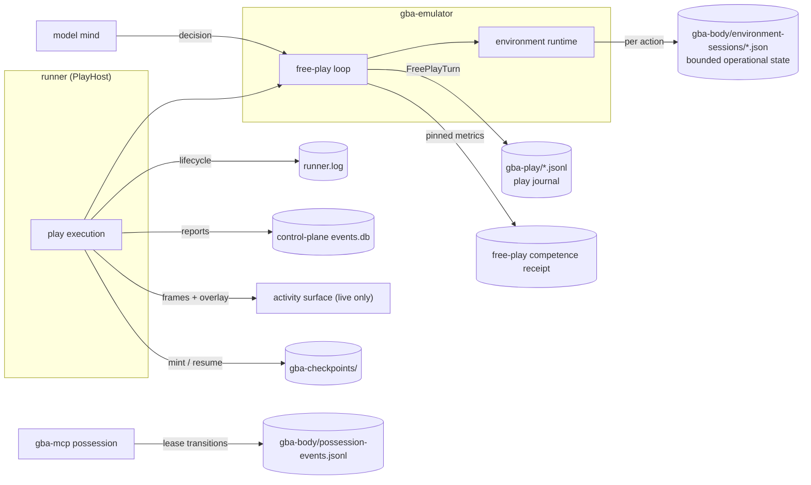

# Logging, tracing, replay, and debugging

## Embodiment and free play

A playthrough leaves a durable trail ([ADR 0068](adr/0068-a-playthrough-leaves-a-durable-trail.md)).
Every artifact of an asked-play session ([ADR 0063](adr/0063-asked-embodiment-and-captain-started-play.md))
or an MCP possession ([ADR 0053](adr/0053-mcp-possession-of-clankies-body.md)) lives in a file an
operator can read after the fact:

| Artifact                   | Path                                                                            | Contents                                                                                                                                                                                           |
| -------------------------- | ------------------------------------------------------------------------------- | -------------------------------------------------------------------------------------------------------------------------------------------------------------------------------------------------- |
| Play journal               | `~/.local/state/clankie/gba-play/<stamp>-<runId>.jsonl`                         | One file per run: header (identity, resume lineage), every `FreePlayTurn` (monologue, intent, objective, action, outcome, effect) as it settles, summary (outcome, progress, volition, coherence). |
| Environment session record | `~/.local/state/clankie/gba-body/environment-sessions/<sha256(sessionId)>.json` | Operational state per run: lease, phase, and the newest 128 action outcomes (position, facing, collisions, mode, RAM digest); older terminal actions roll with a `rolledActionRecords` count.      |
| Possession event log       | `~/.local/state/clankie/gba-body/possession-events.jsonl`                       | Every MCP possession lease transition (acquired, released, expired, stolen, refused) across all servers.                                                                                           |
| Body lock                  | `~/.local/state/clankie/gba-body/body.lock`                                     | Who is driving right now (holder id, pid, acquired-at).                                                                                                                                            |
| Checkpoints                | `~/.local/state/clankie/gba-checkpoints/<stamp>[-label]/`                       | Minted savestate + receipt + bootable companion scenario ([ADR 0060](adr/0060-progress-as-minted-checkpoints.md)).                                                                                 |
| Runner log                 | `~/.local/state/clankie/runner.log`                                             | Play-host lifecycle: claimed, running, settled with receipt, refused, failed.                                                                                                                      |
| Embodiment events          | control-plane event store (`events.db`), scope `embodiment:<sessionId>`         | The authoritative lifecycle record.                                                                                                                                                                |
| CLI trace                  | `artifacts/gba-free-play/trace-<stamp>.jsonl`                                   | `pnpm gba:free-play` runs only; per-run by default.                                                                                                                                                |
| Competence receipt         | operator-selected `CLANKIE_GBA_COMPETENCE_RECEIPT_DIR`                          | Content-free pinned benchmark identity, milestone/action/stall metrics, and report hash; ROM, savestate, frames, transcript, prompts, and decisions are absent.                                    |



Watching live is the activity surface (`http://127.0.0.1:4320`); everything
else above is for afterwards. To follow a run as it happens from a terminal:

```bash
tail -f ~/.local/state/clankie/gba-play/$(ls -t ~/.local/state/clankie/gba-play | head -1)
```

## Structured logs

Use `@clankie/observability` and Pino JSON logs. Required context where known:

```text
service version runnerId missionId taskId workerRunId
correlationId profileHash eventId provider nativeSessionId
```

Redact tokens, authorization headers, API keys, passwords, secret values, private audio, and raw user content by default.

## OpenTelemetry

Trace across:

```text
channel command
  → captain turn
  → plan validation
  → task lease
  → provider/native session
  → tool/process spans
  → verification
  → action policy
  → approval
  → connector side effect
  → evaluation
```

Propagate trace/correlation IDs through the relay and event stream. Terminal bytes are not span attributes; attach bounded metadata and artifact references.

Local development may send OTLP to the stack in `infra/observability/`. Production exporters are environment-configured and fail open for telemetry, never for mission execution.

## Event replay

`@clankie/event-store` stores hash-chained event records for local audit and deterministic projection — durable SQLite (`SqliteEventStore`, the control plane's mission log) and JSONL (`JsonlEventStore`, eval artifacts) backends share one chain format. Debugging starts from the event timeline:

1. verify hash chain;
2. replay mission projection;
3. identify first invariant divergence;
4. attach provider/terminal logs by worker run and sequence;
5. reproduce in a fixture;
6. create a bounded debug mission.

Agent-status precedence is rebuilt from the same semantic log. Inspect one worker or the captain with:

```bash
pnpm --filter @clankie/devtools dev status explain <workerRunId|captain> <domain-events.jsonl>
```

The explanation includes the current state and basis, winning tier/source/confidence/timestamp, the complete signal chain, and Tier-2 attention-only proposals. `worker.turn.settled` means an idle turn; only terminal `worker.settled` means completed worker execution. Terminal frames and pane text are never resolver inputs.

## Provider diagnostics

Preserve:

- native session/thread/turn IDs;
- command/process exit details;
- normalized lifecycle events;
- bounded stderr tail;
- tool names and timing, without sensitive arguments;
- session cost/token stats where available;
- sandbox/worktree/base commit.

Provider raw streams are optional diagnostic artifacts with shorter retention than semantic events.

## Terminal debugging

- strict sequence numbers;
- snapshots when replay gaps occur;
- control-lease transitions in semantic log;
- terminal size and encoding metadata;
- maximum buffer and artifact offloading;
- ANSI/control-sequence sanitization in non-terminal renderers.

## Support bundle

`pnpm support:bundle` creates a redacted archive containing versions, doctrine hashes, recent semantic logs, event-chain verification, and configuration shape. It excludes environment values, credentials, raw audio, full prompts, source files, terminal history, and runner worker-transcript projections. Transcript entries remain excluded even though their runner-owned store is already redacted.

## Error reporting

Add Sentry to iOS/macOS and hosted services only after privacy defaults are configured:

- scrub breadcrumbs and request bodies;
- attach IDs, not prompt/source content;
- separate user opt-in diagnostics from required operational logs;
- allow self-hosted/no-telemetry mode.
