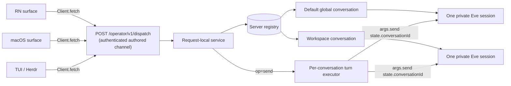

# Operator conversations

Operator conversations are the durable unit of lead-chat identity. The captain
owns one server-side registry. React Native, macOS, TUI, and Herdr surfaces call
one identical callable contract and retain only an independent, conversation-
bound opaque replay cursor.

## Callable boundary

The captain exposes the registry through one authenticated route,
`POST /operator/v1/dispatch` (`OPERATOR_CONVERSATION_DISPATCH_PATH`), authored as
a stateful eve `defineChannel` in `apps/captain-eve/agent/channels/operator-conversations.ts`.
Custom channel routes are not auto-authenticated, so the route calls
`routeAuth(request, [captainBearer, localDev()])`: a shared `CLANKIE_CAPTAIN_TOKEN`
bearer when configured, else loopback; anything else fails closed with `401`.

The body is one `OperatorConversationServiceRequest` (`op`: `list`/`get`/`create`/
`replay`/`tail`/`send`) validated at the edge; the reply is the matching
`OperatorConversationServiceResult`. RN/macOS/TUI build a client with
`createOperatorConversationServiceClient(dispatch)` (protocol) over `Client.fetch`;
VUH-864's relay projects the same route to physical devices. VUH-864 owns the
physical transport, not this callable contract; the route never proxies approval
completion.

## Public inventory

`@clankie/protocol` exports these provider-neutral, strict, bounded families:

- lane versioning: `CaptainLaneSchema` (frozen v1 legacy read) and
  `CaptainSessionLaneV2Schema` (`operator` lane contract);
- records: `OperatorConversationSchema` (strict), scope/session-state schemas;
- registry request/response: `ListOperatorConversations*` (bounded list),
  `GetOperatorConversation*` (`conversation` optional — typed not-found), and
  `CreateOperatorConversation*`;
- events: the strict discriminated `OperatorConversationStreamEventSchema`
  (message / reasoning / tool / input requested·resolved / auth / session /
  turn accepted·completed·failed·cancelled / worker_transcript / bounded
  `unsupported`) plus `OperatorConversationEventBody`;
- replay/recovery: `ReplayOperatorConversationRequestSchema` (bounded `limit`),
  `OperatorConversationReplayPageSchema`, and `OperatorConversationRecoverySchema`
  (`cursor_invalid`/`cursor_expired`/`cursor_reset`/`run_conflict`/
  `unknown_conversation`);
- submit/results: `SubmitOperatorConversationTurnSchema` (`message` /
  `input_response` / `worker_steer`; `approval` is not an accepted input
  response — the lane never authorizes approvals), accepted (with `runId`) /
  `OperatorConversationRevisionConflictSchema` / unsupported results;
- callable contract: `OperatorConversationServiceRequest/ResultSchema`, named
  per-op result types (`OperatorConversation{List,Get,Create,Replay,Tail,Send}Result`),
  `OperatorConversationServiceClient`, `createOperatorConversationServiceClient`,
  and `OperatorConversationTailItem`.

No public record contains an Eve continuation token, provider identity, or
credential. `@clankie/captain-runtime` exports `OperatorConversationPort`,
`OperatorConversationRegistry`, `OperatorConversationReader`,
`LocalOperatorConversationService`, and `serveOperatorConversationRequest`.

## Execution model

`send` acknowledges promptly and durably: within one revision the registry
persists the operator's own `message` event and a `turn.accepted` run event
(so replay after restart reconstructs both sides of the transcript), then returns
a typed `accepted` result carrying a `runId`. Execution runs detached — a caller
disconnect or cancellation cannot cancel accepted work — and publishes a terminal
`turn.completed`/`failed`/`cancelled` run event without rolling back the revision.

The request-local executor drives the accepted turn through the authored
channel's own `args.send(message, { state: { conversationId } })`, whose
`metadata`/`context` project `captainLane: "operator"` and
`captainTargetId: conversationId`, so simultaneous conversations stay isolated to
their own Eve sessions — never a process-global env var. It binds the session
privately (self-rotation allowed via `rebindSession`, cross-conversation and
cross-token reuse fail closed), consumes `Session.getEventStream(startIndex)` from
a private per-conversation Eve stream index (reset on rotation) so a re-driven
turn never re-projects the transcript, and redacts each event into the durable
log through `redactEveStreamEvent`. eve's `SendFn` accepts no `AbortSignal`, so
caller-detachment is preserved and provider-preemption (which settles the
admission lease) is the only cancellation. Transcript projection errors are
logged as a bounded, safe structured line (error name/code only, never the raw
message).

## Cursors, replay, and tail recovery

Replay is bounded and pageable (`limit`, `nextCursor`, `retainedFromCursor`,
`safeCursor`, `hasMore`). Opaque cursors are conversation-bound: a cursor issued
for conversation A is rejected as `cursor_invalid` on conversation B and can
never silently advance it. Surfaces keep independent caller-held cursors; no
exclusive/takeover cursor state is stored, so cross-surface reuse within one
conversation is allowed. Malformed, ahead-of-log, below-retention, and
unknown-conversation cases return a typed non-throwing recovery envelope with a
reset cursor. The client `tail` yields typed `event` items and, on a recovery
outcome, one `recovery` item and then stops — RN/TUI distinguish
invalid/expired/reset from an empty tail and never silently resync past a reset.

## Migration and ownership

Migration is dual-read/single-write. Startup may read one legacy v1 `tui` row and
atomically adopt its session and continuation capability into the default global
conversation. It never rewrites or emits a new v1 lane. Multiple legacy TUI rows,
a conflicting default, identity drift, session reuse, or continuation reuse fail
closed. The private SQLite path remains mode 0700/0600.

Exactly one default global conversation is protected by a partial unique index,
including concurrent process startup. Admission serializes one conversation key
and admits different conversation keys concurrently; every operator conversation
outranks voice, presence, and gameplay without reserving capacity for a device.

## TUI handoff

The TUI builds a production `OperatorConversationServiceClient` over the captain
route via `createCaptainOperatorConversationClient(eve Client)`. `/conversation`
lists and selects the server-owned registry; `clankie --chat <conversationId>` is
the stable direct form (it selects an existing server id, never mints a local
one). The `OperatorConversationSelectionStore` persists the selection fail-closed
(only a missing file is "no selection"; corrupt/wrong-version/invalid-id stores
raise) with an atomic 0600 write under a 0700 parent, and reloads it across
restart. `resolveInitialConversation` confirms every `--chat` or persisted id
against the server (`get`) before attaching, so a stale or attacker-supplied id
can never bind.

Every ordinary prompt snapshots that selected id, catches up unread history,
sends a revision-fenced `message`, then renders only strict
`OperatorConversationStreamEvent` items from the typed tail until the accepted
run reaches a terminal event. It never falls back to the direct/default Eve
session. A private `OperatorConversationTailStore` persists one stable TUI
surface id and an opaque cursor per conversation, so restart and A-to-B switching
resume the exact durable boundaries. Typed recovery is rendered once and stops
the stream before the reset boundary; the TUI never auto-resyncs. Transport
schema failures and recovery copy are display-safe and never echo raw response
payloads.

The authored-channel integration test uses eve 0.22.4's real `SendFn`/`Session`
types with an in-process fake session. It proves `state.conversationId` becomes
`metadata.captainTargetId`, resolves through `captainLaneAddress`, and reaches the
same lifecycle-hook reconciliation core that binds the private conversation
session. This metadata plumbing requires no paid model provider.
