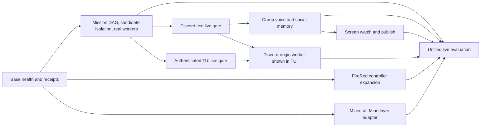

# End-to-end capability completion contract

## Product impact

This contract turns Clankie's existing channel, worker, memory, and embodiment
seams into one operational teammate. Without the live gates below, individual
packages can pass while the product still cannot join a real Discord server,
work with several people, run coding workers on command, or play the supported
local games end to end.

## Outcome

Clankie runs as one durable identity across Discord and the operator TUI. A
Discord conversation can create and steer a governed mission, the runner can
execute its typed task graph with real Codex and Claude workers, and the TUI
shows those same worker runs from the shared semantic event stream. Voice,
screen media, social memory, Pokémon FireRed, and Minecraft use isolated
capability owners behind the existing doctrine and environment-runtime
boundaries.

Passing unit tests is necessary but does not complete this contract. Each
capability also has a live or operator-supplied evidence gate.

```mermaid
flowchart TB
  subgraph Discord
    TXT[Official bot text and commands]
    VOICE[Official bot group voice]
    SCREEN[Opt-in personal-lab screen transport]
  end

  TXT --> BRIDGE[Discord bridge]
  VOICE --> VOX[@discordjs/voice DAVE media owner]
  SCREEN --> MEDIA[Isolated screen media process]
  BRIDGE --> CAPTAIN[Eve captain]
  VOX --> BRAIN[Governed voice brain]
  MEDIA --> BRAIN
  BRAIN --> CAPTAIN

  CAPTAIN --> CP[Control plane and doctrine]
  CP --> EVENTS[(Durable semantic events)]
  CP --> MEMORY[(Governed social memory)]
  CP --> RUNNER[Local runner]
  RUNNER --> CODEX[Codex workers]
  RUNNER --> CLAUDE[Claude workers]
  RUNNER --> PI[Pi/local workers]
  EVENTS --> TUI[Operator TUI]

  CAPTAIN --> ENV[Environment runtime]
  ENV --> GBA[Headless mGBA and FireRed]
  ENV --> MC[Mineflayer and private Paper server]
```

## Source authority and fixed boundaries

- Tracker acceptance criteria remain product authority. Repository ADRs remain
  technical authority. This contract reports drift instead of rewriting either.
- Discord text and official-bot voice use bot credentials only. Screen watch
  and publish use the separately enabled personal-lab transport from
  [ADR 0024](adr/0024-discord-dual-plane-presence.md); the two transports never
  co-own a media session.
- Voice media follows [ADR 0045](adr/0045-official-bot-dave-group-voice.md). Raw
  audio and video do not enter mission events, model transcripts, analytics, or
  social memory.
- Pokémon automation is local FireRed emulation through
  `EnvironmentRuntime`. It does not add a live PokeMMO input path.
- Minecraft success comes from the private Paper verifier, not from Mineflayer
  or model prose.
- Discord is an ambient surface. It can create, query, steer, pause, resume,
  and stop allowed work; privileged approval stays on an authenticated surface.
- Provider credentials, Discord credentials, ROM bytes, savestates, and game
  account credentials remain outside worker processes and repository artifacts.

## Completion matrix

| Capability                        | End-to-end acceptance                                                                                                                                                                                                                                                                                                                                               | Required evidence                                                                                                                                                                         |
| --------------------------------- | ------------------------------------------------------------------------------------------------------------------------------------------------------------------------------------------------------------------------------------------------------------------------------------------------------------------------------------------------------------------- | ----------------------------------------------------------------------------------------------------------------------------------------------------------------------------------------- |
| Discord bot and text chat         | The credential-broker-backed official bot starts, registers commands, admits an allowlisted message or owner DM, completes one bounded Eve turn, posts the reply through governed presence, and creates one mission thread whose state survives bridge restart.                                                                                                     | Content-free bridge/control-plane event receipt, live Discord message and thread identifiers, restart projection check, and ambient-approval denial.                                      |
| Multi-person Discord voice        | An explicit join disclosure starts one official-bot session with at least three human participants. Per-speaker PCM is attributed to the Discord user, transcribed, arbitrated with overlap/interruption handling, and answered with governed AI-generated speech. Leave, emergency stop, deletion, and raw-audio-default-off behavior work.                        | Positive `@discordjs/voice` DAVE protocol, three speaker-attributed content-free receipts without raw audio/text, consent receipt, audible-response receipt, and clean leave.             |
| Discord screen watch and publish  | An explicit owner opt-in starts the isolated personal-lab transport. Watch samples bounded frames from an approved Go Live stream into vision turns; publish sends an owned test pattern or Clankie-rendered surface with paced audio/video. Stop immediately revokes both paths.                                                                                   | Official-client live capture, bounded frame/health hashes, receive/send DAVE and recovery counters, stop receipt, and proof that raw frames are absent from semantic events.              |
| Pokémon FireRed                   | With operator-supplied, hash-pinned ROM and savestate bytes, the state-derived controller handles overworld navigation, dialog, menus, party/inventory, and trainer battle without an input transcript. It pauses on uncertain state and reproduces deterministic scenarios across fresh cores.                                                                     | ROM-gated scenario receipts, screenshots, decision/evidence chains, no-network tripwire, and two-run determinism for each scenario.                                                       |
| Minecraft                         | A runner-owned Mineflayer adapter joins the disposable private Paper server, performs the frozen survival gather/craft/place objective through bounded actions, and reconnects safely. The Paper plugin alone declares the goal result.                                                                                                                             | JDK 21 build/test receipt, server and adapter lifecycle events, Paper hash-chained report, reconnect/emergency-stop tests, and no public-server capability.                               |
| Long-term people memory           | A stable Discord guild/user identity can accumulate approved person facts, preferences, and relationship notes with provenance, confidence, visibility, expiry, correction, export, and deletion. Voice/text may propose facts but cannot commit them or persist a raw transcript. Recall is scoped to the current guild/channel policy and is visibly inspectable. | Proposal/approval/commit/replay tests, identity-rename test, cross-guild isolation, retention/deletion receipts, and a live recall demonstration.                                         |
| Command-started coding workers    | Discord and TUI requests can create an arbitrary-length typed mission plan, start ready Codex/Claude/Pi workers, steer active native sessions, recover leases, and require an independently attributed verifier. Concurrent writer branches use isolated candidates and deterministic integration before they are advertised as parallel execution.                 | Real-provider readiness and mission receipts, native session IDs, Git/check evidence, crash recovery, parallel-branch isolation/integration tests, and ambient authority rejection tests. |
| Live operator TUI                 | `clankie` starts the captain service and authenticated TUI with matching broker credentials. The TUI renders mission state, approvals, worker roster, event history, safe transcript projection, terminal observation, and steering without reading terminal text as control state.                                                                                 | Launch/health receipt, restart and cursor recovery, authenticated operator check, and terminal/transcript interaction capture.                                                            |
| Discord-origin workers in the TUI | A mission created from Discord produces the same canonical mission/task/worker-run IDs consumed by the TUI. Worker start, replacement, wait, failure, and completion update without a Discord-specific projection or polling terminal text.                                                                                                                         | One live Discord-to-worker-to-TUI run plus deterministic event-feed replay and replacement/cursor tests.                                                                                  |

## Dependency graph



## Bounded implementation waves

1. **Base health and execution foundation**
   - Objective: repair the known formatter-only baseline drift, replace the
     frozen two/five-task admission gate with a retained-candidate-safe general
     plan gate, add isolated candidate/integration support for unordered
     writers, and run concurrent pull lanes.
   - Write scope: the four named GBA format-drift files, control-plane pull
     admission, mission-engine/runner execution, their tests, and the directly
     related runner/control-plane documentation and ADR.
   - Success: current-tree format, architecture, type, and tests pass; generated
     plans larger than five tasks execute; branch-specific verification cannot
     observe an unordered writer.
2. **Discord text and cross-surface worker proof**
   - Objective: make broker-backed bot startup operational and prove one
     Discord-origin real-worker mission appears in the authenticated TUI.
   - Write scope: Discord bridge, control-plane channel/event feed, TUI
     observation seams, integration harness, and related docs/tests.
   - Success: the two completion-matrix rows pass in a configured test guild.
3. **Group voice and social memory**
   - Objective: land the official-bot DAVE media owner, the two-tier realtime
     voice brain, speaker arbitration, consent, and governed person-memory
     proposal flow.
   - Write scope: Discord voice bridge, media/voice packages,
     memory-store/control-plane social schema, and related docs/tests.
   - Success: the group-voice and long-term-memory rows pass.
   - Current evidence: the single-owner DAVE media path, native Opus
     capture/playback, explicit per-user consent, overlap and deliberate
     barge-in arbitration, the two-tier realtime flow (a dormant
     `gpt-realtime-whisper` listener and an engaged `gpt-realtime-2.1` session
     whose only tool, `ask_clankie`, reaches the continuing `discord_voice`
     Eve lane), approved person-memory briefing, content-free receipts,
     readiness including the dormant→engaged wake probe, a content-free
     possessor seam receipt, a production-shaped gameplay loopback in both
     directions, and a three-speaker live evaluator pass deterministic tests.
     The evaluator selects the latest ceremony candidate from a cumulative
     receipt log; an incomplete or failed newer DAVE session displaces stale
     success, while a trailing clean reconnect-only session does not. The row remains non-passing
     until the official bot joins the configured private channel and three
     consenting humans complete audible round trips.
4. **Personal-lab screen media**
   - Objective: implement the isolated user-session transport and bounded watch
     and publish paths.
   - Write scope: a separate media process/package, bridge adapters, doctrine
     actions, and related docs/tests.
   - Success: the screen row passes without weakening the official-bot plane.
   - Current evidence: the official bot voice surface and Social SDK expose no
     supported Go Live watch/publish API, while Discord explicitly forbids
     automating normal user accounts outside OAuth2/bot APIs. The unified gate
     records `discord_screen_official_transport_unavailable`; it does not
     implement or connect a self-bot. The tracker must choose a supported future
     API or a compliant human-controlled official-client acceptance boundary.
5. **FireRed gameplay**
   - Objective: widen real-core observations and the state-derived controller
     from bounded navigation to menus, party/inventory, dialog, and battle.
   - Write scope: GBA integration, strict environment contracts if necessary,
     ROM-free doubles, ROM-gated fixtures, and ADR/docs.
   - Success: the FireRed row passes with operator-supplied bytes.
   - Current evidence: the version-pinned decoder and complete
     menu/party/inventory/dialog/trainer-battle decision loop pass in ROM-free
     CI and in the ROM-gated `firered-oaks-lab-rival` fixture. Two fresh real
     cores produce byte-identical report, decision, and event traces; the run
     observes party and bag, reaches the trigger from decoded coordinates, wins
     on decoded outcome `1`, and records zero network attempts. This row passes.
     Manifest v2 adds a free-play competence gate: two pinned deterministic
     seeds reach every navigation/dialog/battle milestone within eight turns,
     repeat-only control fails, and the operator-local real bedroom route
     reaches its target in one state-derived macro action with no unresolved
     stall. The competence evaluator reopens only the operator-local source
     bytes, runs a fresh core instance, binds the stored receipt/report to the
     canonical benchmark pins, recomputes its checks, and requires the fresh
     report to match. No ROM or savestate bytes enter an artifact. “Optimal” here means repeatable,
     efficient milestone progress with bounded stalls, not speedrun optimality.
6. **Minecraft gameplay**
   - Objective: add the production Mineflayer adapter/account boundary and run
     the frozen private-Paper objective.
   - Write scope: runner environment adapter, a Minecraft integration package,
     Paper verifier compatibility changes, and related docs/tests.
   - Success: the Minecraft row passes on the disposable local server.
   - Current evidence: the runner-owned adapter, real Mineflayer motor,
     state-derived collect/craft/place controller, reconnect boundary,
     out-of-band action settlement, and emergency-stop proof pass in CI. The
     Paper plugin builds and its unchanged verifier suite passes on JDK 21. The
     official Paper 1.21.11 build 132 bootstrap is hash-pinned and JDK 21 is
     installed. The live row remains non-passing until the owner explicitly
     acknowledges the Minecraft EULA.
7. **Unified live evaluation**
   - Objective: run every live gate from one versioned manifest and produce a
     redacted, independently checkable receipt.
   - Write scope: evaluation harness, artifact schemas, and current-state docs.
   - Success: every row is green or the overall result is non-passing with a
     typed missing-human-input reason.
   - Current evidence: `pnpm eval:capabilities` validates the nine-row
     `evals/capabilities/v2/manifest.yaml`, invokes commands without a shell,
     caps and discards raw output after hashing, and writes an atomic redacted
     report. Missing live/operator inputs and the Discord screen policy/API
     blocker remain typed separately from implementation failures.

Each wave uses an implementer and a separate verifier. Failed unchanged checks
produce a debugger task with the exact failure evidence. No wave changes frozen
acceptance criteria to make itself pass.

## Required human decisions and operator inputs

These inputs are explicit gates rather than inferred permission:

- Resolve the Discord screen-media tracker conflict: normal-user automation
  remains forbidden, so choose a supported future API or replace the current
  user-session acceptance with a compliant human-controlled official-client
  boundary. No user-session credential is accepted before that decision.
- Supply the Discord application, test guild/channel/role configuration, and
  broker-stored `discord_bot` credential plus three consenting humans for live
  text and voice evidence.
- Explicitly acknowledge the Minecraft EULA before the disposable private
  Paper live proof runs.
- Restore tracker authentication before this contract changes authoritative
  issue state or acceptance criteria.

## Base-health receipt

The implementation base is
`eb43e3f8fc60006e341426bf7955e208a9190941`. The isolated preflight runs
`pnpm install --frozen-lockfile`, format, lint, docs, typecheck, all tests, and
architecture checks. Lint, docs, typecheck, 165 test files, and architecture
pass. Format reports only four committed GBA files; wave 1 repairs those files
mechanically and reruns the current-tree gate. This known formatter drift is
the only base exception.
