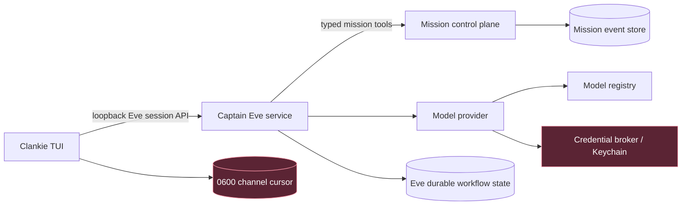

# ADR 0014: Live Eve captain session boundary

Status: accepted (James, 2026-07-11; VUH-785).

## Context

The operator TUI already configures real models and credentials, but its plain
prompt path is a canned in-process simulator. The real captain is authored as
an Eve application, and Eve already owns durable sessions, reconnectable event
streams, compaction, continuation tokens, and per-step usage. Reimplementing
that lifecycle in the control plane or TUI would create two competing sources
of conversation truth.

The continuation token can resume a conversation and is therefore
capability-like. It does not belong in the mission audit chain, support bundle,
terminal transcript, or structured logs. Provider credentials likewise stay
outside the TUI and worker processes.

## Decision

The TUI is a loopback-only channel to the Eve captain. The captain is a
privileged shared local singleton whose lifetime is independent of any one TUI
face. It resolves the selected model through the model registry and credential
broker, then calls only the narrow authored mission tools. Mission state
remains authoritative in the control plane; Eve text and tool-stream events
are presentation data.

The singleton runs the output of `eve build` through `eve start`. The launcher
serializes first-build ownership across concurrent faces, then attaches every
face to the same loopback process. Development hot reload remains an authored
captain development tool, not the durable operator runtime: `eve dev` pins
sessions to immutable source snapshots that its retention policy may later
prune, while built sessions contain bundled runtime artifacts and survive a
process restart without an ephemeral filesystem path.

The TUI persists only the Eve `sessionId`, `continuationToken`, and consumed
event index plus a SHA-256 build generation in a mode-0600 local cursor file.
Eve owns conversation history and compaction. A settled cursor from another
generation resets with an operator notice. An active incompatible cursor stays
blocked until `/new` explicitly abandons it, because its old turn may already
have emitted mission side effects. The control plane may project redacted
session identifiers and semantic mission events, but never raw continuation
tokens or private model stream content.

ChatGPT subscription access is an explicit provider identity,
`openai-codex`. It presents only models verified against the streamed Codex
backend contract and coexists with `openai`, which continues to mean the OpenAI
API-key transport. First-party Codex model visibility does not imply that a
third-party originator can call the same model. The runtime never silently
borrows one provider's credential for the other.

Eve has no public server-side turn-cancellation route. After a prompt is
accepted, Escape detaches the TUI from observation; it does not claim that the
durable turn or its tools were cancelled. The client reconnects from its saved
cursor and waits for a session boundary before sending another plain prompt.

## Options weighed

- **Keep the simulator until all of M2 is complete** — rejected because auth
  and model selection then appear functional while prompts never reach them.
- **Call the AI SDK directly from the TUI** — rejected because it moves raw
  provider credentials, durable conversation state, and agent tools into a UI
  process.
- **Proxy captain chat through the mission control plane** — rejected because
  conversational streaming is not authoritative mission state and would make
  the control plane a second Eve runtime.
- **Persist full captain history in the mission event store** — rejected because
  Eve already provides durable execution history and the audit store has
  stricter privacy and retention semantics.
- **Treat stream abort as turn cancellation** — rejected because Eve only
  cancels the HTTP observation; the accepted durable run may continue.
- **Run the shared singleton with `eve dev`** — rejected because a durable
  between-turn session can retain a development snapshot after snapshot
  cleanup removes its compiled manifest.
- **Discard a cursor whenever the development snapshot changes** — rejected
  because it hides the lifecycle error by losing conversation state and can
  abandon an active turn that already produced mission side effects.

## Consequences

- VUH-785 owns the live TUI-to-Eve vertical slice. VUH-700 remains read-only
  mission observation, and VUH-694/VUH-761 remain open for their broader
  mission-dispatch and session-management acceptance criteria.
- The captain service, not the TUI, resolves provider credentials into an
  opaque language model.
- The launcher builds only when no compatible shared service is healthy; the
  resulting `.output` is generated, ignored local state.
- Direct credential configuration in the TUI remains a transitional local UX;
  moving credential mutation behind a narrow runner API does not change the
  session boundary.
- True cancel-and-edit requires a future Eve or gateway cancellation contract
  with acknowledged turn identity and idempotency.
