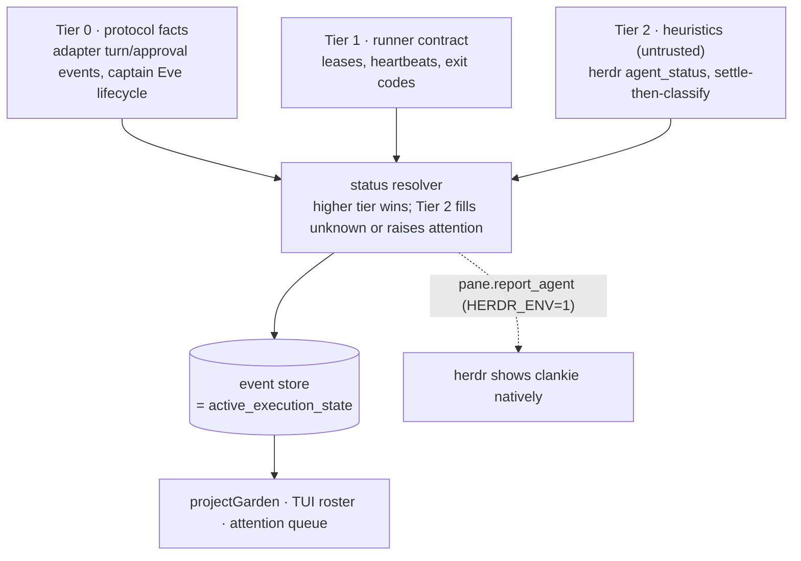

# ADR 0015: Tiered agent status detection

Status: accepted (James, 2026-07-11; VUH-786–VUH-791).

## Context

The garden, TUI, and iOS supervision surfaces must always know whether every
agent — each worker and Clankie-the-captain — is working, idle, waiting on a
human, blocked, failed, completed, or offline. `AgentVisualState` and
`projectGarden` in `packages/garden-model` already define the vocabulary and
the event→state projection; process leases (`apps/runner/src/process-leases.ts`)
already prove liveness. What was undecided is where the state *signals* come
from and which signal wins when they disagree.

Herdr answers this for arbitrary harness panes by screen-scraping: per-agent
TOML manifests match the live screen and OSC title, with a hook-authority
path for agents that self-report over its socket. That works for a generic
pane host, but it has a structural ceiling: blocked-detection rules are
deliberately strict, so a harness that stops with a *prose* question ("Tell me
whether to wait or proceed anyway") falls back to idle. No finite rule set can
enumerate every way a model phrases a question.

Clankie is not a generic pane host. It spawns its own workers over structured
protocols (ADR 0006): Codex App Server approval requests arrive as
server→client JSON-RPC requests, the Claude Agent SDK holds a permission
callback open, Pi emits `agent_settled`. For those workers, "waiting for the
user" is a protocol fact, not an inference. Doctrine already points the same
way: the event store owns `active_execution_state`, semantic events are
mandatory for state transitions, terminal ANSI is untrusted, and
terminal-output-only status inference is an ablation the system must beat
(`docs/02-lead-agent-e2e-proof.md`).

## Decision

Agent status is derived through a three-tier signal ladder and resolved into
semantic status events in the event store, which remains the single authority.
Every status event carries provenance: `{state, tier, source, confidence,
observedAt}`.

- **Tier 0 — protocol facts (authoritative).** Native adapter events: turn
  started/settled, pending approval or question ⇒ `waiting_user`. The captain
  emits its own Tier-0 status from the Eve turn lifecycle (active turn ⇒
  `working`, awaiting workers ⇒ `waiting_dependency`, question to the operator
  ⇒ `waiting_user`, none ⇒ `idle`), with attention-first precedence.
- **Tier 1 — runner contract.** Process leases, heartbeats, exit codes:
  distinguishes `idle` (alive, no work) from offline/crashed (`expired`,
  `worker.lost`), and carries `worker.completed`/`worker.crashed`.
- **Tier 2 — heuristics (untrusted).** For PTY escape-hatch workers and
  foreign panes only: herdr `agent_status` ingestion when running under herdr,
  and settle-then-classify (below). Tier 2 can only fill `unknown` or raise
  attention; it never overrides a live Tier-0/1 state.

**Settle-then-classify.** Heuristic status runs in two stages, and the
expensive stage triggers on *settle transitions*, never per output change — a
streaming pane's status is already known, and per-change classification is
racy and wasteful. Stage one is mechanical settle detection (quiet probes,
stable screen signature, ~700ms working→idle hold, prompt-box bypass, startup
grace — constants proven in herdr and v1). Stage two: visible permission
chrome short-circuits to `waiting_user` at full confidence; otherwise a
**local** model classifies the last ~60 lines into `finished |
awaiting_input_required | finished_with_offer | errored` with a confidence and
a one-line question summary for the attention queue. Pane text may contain
secrets, so classification never leaves the machine (ADR 0001). Results are
cached by screen signature.

**Done is presentation, not detection.** `completed` plus an unacknowledged
flag renders as "done"; acknowledgement flips it to idle. No detector emits a
"done" state (herdr's `seen` mechanism, adopted as a projection concern).

**Herdr interop without a fork.** When `HERDR_ENV=1`, clankie panes
self-report status over herdr's socket (`pane.report_agent`), which is herdr's
most reliable detection class and needs no herdr change; herdr's
`pane.agent_status_changed` is ingested as a Tier-2 source. Local manifest
overrides remain an operator band-aid. A carried fork commit (bundled clankie
manifest, lifecycle-authority whitelist) is optional cosmetics, never a
dependency.

**Explainability.** A `status explain` command reports the current state and
the full signal chain that produced it (winning tier, source, confidence,
timestamps) — the debugging analog of `herdr agent explain`.

## Options weighed

- **Port herdr's manifest scraping wholesale** — rejected: doctrine forbids
  clients inferring state from ANSI; the manifest approach cannot catch prose
  questions; maintaining per-harness rule sets duplicates what protocol events
  give us for free.
- **Classify every pane change with a model** — rejected: streaming panes
  change many times per second while their status is already known; per-change
  calls are costly, race half-drawn screens, and flap.
- **Protocol events only, no heuristic tier** — rejected: PTY escape-hatch
  workers and foreign panes would be invisible, and the ablation comparison
  needs a measured heuristic baseline.
- **Cloud model for tail classification** — rejected: pane text can carry
  secrets; local-first (ADR 0001).
- **Fork herdr to add a clankie agent variant** — rejected as a dependency:
  socket self-report reaches herdr's hook-authority class without any herdr
  change.
- **Detect "done" as a first-class state** — rejected: completion plus
  acknowledgement is a projection concern; detectors only ever see idle.

## Consequences

- New protocol events (`worker.turn.started`, `worker.turn.settled`,
  `worker.waiting_user`, captain status/heartbeat) and provenance fields;
  `projectGarden` gains mappings for `waiting_user`/`waiting_dependency`,
  which the projection currently never emits.
- Implementation issues: VUH-786 (adapter status events), VUH-787 (resolver +
  `status explain`), VUH-789 (captain presence), VUH-790 (settle-then-classify),
  VUH-791 (herdr interop), VUH-788 (frozen settle fixtures and the tier
  ablation).
- The Tier-2 classifier's quality is measured against frozen fixtures before
  the attention queue trusts it; the tier-2-only configuration doubles as the
  ablation required by `docs/02-lead-agent-e2e-proof.md`.
- Sprite/pose binding consumes `AgentVisualState` unchanged (VUH-709/710/720);
  liveness distinctions map cleanly onto the authored pose set (sleep/wilt/poof).
