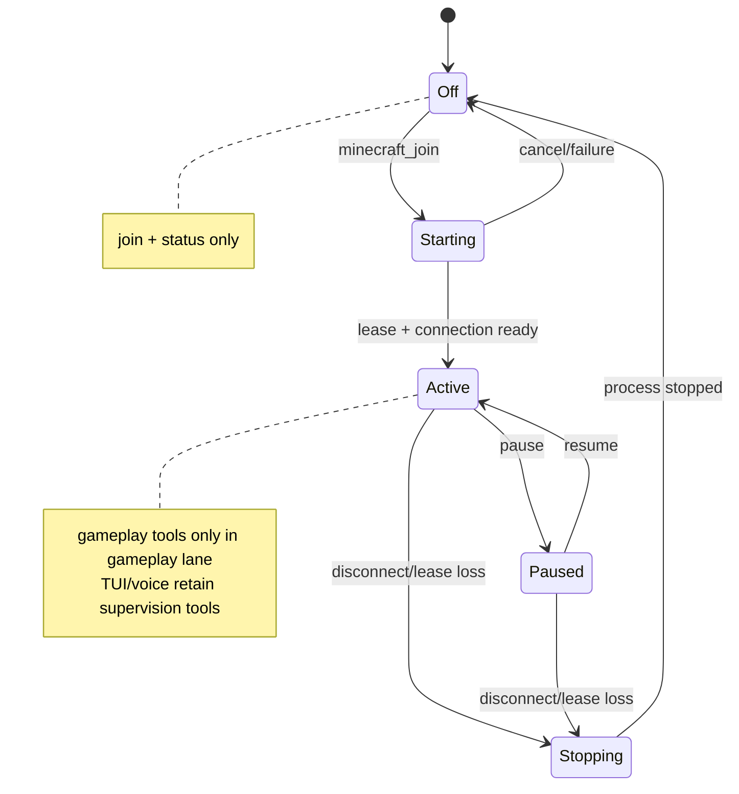

# ADR 0016: Versioned interactive-environment contract and lane-scoped tools

Status: accepted.

## Context

Minecraft introduces a durable external body whose motor loop outlives any one
model turn. TUI, Discord voice, and gameplay reasoning use separate Eve
sessions but present one Clankie identity. A global Minecraft tool catalog or a
blocking tool call would couple those sessions, waste model context, and let a
stale background decision override a newer foreground command.

The runtime also crosses several trust boundaries: model-authored arguments,
untrusted Minecraft content, runner-owned account credentials, and
server-authoritative verification. Mineflayer implementation types are not a
stable product API.

## Decision

`@clankie/protocol` owns the cross-product identity, captain-lane, authority,
intent, character-snapshot, and mission/task binding schemas.
`@clankie/interactive-environment` owns provider-neutral session, lease,
command, action-result, observation, event, and Minecraft profile schemas.
Runtime adapters depend inward on these contracts; neither shared package
imports Mineflayer or Paper types.

Every command carries a source lane, principal and authority tier,
correlation ID, and expected `goalVersion`. The arbiter rejects a command when
its expected version is stale. Long-running commands return an action handle;
completion and failure arrive as later results and semantic events.

Tool exposure is a deterministic projection of session phase and lane:

The runner owns the lease, credentials, connection, and cancellation. Lease
schemas name server, world, character, quotas, and capabilities but reject
credential fields. Ticks, chunks, packets, audio, and video never enter the
semantic event stream; bounded artifacts reference them when evidence needs
the data.

Each top-level contract carries integer `schemaVersion: 1`. Additive optional
fields may retain the version. A breaking semantic or structural change
increments the version. During a migration, boundaries dual-read the current
and immediately previous version, translate to the current in-memory shape,
and single-write the current version. Unknown versions fail closed and emit a
compatibility event; stored history is migrated by explicit, tested
translators rather than reinterpretation.

## Options weighed

- **Expose every Minecraft MCP tool to every captain session** — rejected
  because dormant TUI and voice turns do not need motor schemas, and ambient
  channels must not gain gameplay authority.
- **Use one Eve session for TUI, voice, and gameplay** — rejected because a
  long voice or gameplay turn would block foreground TUI work and mingle
  continuation-token authority.
- **Represent long actions as blocking tool calls** — rejected because model
  and channel availability would inherit pathfinding and server latency.
- **Adopt Mineflayer objects as the protocol** — rejected because adapter and
  Minecraft-version changes would become control-plane breaking changes.
- **Place raw tick and packet data in domain events** — rejected because it
  makes replay, privacy, and support bundles unbounded.

## Consequences

- Downstream components share one validated contract and can evolve adapters
  independently.
- Dormant Minecraft contributes only `join` and `status` to model routing.
- Active gameplay tools cannot appear in TUI or Discord lanes through a
  model-authored request; the deterministic projection rejects forged sets.
- Version negotiation and migration require explicit boundary code when v2 is
  introduced.
- Schemas describe authority requests and results but grant no capability and
  connect to no server by themselves.
