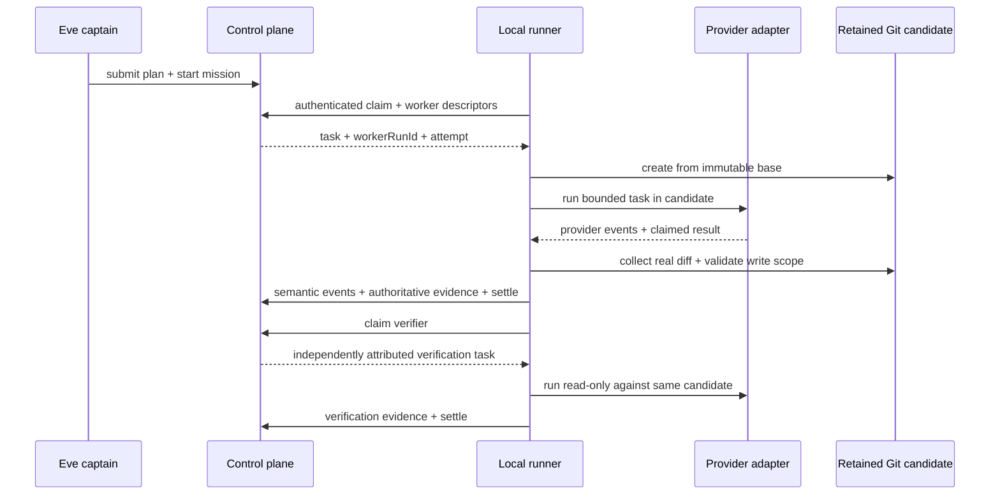

# ADR 0019: Runner pull execution retains one mission candidate through verification

Status: accepted (James, 2026-07-11).

## Decision

The local runner connects outbound and pulls dependency-ready assignments from the control plane. The control plane owns mission plans, deterministic scheduling state, attempt identity, and semantic event replay; it never imports a provider client or owns a provider process. The runner authenticates, advertises concrete worker descriptors, and reports events and settlement against the exact `workerRunId + attempt` lease.

One mission uses one runner-owned candidate worktree created from an immutable Git commit. Implementation writes into that candidate. A dependent verifier uses the same retained candidate read-only, so it inspects the actual implementation rather than a clean replacement. Dirty candidates and diff artifacts remain available after failure.

Provider completion means only that the assigned implementation attempt settled. It is not independent verification, mission completion, merge authority, or deployment authority. Mission state exposes the retained candidate task result while the verification task remains queued or running.

## Idempotency and recovery

Claims carry a runner-scoped claim ID. Each active attempt is bound to the server-authenticated runner identity and an expiring heartbeat lease. Worker events carry stable event IDs. Settlements bind to the exact attempt. A repeated active claim returns the same assignment; a repeated settled or expired claim never returns executable work. Mission-engine pull events persist in the control-plane event store and rebuild pull leases, heartbeat renewal, requeues, settlements, and terminal success after control-plane restart. The reducer does not claim to reconstruct arbitrary provider-native session internals.

The runner atomically records the candidate's mission ID, path, branch, and immutable base separately from the process lease. Startup orphan reclamation preserves dirty worktrees, and the mission worker validates and reacquires that exact candidate before verification. Missing, corrupt, out-of-root, wrong-branch, or wrong-base manifests fail closed.

The runner independently collects committed changes since the base, HEAD, index-tree identity, staged changes, unstaged changes, untracked files, ignored-untracked hashes, and rename paths. Paths are normalized to repository-relative POSIX form before `TaskSpec.writeScope` validation. Ignored file content is never copied into a diff artifact. Evidence exposes opaque artifact references rather than local filesystem URIs. A scope, HEAD, or index violation converts apparent provider success into failure without cleaning the candidate.

Verification success requires configured runner-owned deterministic commands with observed exits and `test_report` evidence. Those commands run in a verification-specific sandbox that limits reads to the candidate, exact runner-declared dependency inputs, and required system/toolchain runtime paths; host homes, Codex state, runner state, sibling repositories, and network access are not ambient inputs. Verification receives a worktree-local synthetic home, and stdout/stderr evidence contains only byte counts and cryptographic fingerprints so candidate output cannot exfiltrate host content into mission events. Provider completion alone cannot produce terminal mission success. The control plane reaches `succeeded` only after implementation and the read-only verification task both settle successfully with deterministic evidence.

## Deferred boundary

Persistent Codex thread resume, turn steering, interruption, approval handling, and user-question resolution belong to VUH-786. This pull slice intentionally invokes the existing adapter from start to settlement and does not claim native session lifecycle support beyond what that adapter currently emits.

## Options weighed

- **Control plane pushes provider work** — rejected because it would move provider credentials, processes, and worktree ownership across the trusted runner boundary.
- **One worktree per task** — rejected for the proof slice because a verifier could inspect a clean or separately reconstructed tree instead of the exact candidate.
- **Trust provider success and reported files** — rejected because provider output is untrusted; Git state and runner-authored evidence are authoritative.
