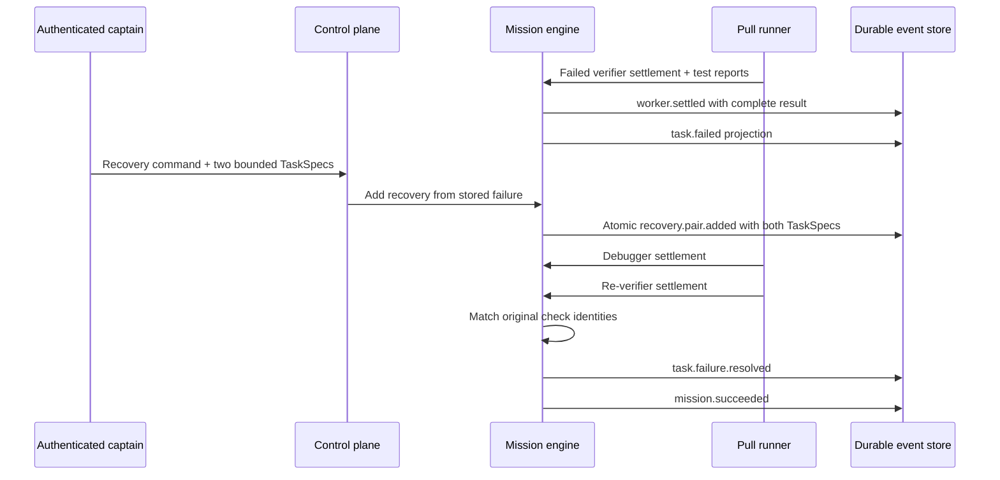

# ADR 0020: Bounded native-coding recovery

- Status: accepted
- Date: 2026-07-11

## Context

Native coding missions retain a candidate and require a read-only verifier, but
a failed verifier previously left the mission terminally failed. The
deterministic self-build laboratory demonstrates debugger recovery, while the
production pull runner needs the same control-loop property without allowing a
captain or worker to rewrite failure history, select weaker checks, or forge
diagnostic authority.

The stable protocol already provides open `TaskSpec.metadata` and domain-event
data. Expanding the frozen protocol is unnecessary for this recovery slice.

## Decision

The control plane accepts one authenticated recovery command for a failed
read-only verifier. The command contains exactly two new task specifications:

1. a `debugging` task with the `debugger` role, the original implementation
   dependency lineage, and the exact original implementation write scope;
2. a read-only `verification` task with the `verifier` role that depends only
   on the debugger.

The mission engine derives reserved recovery metadata from authoritative stored
state. It attaches the failed verifier's diagnosis, complete structured
evidence, trusted `runner-check:<id>:sha256:<digest>` identities, and an
unchanged-test-integrity marker. Each digest canonically binds the command,
arguments, dependency roots, sandbox profile/version, and read/network/environment
access contract. Caller metadata cannot replace these fields.

One `recovery.pair.added` event stores both full normalized `TaskSpec` values,
the command fingerprint, and pair lineage. The event is the atomic visibility
boundary: replay materializes both tasks or neither. Legacy partial recovery
`task.added` events remain inert, while generic single-task insertion retains
its existing event. Exact command replay returns the existing pair; a different
payload under the same command ID, caller-supplied reserved recovery metadata,
or a second pair for the same failure fails closed.

The debugger excludes the original implementation worker and original verifier.
The re-verifier excludes both code-writing attempts, while the original verifier
remains eligible to rerun the frozen checks in the three-seat production fleet.
A successful result must contain exactly the trusted check identities captured
from the original failure. The engine then emits
`task.failure.resolved`, retains the original task and `task.failed` event, and
treats that specific failure as resolved for terminal-state calculation.
`mission.succeeded` remains idempotent.

## Alternatives considered

### Let the captain submit diagnosis and checks

Rejected because model-authored fields are not authoritative evidence and
could weaken or replace the failed check contract.

### Change the original failed task to succeeded

Rejected because it destroys audit history and makes replay disagree with what
actually happened.

### Add recovery fields to the frozen protocol

Rejected for this slice because `TaskSpec.metadata` and domain-event payloads
represent the contract without coupling existing providers or frozen scenarios
to a new wire version.

### Let the debugger certify its own repair

Rejected because independent verification is an invariant floor. The recovery
verifier is a separate read-only task with deterministic worker exclusion.

## Consequences

- Failed native-coding missions can recover through an auditable production
  control loop.
- Restart replay preserves the atomic pair, failure resolution, and exactly-once
  terminal success.
- The complete `worker.settled` result precedes terminal task projections, so a
  crash at any durable event prefix retains the evidence required for recovery.
- Recovery remains deliberately bounded to one pair per failed verifier.
- Trusted check identity is preserved, while check execution and sandboxing
  remain runner-owned.
- Richer multi-stage replanning and chained recovery require a later decision.
