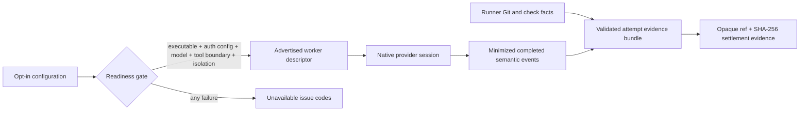

# ADR 0021: Native providers advertise only after readiness and settle with runner evidence

Status: accepted (James, 2026-07-11).

## Decision

The local runner owns a fail-closed provider factory. Codex, Claude, and Pi are individually opt-in and enter claim advertisements only after their startup configuration checks pass. These checks cover executable, authentication configuration, pinned model, tool boundary, and enforced isolation; they are not a live model or token-validity probe. Readiness reports contain stable issue codes and remediation text and never contain credential values or raw provider errors. Claude accepts an Anthropic API key or complete Bedrock/Vertex environment configuration. Consumer Claude OAuth/Max state, ambient config files, and partial cloud variables are not compliant authentication.

The first heterogeneous routing set uses distinct identities and task kinds:

| Worker ID              | Native harness   | Task kinds                  | Write authority |
| ---------------------- | ---------------- | --------------------------- | --------------- |
| `codex-implementation` | Codex App Server | implementation, integration | scoped          |
| `claude-verification`  | Claude Agent SDK | verification, review        | none            |
| `pi-debugging`         | Pi RPC           | debugging                   | scoped          |

Every settled attempt receives an immutable runner-authored evidence bundle. Exclusive publication makes identical retries idempotent and rejects concurrent conflicting content without overwrite. The private file and its containing directory are synced before settlement continues. The bundle records provider/session/correlation identity, Git-observed files, minimized completed-command facts, trusted runner checks, opaque artifact references and hashes, remaining risks, and explicit assumptions. Provider summaries, raw output, command text, patches, and self-reported evidence do not populate the bundle. Diff artifacts are likewise atomically replaced with mode `0600`.

## Provider isolation

Claude receives a synthetic home, temporary directory, and explicit allowlisted process environment. The Agent SDK sandbox is enabled with `failIfUnavailable: true` and `allowUnsandboxedCommands: false`. Its credential rules preserve authentication for the parent SDK process while removing protected variables from tools and denying reads of Claude, Codex, runner, and host-private state. Verification and review expose only Read, Glob, and Grep. An always-on programmatic `PreToolUse` hook rejects traversal-capable glob syntax, resolves requested paths, and rejects every read outside the assigned candidate root, including symlink escapes. Trusted verification commands remain runner-owned.

Pi runs from the repository-pinned `@earendil-works/pi-coding-agent` package. The runner supplies private `0700` home, temp, config, cache, and persistent session directories and rejects nominal success without a native session ID. Its configuration disables ambient extensions, skills, templates, themes, context files, telemetry, and update checks. The entire Pi RPC process runs behind a positive `ShellSandbox` profile: reads enumerate the candidate, Pi state, sanitized executable paths, safe system roots, and a bounded canonical closure of the pinned pnpm runtime; writes enumerate only the candidate and Pi state. Workers see one exact numeric loopback proxy port, and the runner reserves that port on both IPv6 and IPv4 loopback before the proxy forwards only the audited Ollama host and port. The host syslog socket is explicitly denied without delivery; other prohibited network and file operations retain force-termination. Readiness uses Pi's installed Undici dispatcher to fetch exact Ollama tags through the proxy, then initializes pinned RPC and validates its nonempty session ID, canonically session-root-confined session file, selected model, and available-model state without inference.

Codex uses `workerRunId:attempt` as the App Server `clientUserMessageId`. The parent App Server retains `CODEX_HOME` for authentication, while model tools receive a synthetic home/temp environment with no inherited provider variables. Strict inline named permission profiles start from Codex's `:minimal` filesystem set, grant only the candidate, synthetic tool home, and exact `PATH` directories, disable network and login-shell/profile loading, and deny provider/runner private paths. Readiness initializes this strict configuration and uses sandboxed `command/exec` to prove an arbitrary readable sentinel outside the allowlist is unreadable. Empty or malformed auth state does not pass: readiness opens private, owner-controlled `auth.json` once with no-follow semantics, validates its metadata and content through that handle, runs bounded `codex login status` with the credential store forced to `file`, and validates the path again afterward with the same device, inode, and content digest. This admits managed ChatGPT tokens and current complete registered agent-identity records while rejecting empty state, ambient Keychain fallback, symlink swaps, and atomic replacement with another valid file. Codex command and file evidence comes only from authoritative `item/completed` notifications. Claude and Pi likewise correlate structured tool starts with completed results. All three adapters hash command/path identity and omit raw parameters and output.

## Liveness and noninteractive behavior

The recurring worker heartbeat begins before candidate acquisition and initial evidence collection. Transient claim, event, and settlement failures retry with bounded backoff, and an exhausted polling operation does not terminate `runForever`. A `waiting_user` event blocks and aborts a noninteractive attempt by default; explicitly interactive deployments may opt into allowing it.

## Options weighed

- **Advertise configured providers before probing them** — rejected because the scheduler can lease work that the runner cannot safely start.
- **Use one generic coding descriptor** — rejected because heterogeneous routing and independent attribution require stable harness- and role-specific identities.
- **Store worker-written completion prose as evidence** — rejected because model text and provider output are untrusted inputs.
- **Run a globally installed Pi binary** — rejected because a mutable host installation breaks reproducibility and version attribution.
- **Allow direct or host-wide localhost access from Pi** — rejected because host-only filtering does not constrain the Ollama port and provider runtimes encode loopback endpoints differently. Pi receives only the runner proxy's one numeric port, reserved by the proxy on both loopback address families; the proxy enforces the Ollama target.
- **Enumerate common credential directories while retaining host-wide reads** — rejected because unanticipated private files would remain readable. Candidate tools use positive read roots and an adversarial startup probe instead.

## Consequences

Provider startup is deliberately stricter and may leave a runner with zero advertised workers until configuration is complete. Pi adds pinned transitive dependency and lockfile weight. The bundle is authoritative metadata, not an artifact download API; authenticated artifact retrieval, native session resume/steering, broader provider/model matrices, and promotion of retained candidates remain separate runtime work.
