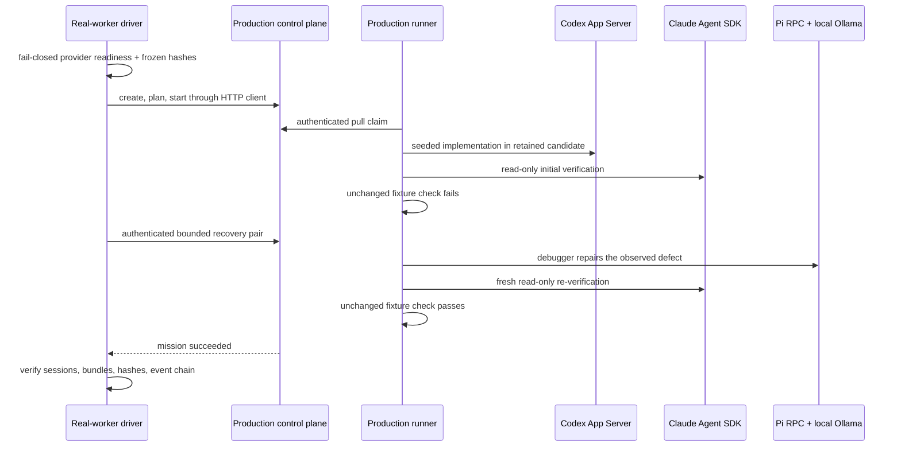

# ADR 0022: The real-provider proof uses production processes and frozen evidence

Status: accepted (James, 2026-07-11).

## Decision

The first real-provider gate is an explicit `pnpm eval:real-workers` command in the
lead-agent lab. The driver does not import the control-plane or runner application. It
starts both production process entrypoints, communicates only through
`ClankieApiClient`, and places control-plane SQLite state, runner state, retained
worktrees, and runner artifacts under one temporary runtime root.
The control-plane process receives only host runtime variables and its generated
captain/runner tokens. Provider configuration and credentials are projected only
into the runner process.

The lightweight CLI preflight is an early UX check, not the execution authority. The driver passes a
one-run nonce and private readiness path to the production runner. After `createReadyProviderFleet` completes,
the runner atomically publishes only worker ids, provider names, statuses, and issue codes. The driver creates
no mission until that signal is bound to its nonce and runner id and contains exactly the ready
`codex-implementation`, `claude-verification`, and `pi-debugging` fleet. Missing Seatbelt, an unavailable Codex
permission profile, or any other production readiness failure ends startup within a bounded window.

The gate uses the frozen `injected-retry-defect` scenario. Code contains an aggregate
SHA-256 over the scenario, fixture README, and unchanged fixture test. The driver checks
that aggregate before process startup, creates an immutable temporary Git base commit,
and checks the source, base repository, retained candidate, scenario, and test again
after execution.

The initial Codex task explicitly creates the scenario's seeded exclusive-bound defect.
The first Claude attempt is read-only and cannot certify success because the runner-owned
exact fixture check fails. Only that authoritative failure enables the captain-authenticated
recovery route. Pi receives the inherited implementation write scope, and a fresh Claude
session runs the same check identity after repair. The original failed task remains in the
mission history while terminal mission state becomes `succeeded` through the bounded
failure-resolution event.

Every attempt must bind a non-null, pairwise-distinct native session ID. The final collector
requires the matching semantic event, task/worker/provider attribution, immutable runner
evidence bundle, opaque reference, SHA-256, Git diff artifact, and trusted verification
evidence where applicable. It copies validated bundles and redacted process logs into
a private sibling staging directory and writes a hash-chained manifest over fixture identity,
control-plane events, evidence references, logs, and the final AGENTS-shaped report. Every staged file is
mode `0600`, every directory is mode `0700`, and files/directories are synced before publication. A final
`COMMITTED.json` binds the report and manifest hashes. The staging directory is atomically renamed to
`artifacts/evals/real-workers/`; only that final directory with a valid marker is authoritative. A crash can
leave an uncommitted staging directory or no current result, but never a partially published PASS.
The tree digest excludes only this root commit marker; a same-named file anywhere below the root remains
ordinary hashed evidence, so nested-file tampering invalidates the result.

## Authentication readiness

Readiness is a separate content-free process and always fails nonzero when incomplete.
Codex requires a private, structurally valid file-backed CLI home, open-once/no-follow
validation before and after a bounded login-status probe forced to that file store, and a
configured model. The two validations require the same device, inode, and content digest,
so symlink and atomic replacement cannot substitute another valid auth document during the
probe. Claude requires an
Anthropic API key or complete Bedrock/Vertex configuration. Consumer/Max OAuth and local
consumer credential files are intentionally insufficient for a third-party Agent SDK gate.
Pi requires the repository-pinned 0.80.6 RPC entry, macOS Seatbelt, and the exact configured
model at a credential-free localhost Ollama origin. Readiness never starts a Claude session.

Before readiness or process spawn, the driver privately reads the required Codex `auth.json` and an enabled
Vertex ADC file. It retains only recognized secret leaves in the in-memory redactor: Codex API and session
tokens, agent-identity JWT/private key, personal access token, and Bedrock key, plus known Vertex credential
tokens and private/client keys. Each credential source is opened once without following a final symlink, then
checked through that handle for a regular, owner-private file no larger than 1 MiB before it is read. Invalid
credential JSON fails closed without echoing its path or contents. Account, user, region, and project metadata
are not classified as secrets. Literal and JSON-escaped forms of each secret are redacted as the process
streams close and are redacted again before private log persistence; the secret set is never written as an
artifact.

## Options weighed

- **Import application factories into the lab** — rejected because an in-process test can bypass
  startup, authentication, persistence, and process-boundary failures present in production.
- **Accept existing Claude consumer login** — rejected because consumer/Max authorization is not
  an approved third-party SDK credential boundary.
- **Trust provider summaries or session output** — rejected because provider prose is untrusted;
  runner checks, Git evidence, session events, and artifact hashes are authoritative.
- **Include the live gate in routine CI** — rejected because the gate consumes real provider and
  local inference resources. Recorded process/API tests cover orchestration without credentials.

## Consequences

The command is intentionally strict and commonly reports a readiness blocker on an
unconfigured machine. A passing run is durable evidence for one frozen heterogeneous recovery
flow, not a release claim for general coding quality. Provider-swapped runs, additional seeds,
cost comparison, interactive session control, artifact retrieval, and human merge approval
remain separate promotion evidence.
