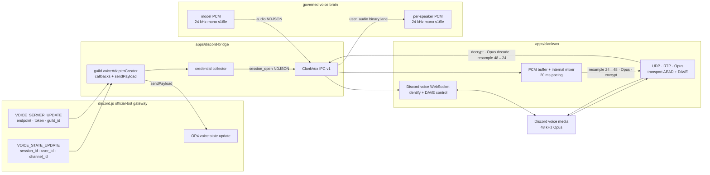

# ADR 0025: ClankVox is an in-repo voice sidecar behind versioned bridge IPC

Status: accepted (James, 2026-07-11; VUH-804).

## Context

ClankVox is the Rust media sidecar carried selectively from the v1 Clankie repository. The v2
bridge needs Discord voice WebSocket/UDP, RTP/Opus pacing, transport encryption, DAVE, inbound
speaker audio, and transport health without inheriting the v1 brain, Go Live/video, user-token,
music/YouTube, or player-control surfaces.

The source snapshot is `Volpestyle/clankie@04734df9ec1ec4665a233c4c64f0a51a9d3b0b83`, path
`clankvox/`, Git tree `11f24ddcfc3ee62d45b83638e788877f39cd8fdc`. VUH-805 records
file-level provenance when it performs the selective import.

## Decision

### Placement and import boundary

The executable lives at `apps/clankvox/` as an in-repository Cargo crate with a pnpm package
facade. The crate and lockfile are reviewed and built with the rest of the repository; CI produces
platform-named binaries from source. VUH-805 creates the directory, Cargo crate, package facade,
provenance record, offline smoke fixtures, and build job atomically. VUH-804 deliberately does not
leave a README-only workspace directory because `arch:check` requires every `apps/*` directory to
be a complete package.

Vendoring remains gated on the owner's licensing disposition. The upstream crate declares
`AGPL-3.0-or-later`, while this repository declares Apache-2.0. VUH-805 preserves the upstream
license and provenance unless the owner records another valid disposition; no import silently
relicenses the code.

The selective import retains voice RTP/Opus, PCM conversion and internal mixing, pacing,
transport AEAD, DAVE audio, speaking/capture state, and transport statistics. The only governed
outbound media input is generic `audio`. It does not retain v1 music/YouTube/player-control IPC,
Go Live, video, user-token paths, v1 Realtime orchestration, or transcript-pane naming.

### One Discord media owner

The bridge invokes `guild.voiceAdapterCreator(callbacks)` directly. It uses the returned
`sendPayload` to send Discord gateway OP4 voice-state updates for join and leave, collects
`VOICE_SERVER_UPDATE` and the bot's `VOICE_STATE_UPDATE`, then sends one complete `session_open`
to ClankVox. The bridge does **not** call `joinVoiceChannel()` for a ClankVox-backed session.

This distinction is structural. In the locally installed `discord.js@14.26.4`,
`Guild#voiceAdapterCreator` registers the supplied callbacks and returns `sendPayload` backed by
the guild shard. In `@discordjs/voice@0.19.2`, `VoiceConnection` supplies callbacks to an adapter,
collects both gateway packets, and `configureNetworking()` constructs its own `Networking`
instance. Using `joinVoiceChannel()` would therefore create a second voice WebSocket/UDP owner
that competes with ClankVox.

The gateway packets are sufficient for the official-bot media handshake:

- `VOICE_SERVER_UPDATE` supplies `endpoint`, `token`, and `guild_id` (`serverId`).
- the bot's `VOICE_STATE_UPDATE` supplies `session_id`, `user_id`, and `channel_id`
  (`daveChannelId`);
- the bridge already authenticates as the official Discord application bot and never accepts a
  normal-user token.

Local dependency source also supports the DAVE shape: `@discordjs/voice@0.19.2` constructs its
voice `Networking` from exactly those fields, advertises `max_dave_protocol_version` by default,
and creates `DAVESession(protocolVersion, userId, channelId)`. The v1 ClankVox snapshot constructs
its DAVE manager from the same `user_id` and voice `channel_id`. This confirms credential-field
sufficiency, not live interoperability. VUH-807 must prove `dave_state=ready` and audible outbound
voice using bot credentials only before the path is treated as live-proven.



### IPC transport

`apps/discord-bridge/src/clankvox-ipc.ts` is the TypeScript source of truth for the adapter
contract. Rust mirrors it during VUH-805.

Node to Rust is newline-delimited UTF-8 JSON. Each complete line, including its newline, is capped
at 8 MiB. The reader discards an oversized line through its newline, emits `input_too_large`, and
continues; malformed UTF-8/JSON produces a typed error without terminating the process. Binary
PCM accepted by the TypeScript API is encoded as base64 before it reaches this NDJSON wire.

Rust to Node uses a fixed five-byte frame header:

```text
+---------+----------------+-----------------------+
| lane:u8 | length:u32 LE  | payload:length bytes  |
+---------+----------------+-----------------------+
```

`length` covers payload bytes only and is capped at 32 MiB before allocation. Unknown lanes,
oversized lengths, malformed lane payloads, and incompatible schema versions fail closed; VUH-806
owns child termination and restart policy.

| Lane         | Value | Payload                                                   | Delivery semantics            |
| ------------ | ----: | --------------------------------------------------------- | ----------------------------- |
| control      |   `0` | versioned JSON lifecycle, speaking, end, and error events | ordered, must deliver         |
| `user_audio` |   `1` | binary header plus mono s16le PCM                         | lossy under backpressure      |
| log          |   `2` | versioned structured JSON log event                       | best effort, secrets redacted |
| health       |   `3` | versioned JSON health and transport-stat snapshots        | latest usable snapshot        |

Every JSON command and event carries integer `schemaVersion: 1`. Additive optional fields may
retain version 1. A breaking semantic, field, lane, or binary-layout change increments the version.
During migration, adapters may dual-read the current and immediately previous version, translate
to the current in-memory type, and single-write the current version. Unknown versions never fall
back to best-effort interpretation.

One ClankVox process owns at most one Discord voice session. Session-scoped output therefore does
not repeat a session identifier; the bridge binds process identity to its session lifecycle.

### Node-to-Rust commands

| Type             | Fields                                                                                | Meaning                                                                                                     |
| ---------------- | ------------------------------------------------------------------------------------- | ----------------------------------------------------------------------------------------------------------- |
| `session_open`   | `endpoint`, `token`, `serverId`, `sessionId`, `userId`, `daveChannelId`, `sampleRate` | Open the one official-bot voice media session. `sampleRate` is the model-facing PCM rate.                   |
| `audio`          | `encoding="pcm_s16le_base64"`, `pcmBase64`, `sampleRate`                              | Queue generic mono assistant PCM. The sidecar owns 48 kHz conversion, mixing, Opus, pacing, and encryption. |
| `health_request` | none                                                                                  | Request an immediate health snapshot without waiting for periodic transport stats.                          |
| `session_close`  | optional `reason`                                                                     | Stop media, close WS/UDP, zero session credentials, and settle the process session.                         |

There is no v1 `join`, gateway-fragment, music, player, stream-watch, stream-publish, video, or
user-token command in version 1.

### Rust-to-Node events

Control JSON includes `process_ready`, `session_state` (including explicit `daveState`),
`speaking_start`, `speaking_end`, `user_audio_end`, and typed `error`. Health JSON includes
`health_snapshot` (including `daveState`) and
`transport_stats`; audio-only stats retain cadence, IPC drops, inbound decrypt/loss/concealment,
outbound RTP, and DAVE encryption failures. Log JSON contains `level`, `target`, `message`, and
bounded structured `fields`; endpoint, token, session identifiers, raw private audio, and prompt
content are never logged.

`user_audio` is the only binary event. Its schema-1 payload preserves the v1 18-byte little-endian
header exactly:

| Offset |     Width | Field                                                           |
| -----: | --------: | --------------------------------------------------------------- |
|    `0` |         8 | Discord `userId` as unsigned u64 LE                             |
|    `8` |         2 | `signalPeakAbs` as u16 LE                                       |
|   `10` |         4 | `signalActiveSampleCount` as u32 LE                             |
|   `14` |         4 | `signalSampleCount` as u32 LE                                   |
|   `18` | remaining | mono s16le PCM at the active session's model-facing sample rate |

The binary payload version is selected by the process's schema-1 contract; it does not add a
second version word to the v1 header. `user_audio_end` closes the current per-speaker PCM burst.

## Options weighed

- **Git submodule** — rejected because clean checkout, CI, provenance capture, atomic IPC changes,
  and offline verification would depend on a second repository state and submodule update flow.
- **Prebuilt released binary** — rejected because it weakens source review and reproducibility,
  complicates platform/architecture coverage, and separates contract changes from their binary.
- **External sibling checkout** — rejected because it makes local machine layout part of the
  product and cannot satisfy clean-checkout builds.
- **Library embedded in the Node process** — rejected because Rust media failures, native linking,
  pacing, and backpressure need a process boundary and independent lifecycle.
- **`joinVoiceChannel()` with a custom adapter** — rejected because `@discordjs/voice` creates its
  own `Networking` after the two gateway packets arrive.
- **Raw v1 IPC without a version** — rejected because Rust and TypeScript could silently drift.
- **Carry v1 music/player commands** — rejected because they contain brain/product policy and are
  not required for the governed outbound PCM boundary.

## Consequences and follow-up gates

- The TypeScript contract and golden fixtures can be reviewed before Rust is imported.
- Rust/CMake enter the monorepo toolchain and CI in VUH-805.
- VUH-805 cannot vendor source until licensing disposition is recorded.
- VUH-806 replaces the bridge's temporary `joinVoiceChannel()` voice path with the direct adapter,
  credential collector, child lifecycle, and contract implementation.
- VUH-807 supplies the first live official-bot/DAVE proof.
- VUH-808 and VUH-810 share this media boundary without coupling the voice brain to Discord
  transport.
