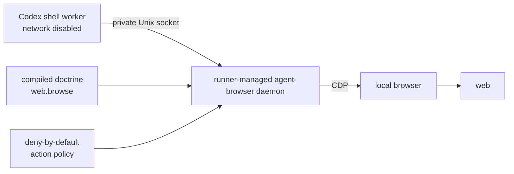

# ADR 0028: Read-only worker browser control through a runner-managed daemon

Status: accepted (implementation baseline, 2026-07-12).

## Context

Shell-capable workers sometimes need a rendered page, accessibility snapshot, or screenshot when
HTTP search and fetch are insufficient. Granting the worker shell general network egress would make
every executable in the task environment a connector and would bypass doctrine classification.
`agent-browser` already separates a small CLI from a persistent browser daemon, making the daemon a
natural runner-owned network boundary.

Options weighed:

1. Enable network access in the Codex shell profile. Rejected: arbitrary task code could use it.
2. Run `agent-browser` entirely inside the worker sandbox. Rejected: its daemon would either remain
   offline or inherit the same over-broad egress as the worker.
3. Start and configure the daemon in the trusted runner and expose only its local IPC endpoint to a
   network-disabled worker. Accepted.

## Decision

The capability is opt-in through `CLANKIE_BROWSER_ENABLED=true` and is projected as `web.browse`, a
read-class connector action. Projection requires a compiled doctrine profile and an exact `allow`.
The runner also probes the configured `agent-browser` executable (`CLANKIE_AGENT_BROWSER_EXECUTABLE`,
default `agent-browser`) and starts its daemon with a private runner-created tool-state directory. Any missing
input or failed readiness check withholds the capability and produces a startup projection log.

The Pi-to-loopback-Ollama path establishes the governing pattern: a runner-owned process holds the
network capability while the worker receives only a narrowly scoped local endpoint. On Unix,
`agent-browser` currently uses a namespaced Unix-domain socket rather than a TCP listener. The runner
therefore places that socket under the private Codex tool home and projects only the socket variables
into the Codex tool environment. This is tighter than loopback TCP: the worker's native network
permission remains disabled, and filesystem policy limits access to the one tool home containing the
endpoint. A future upstream TCP transport may replace the socket with an exact loopback target using
the existing `ShellSandbox.networkTargets` mechanism; it may not broaden shell egress.

The runner writes a daemon-enforced, deny-by-default action policy. Direct workers may navigate,
read, snapshot, scroll, wait, and query page state. They may not click, fill, type, press keys,
evaluate script, upload or download files, change cookies/storage, intercept network requests, or
invoke other interaction categories. Clicks are excluded because a link or button can submit a form
or publish content even without typed input. Those operations require separately classified
privileged connector actions and are outside this capability.

The high-assurance overlay denies `web.browse` exactly. The operator flag, doctrine projection,
binary readiness, daemon readiness, restrictive daemon policy, and worker's unchanged network deny
are all required; no layer can compensate for another missing layer.

## Consequences

- Rendered web observation no longer requires general worker network egress.
- The browser daemon and browser process are trusted runner-side connector infrastructure and must
  not inherit worker-controlled configuration beyond the fixed command protocol.
- `agent-browser` navigation still processes untrusted web content. Content boundaries are enabled,
  and browser output remains untrusted model input.
- Read-only policy is intentionally less capable than the full CLI. Interactive testing, login,
  form submission, publishing, downloads, uploads, and stateful authenticated workflows require a
  later privileged connector design.
