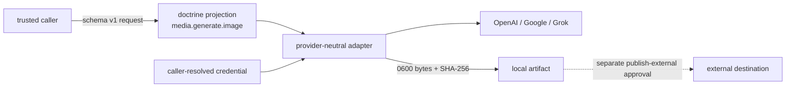

# ADR 0029: Versioned media-generation connector

Status: accepted (implementation baseline, 2026-07-12).

## Context

The TUI can select an image model, but the agent OS has no governed call boundary for generating an
artifact. Calling provider SDKs directly from a UI or captain would couple product surfaces to vendor
types, spread credentials, and bypass doctrine. Image and video providers also evolve independently,
so the durable boundary must describe the requested medium and artifact rather than one API response.

Options weighed:

1. Call provider SDKs from the TUI. Rejected: the UI would own credentials, policy, and vendor types.
2. Treat generation as an arbitrary worker shell command. Rejected: request validation, artifact
   provenance, and authority classification would be implicit.
3. Introduce a provider-neutral schema package with inward-dependent fetch adapters and doctrine
   projection. Accepted.

## Decision

`@clankie/media-connector` owns schema version 1 of `MediaGenerationRequest` and
`MediaGenerationResult`. Every top-level message carries `schemaVersion: 1`. Requests name a media
`kind`, prompt, optional size/aspect ratio, provider, model, and local output path. Results name the
absolute artifact path, SHA-256, byte count, MIME type, and bounded provider/model/request metadata.
Provider response bodies and credentials never enter the shared result.

Version 1 accepts only `kind: image`. The kind is an enum rather than an unversioned literal embedded
throughout callers. Video generation is a later increment on this boundary; adding it requires its
own validated request semantics and doctrine action, not accepting unknown kinds in version 1.

OpenAI `gpt-image-2`, Google `gemini-3.1-flash-image`, and Grok
`grok-imagine-image-quality` adapters implement one interface with plain `fetch`. The transport is
injectable. Callers resolve credential names and pass credential values into adapter construction;
the package never reads `process.env` and imports no provider SDK. Adapters validate requests and
responses, write a mode-0600 local artifact, and calculate SHA-256 from the exact written bytes.

Generation is the read-class connector action `media.generate.image`: it creates a local artifact and
does not mutate an external authority. A caller projects this action through compiled doctrine before
invocation, and missing doctrine fails closed. Uploading, attaching, posting, or publishing generated
media is not part of generation; it remains a separate `publish-external` action with human approval.

Product pixel art is carved out. In the private `clankie-app` repository, Aseprite sources and the
Aseprite MCP pipeline remain authoritative. This connector rejects `.aseprite` targets and output
paths under pixel-art, sprite, or atlas directories rather than generating raster data into those
asset namespaces.

## Consequences

- Callers and future UI wiring depend on one validated contract instead of provider response types.
- Generation credentials remain at the connector call site and are not discoverable through ambient
  package environment access.
- Local artifact creation is independently auditable from later publication.
- Video remains unimplemented but has an explicit versioned extension point.
- TUI execution wiring requires an authority-owning service call site; autocomplete scaffolding alone
  is not such a boundary and does not instantiate adapters.
