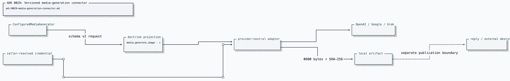

# ADR 0029: Versioned media-generation connector

Status: accepted (implementation baseline, 2026-07-12).

## Context

The TUI selects image and video models while the Clankie service owns the
governed call boundary. Calling provider SDKs directly from a UI or captain
would couple product surfaces to vendor types, spread credentials, and bypass
doctrine. The durable boundary describes the requested medium and artifact
rather than one provider response.

Options weighed:

1. Call provider SDKs from the TUI. Rejected: the UI would own credentials, policy, and vendor types.
2. Treat generation as an arbitrary worker shell command. Rejected: request validation, artifact
   provenance, and authority classification would be implicit.
3. Introduce a provider-neutral schema package with inward-dependent fetch adapters and doctrine
   projection. Accepted.

## Decision

`@clankie/media-connector` owns schema version 2 of `MediaGenerationRequest` and
`MediaGenerationResult`. Requests are a discriminated union on `kind`: image
requests carry image fields, while video requests carry duration and resolution.
Results name the absolute artifact path, SHA-256, byte count, MIME type, and
bounded provider/model/request metadata. Provider response bodies and
credentials never enter the shared result.

OpenAI `gpt-image-2`, Google `gemini-3.1-flash-image`, and Grok
`grok-imagine-image-quality` adapters implement one interface with plain `fetch`. The transport is
injectable. Callers resolve credential names and pass credential values into adapter construction;
the package never reads `process.env` and imports no provider SDK. Adapters validate requests and
responses, write a mode-0600 local artifact, and calculate SHA-256 from the exact written bytes.

`media.generate.image` and `media.generate.video` are separate read-class
connector actions. A caller projects each through compiled doctrine before
invocation, and missing doctrine fails closed. Generation creates a local
artifact; publication uses the governed reply boundary in
[ADR 0085](0085-a-picture-he-makes-is-something-he-says.md).

Product pixel art is carved out. In the private `clankie-app` repository, Aseprite sources and the
Aseprite MCP pipeline remain authoritative. This connector rejects `.aseprite` targets and output
paths under pixel-art, sprite, or atlas directories rather than generating raster data into those
asset namespaces.

## Consequences

- Callers and TUI wiring depend on one validated contract instead of provider response types.
- Generation credentials remain at the connector call site and are not discoverable through ambient
  package environment access.
- Local artifact creation is independently auditable from later publication.
- Image editing and video use the same versioned boundary with medium-specific
  request fields.
- `ConfiguredMediaGenerator` is the authority-owning service call site and the
  only adapter constructor.
