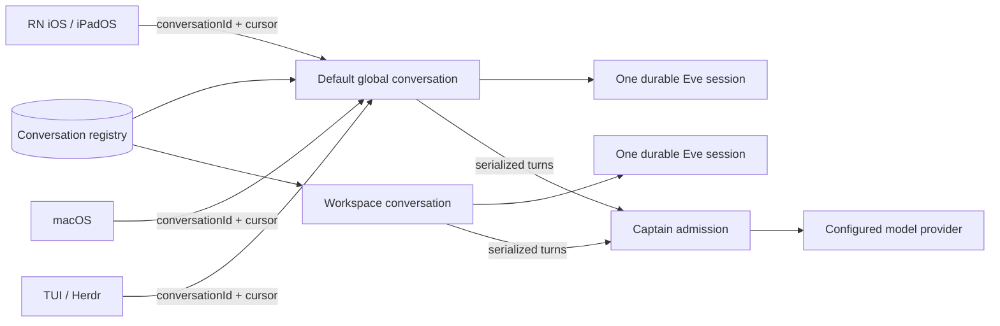

# ADR 0032: Conversation-scoped operator lanes

Status: accepted (James, 2026-07-12).

## Context

The captain runtime currently models the authenticated TUI as a durable lane
and gives that device-shaped lane a foreground reservation. Product surfaces
now include React Native iOS/iPadOS, macOS, TUI faces, and Herdr panes. A person
expects a lead conversation started on any one of them to remain the same
conversation on every other surface. A device lane would instead fork history,
make a phone-local chat list authoritative, and force a second surface either
to steal a continuation token or create a duplicate captain session.

Clankie also supports multiple intentional lead-chat tabs. Those tabs must run
concurrently, while two sends to the same tab must remain serialized. The
existing one-session-one-lane fail-closed invariant remains necessary to stop a
durable Eve session or continuation token from being rebound to another
conversation.

## Decision

The operator conversation, not the device or UI process, is the unit of captain
identity, durability, and admission. Each operator conversation owns exactly one
durable Eve session. Its captain lane address is:

```text
lane = operator
captainTargetId = conversationId
```

There is one non-deletable default global conversation represented by the
garden Clankie. Operators may create additional global or workspace-scoped
conversations. The conversation registry is server-owned and enumerable by all
authenticated operator surfaces; a phone-local `chatStore` is only a cache.



The shared protocol exposes a provider-neutral conversation record with at
least:

```text
schemaVersion
conversationId
scope = global | workspace(workspaceId)
title
isDefault
createdAt
updatedAt
sessionState
revision
```

The record never exposes an Eve continuation token. The registry/runtime owns
the `conversationId` to Eve-session binding and enforces uniqueness in both
directions. Rebinding a live session, token, or conversation to a second lane
fails closed. Captain identity migration continues to settle sessions as
specified by ADR 0023.

Each surface attaches as a client with its own opaque replay cursor. Attachment
does not grant exclusive ownership and does not invalidate another surface's
cursor. A second surface may list the conversation, replay from its cursor, and
tail new NDJSON events immediately. Sending a turn requires the latest
conversation revision. The server serializes accepted turns within that
conversation and rejects a stale revision with the current revision/cursor so
the client refreshes before retrying. An already accepted turn keeps running;
disconnecting or attaching elsewhere is not cancellation. Different
conversation IDs admit concurrently up to provider capacity.

Operator conversations share the highest admission class. Discord voice and
presence follow operator conversations; gameplay remains the lowest,
cancellable borrower. There is no TUI, mobile, macOS, or per-device foreground
reservation.

The TUI gains an authenticated conversation picker and a stable direct form
such as `clankie --chat <conversationId>`. A selected TUI face is another
surface client, not a distinct conversation kind.

Physical devices reach this contract through an authenticated relay
HTTP/NDJSON proxy. The relay may list conversations, submit Eve session turns,
and replay/tail stream events using surface cursors. It must never proxy
approval completion; privileged approvals remain on their dedicated
authenticated control-plane surface. Tailscale is an acceptable personal
transport during the interim, not the application authorization boundary.

Garden worker chat is a separate read model. The runner owns a structured,
redacted worker-transcript projection; the control plane exposes read/tail
access to that projection. Operator conversation history never becomes the
worker transcript source of truth, and raw worker terminal/model output is not
copied into the conversation registry.

## Options weighed

- **One lane per device or surface** — rejected because it forks conversation
  history and makes handoff a token-transfer problem.
- **A phone-local conversation registry** — rejected because TUI and macOS
  could not enumerate or resume the same tabs.
- **One global captain session with tabs as local views** — rejected because
  tabs are intentionally concurrent conversations with independent history.
- **Exclusive cursor takeover** — rejected because read attachment is safe to
  share; revision-fenced writes solve the actual same-conversation race without
  evicting another client.
- **A single admission lock across all operator tabs** — rejected because it
  prevents the approved concurrent-conversation product model.
- **Relay approval completion alongside chat** — rejected because chat
  transport must not widen approval authority.

## Consequences

- The current `tui` captain lane and its foreground reservation are superseded
  by the `operator` conversation lane. Voice, presence, and gameplay remain
  separate non-operator lane kinds.
- The registry protocol, revision fence, cursor lifecycle, relay proxy, and TUI
  picker are implementation work tracked separately so RN/macOS/TUI can share
  one contract.
- Existing surface-local transcript/chat stores migrate to caches keyed by
  `conversationId`; they do not invent durable conversation identifiers.
- Cursor expiration and retention may require a bounded replay reset, but must
  produce an explicit client-visible state rather than silently opening a new
  conversation.
- The runner-owned worker-transcript projection remains separately redacted,
  authorized, retained, and auditable.

