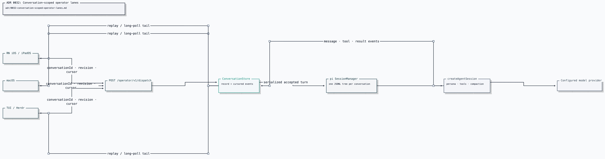

# ADR 0032: Conversation-scoped operator lanes

Status: accepted (James, 2026-07-12). Applies to the pi captain.

## Context

The TUI, relay, iPhone, iPad, and macOS surfaces all need to open the same
operator conversations. A device-local chat would fork history, while one global
session would prevent intentional tabs from running independently.

## Decision

The operator conversation is the unit of identity and durability. Each
conversation owns one pi `SessionManager` JSONL tree and one revision-fenced
event log under `~/.clankie/captain/`. The service owns the mapping; clients see
only `conversationId`, revision, and replay cursors.

There is one non-deletable default global conversation. Operators may create
additional global or workspace-scoped conversations. Different conversations
run concurrently; sends to the same conversation serialize. A stale revision is
rejected with the current revision and safe cursor so the client can refresh.

Each TUI process creates a fresh conversation in its launch scope unless
`--chat` explicitly resumes one. Conversation and Pi session lifetime stay the
same; bounded retention removes their shared directory together
([ADR 0111](0111-a-console-process-starts-one-conversation.md)).

The public record is provider-neutral and never exposes provider credentials or
pi session internals. Each surface attaches with its own cursor, so another
surface can replay and tail without taking ownership away from the first.

Physical devices reach the same contract through the authenticated relay.
Approval completion and other privileged control surfaces stay separate.

## Consequences

- `operator` is the conversation-scoped captain lane.
- Local replay state is a bounded delivery checkpoint keyed by `conversationId`,
  never a session or source of durable identity.
- Disconnecting a client does not cancel an accepted turn.
- Worker conversations remain herdr panes and are not copied into the operator
  conversation store.
