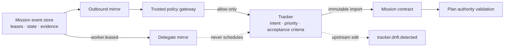

# ADR 0034: Tracker mirror identity and authority partition

Status: accepted (VUH-764).

## Context

Clankie needs tracker context while planning and reporting missions, but the tracker and
mission engine own different facts. Copying issue fields into mutable mission state would
let upstream edits silently change an active contract. Treating tracker assignment as a
worker lock would also create a second scheduler beside mission-engine leases.

The fleet appears externally as one embodied teammate. Exposing every internal worker as a
tracker user leaks implementation topology, consumes provider seats, and makes authorship
depend on the worker provider. The connector still needs exact worker attribution without
giving worker processes tracker credentials.

## Decision

### Authority is partitioned by field

The workspace binds the connector-neutral `product_intent` and
`acceptance_criteria` authority roles to a tracker connector. Import creates an immutable,
versioned mission contract containing those fields, the issue priority, source revision,
and app identity. Plan validation rejects conflicting tracker-owned intent or acceptance
criteria. Reconciliation compares the contract with the current issue and records
`tracker.drift.detected`; it never rewrites the active contract.

Priority remains represented in the imported contract and drift report, but it is not
silently aliased to another doctrine role. Priority mutation remains fail-closed behind its
own policy action until the explicit priority authority role is decided in VUH-797.

The mission/event store owns active execution: task state, leases, attempts, evidence, and
verification. A `worker.leased` event may mirror Clankie as the tracker delegate, but
tracker assignment never grants a lease or resolves a write-scope conflict.

### One Clankie app identity owns tracker presentation

The connector accepts only an app identity for automated operation. Outbound comments are
rendered under that single identity and include mission, task, worker-run, role, native
session, and source-event attribution. Stable event-derived idempotency keys make replayed
delivery safe. The privileged client port exposes neither credentials nor an author
override, so workers cannot impersonate another tracker actor.

The Linear implementation uses an OAuth app with `actor=app`. App creation, installation,
credential insertion, live assignability/mention verification, and retirement of the
temporary shared member alias are human-owned operations (VUH-799). Credential-free tests
and the owner-run, environment-gated live smoke keep that transition explicit.

### Every mutation crosses trusted policy

Comments, delegate mirrors, priority changes, and completion changes use distinct trusted
tracker actions. Only an `allow` decision reaches the credential-owning client; denial and
approval-required decisions fail closed. Connector failures produce bounded
`tracker.sync.failed` events without serializing provider errors or credentials.

The interfaces name tracker concepts rather than Linear. A Jira-shaped adapter implements
the same port without doctrine changes; provider-specific parsing and API calls stay in the
adapter.

## Alternatives considered

1. **Tracker fields become ordinary mutable mission fields.** Rejected because upstream
   edits could silently rewrite active execution intent.
2. **Tracker assignment acts as the claim mutex.** Rejected because it creates a second,
   eventually consistent scheduler outside mission leases and write-scope validation.
3. **One tracker identity per worker.** Rejected because workers are internal anatomy of one
   Clankie identity and must not receive tracker credentials.
4. **A Linear-specific doctrine contract.** Rejected because authority and policy are
   connector-neutral workspace concerns.

## Consequences

- Tracker imports require compatible workspace authority bindings and fail closed otherwise.
- Mid-mission tracker changes require an explicit reconciliation or replan decision.
- Tracker narrative remains attributable to the internal worker without exposing a worker
  as an external user.
- Live OAuth/app-user acceptance remains an owner gate rather than a credential-bearing
  worker check.
- Adding another tracker requires an adapter and workspace binding, not doctrine edits.
